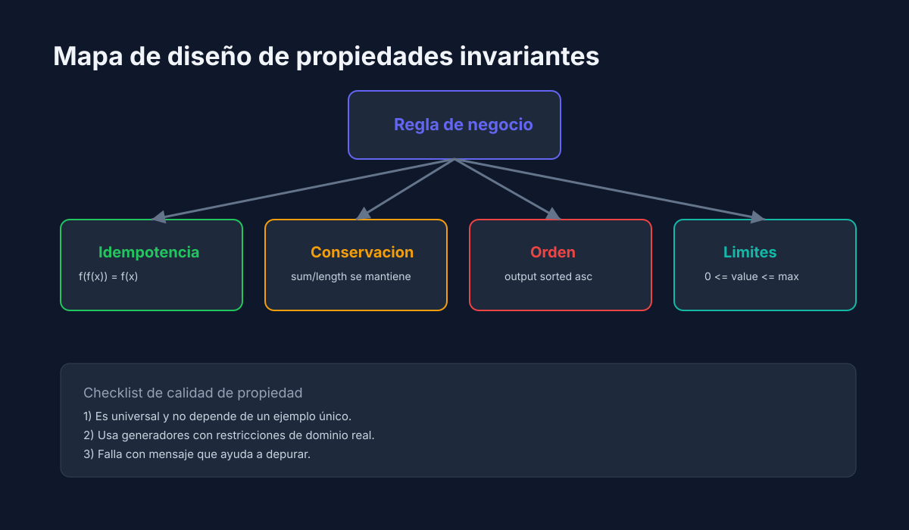
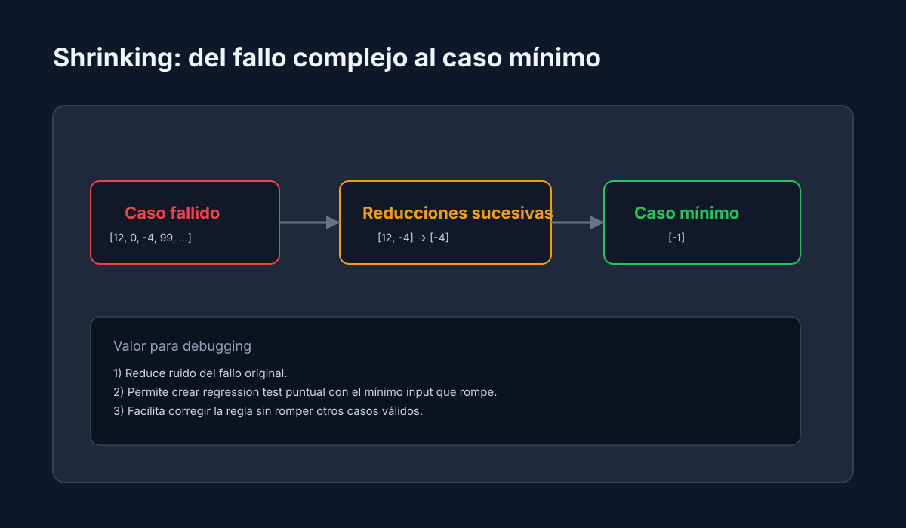

# 03 - Diseno de Propiedades con fast-check

> **Lenguaje:** JavaScript (Jest + fast-check)




---

## Objetivo

Definir propiedades que representen reglas de negocio reales y utiles.

---

## Checklist para una buena propiedad

1. Expresa una regla universal del dominio.
2. Tiene input generado con restricciones coherentes.
3. Tiene oraculo claro para validar salida.
4. Falla con mensaje interpretable.

---

## Patrones utiles

- Idempotencia: aplicar dos veces equivale a una.
- Conservacion: una magnitud se mantiene (ej. longitud, suma total).
- Orden: salida debe permanecer ordenada bajo criterio.
- Limites: resultado dentro de rango permitido.

---

## Ejemplo completo: generadores combinados

Funcion bajo prueba — calcula el precio final de una entrada de museo aplicando un descuento por edad, sin dejarlo nunca negativo:

```javascript
function applyAgeDiscount(basePrice, age) {
  const discount = age < 12 || age >= 65 ? 0.5 : 0;
  return Math.max(0, Math.round(basePrice * (1 - discount)));
}
```

Propiedad: el precio final nunca debe ser negativo ni mayor al precio base.

```javascript
const fc = require("fast-check");

test("should keep final ticket price within valid bounds", () => {
  fc.assert(
    fc.property(fc.integer({ min: 0, max: 100_000 }), fc.integer({ min: 0, max: 120 }), (basePrice, age) => {
      const finalPrice = applyAgeDiscount(basePrice, age);

      expect(finalPrice).toBeGreaterThanOrEqual(0);
      expect(finalPrice).toBeLessThanOrEqual(basePrice);
    })
  );
});
```

Para textos, `fc.string()` por defecto casi nunca genera tabs ni saltos de linea. Si la regla trata sobre whitespace, conviene un generador que lo incluya de forma explicita con la opcion `unit`:

```javascript
// Strings hechos solo con estas unidades: letras y whitespace real.
const hallName = fc.string({ unit: fc.constantFrom("a", "B", " ", "\t", "\n") });

function slugifyHallName(name) {
  return name.trim().toLowerCase().replace(/\s+/g, "-");
}

test("should never leave whitespace in hall slug", () => {
  fc.assert(
    fc.property(hallName, (name) => {
      const slug = slugifyHallName(name);
      expect(slug).not.toMatch(/\s/);
    }),
  );
});
```

---

## Interpretar un contraejemplo simplificado

Supongamos una version con bug que solo reemplaza espacios (`/ +/g`) en lugar de cualquier whitespace (`/\s+/g`):

```javascript
function slugifyHallName(name) {
  return name.trim().toLowerCase().replace(/ +/g, "-");
}
```

Con la misma propiedad, Jest muestra (salida real, recortada):

```text
FAIL ./slug.test.js
  ● should never leave whitespace in hall slug

    Property failed after 1 tests
    { seed: 1987581203, path: "0:1:7:7", endOnFailure: true }
    Counterexample: ["a\na"]
    Shrunk 3 time(s)

    ...

    Cause:
        expect(received).not.toMatch(expected)

        Expected pattern: not /\s/
        Received string:      "a
        a"
```

Como leerlo:

- `Counterexample: ["a\na"]` es el array de argumentos de la propiedad (aqui uno solo, `name`). Ya esta reducido: es el input mas simple que fast-check encontro que sigue fallando, no el string aleatorio original.
- `Shrunk 3 time(s)`: fast-check partio del primer input que fallo y lo simplifico 3 veces.
- `seed` y `path` permiten reproducir exactamente la misma corrida: `fc.assert(property, { seed: 1987581203, path: "0:1:7:7" })`. El `seed` cambia en cada ejecucion, por eso hay que copiarlo del fallo.
- `Cause` es el `expect` que fallo dentro de la propiedad: el slug conserva un salto de linea. El contraejemplo apunta directo al bug (el regex no cubre `\n`).

---

## Recomendacion

Combina tests de ejemplo (casos narrativos) con propiedades (cobertura amplia de entradas). Mejora la confianza sin depender solo de snapshots o de ejemplos puntuales.

---

## Errores frecuentes

- Generadores sin restricciones (`fc.integer()` sin `min`/`max`) cuando el dominio real tiene limites conocidos: genera ruido irrelevante.
- Ignorar el `seed` del fallo y no poder reproducirlo en la siguiente corrida.
- Escribir el oraculo con la misma formula que la implementacion (la propiedad nunca podria fallar).

---

## Regla practica

Ante un fallo, lee primero el `Counterexample` shrunkeado: es el caso mas simple posible, no ruido aleatorio.
