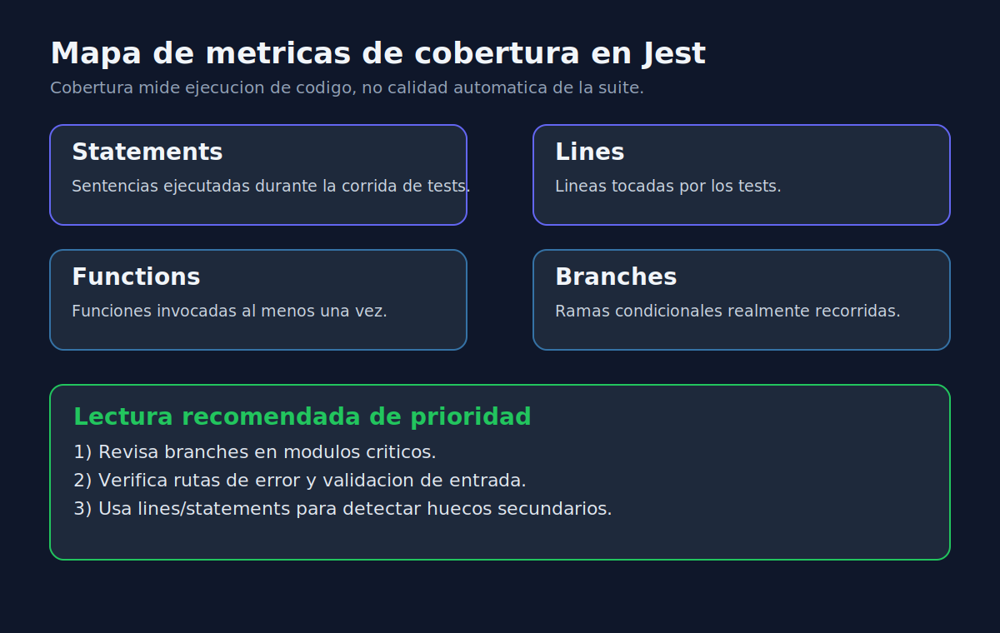

# 01 - Fundamentos de Cobertura en Jest

## Objetivo

Entender que mide cobertura en Jest y como usarla para observar huecos de prueba sin caer en falsas certezas.



---

## Que es cobertura

Cobertura es una metrica que indica que porciones del codigo fueron ejecutadas durante los tests.

En Jest, las metricas mas usadas son:

- `statements`: sentencias ejecutadas.
- `lines`: lineas ejecutadas.
- `functions`: funciones invocadas.
- `branches`: ramas evaluadas (if/else, ternarios, cortocircuitos).

---

## Comando base en Jest

```bash
yarn test --coverage
```

Tambien puedes apuntar a un archivo:

```bash
yarn test pricing.service.test.js --coverage
```

---

## Ejemplo breve

```javascript
function calculateFee(amount, isMember) {
  if (amount <= 0) {
    throw new Error("Invalid amount");
  }

  if (isMember) {
    return amount * 0.9;
  }

  return amount;
}
```

Si solo pruebas `isMember = true`, tendras cobertura de funcion y lineas altas, pero `branches` incompleta: no validaste el camino de no miembro ni el error.

---

## Regla practica

Cobertura responde: "que se ejecuto".
Calidad responde: "que tan bien detecta defectos".
Necesitas ambas.

---

## Recomendaciones iniciales

1. Revisa cobertura por modulo, no solo porcentaje global.
2. Prioriza rutas con validaciones, reglas de negocio y manejo de errores.
3. Usa cobertura para descubrir huecos, luego decide si tienen riesgo real.
