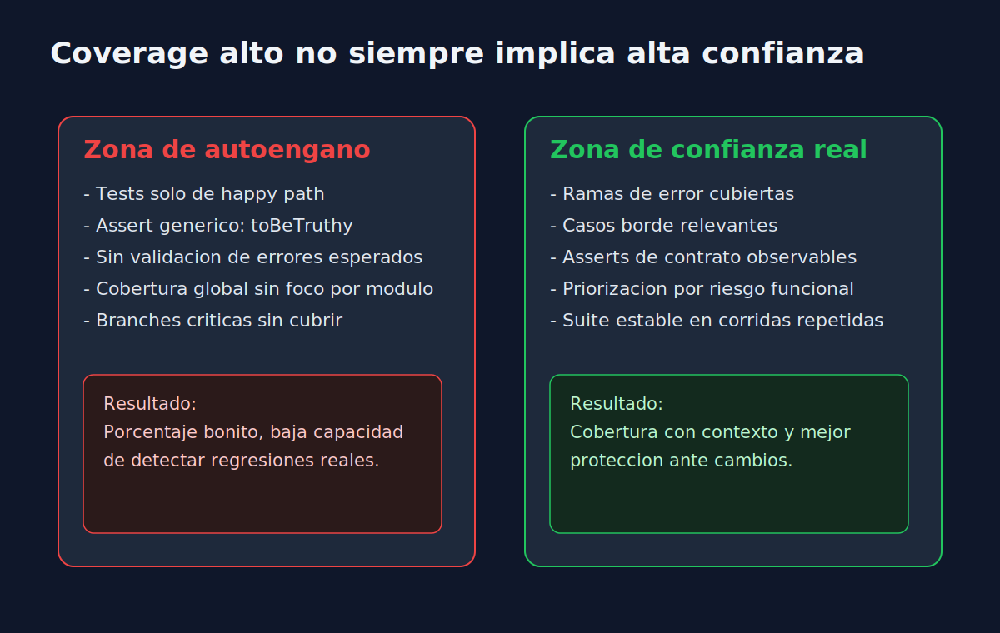

# 02 - Interpretar Metricas Sin Autoengano

## Objetivo

Leer reportes de cobertura con pensamiento critico para evitar decisiones basadas solo en porcentajes.

---

## Errores comunes

1. **Confundir cantidad con calidad**: 90% no implica suite robusta.
2. **Optimizar solo lo facil**: subir lineas tocando codigo trivial.
3. **Ignorar branches**: los defectos suelen vivir en rutas alternativas.
4. **No considerar criticidad funcional**: una rama de pago pesa mas que un helper de formato.

---

## Preguntas utiles al leer coverage

- Que reglas de negocio importantes aun no estan verificadas?
- Que errores esperados no tienen test?
- Que tests solo validan el happy path?
- Que modulos tienen mucha cobertura pero assertions debiles?

---

## Señales de buena interpretacion

- Se incorpora al menos un test por caso borde relevante.
- Se cubren rutas de fallo con mensajes/errores concretos.
- Se evita inflar numeros con tests redundantes.
- Las mejoras se relacionan con incidentes reales o riesgos conocidos.

---

## Mini checklist operativo

- [ ] Revisar `branches` primero en modulos criticos.
- [ ] Agregar pruebas de error/validacion.
- [ ] Refactorizar tests fragiles antes de agregar mas cantidad.
- [ ] Repetir ejecucion para verificar estabilidad (no flaky).
