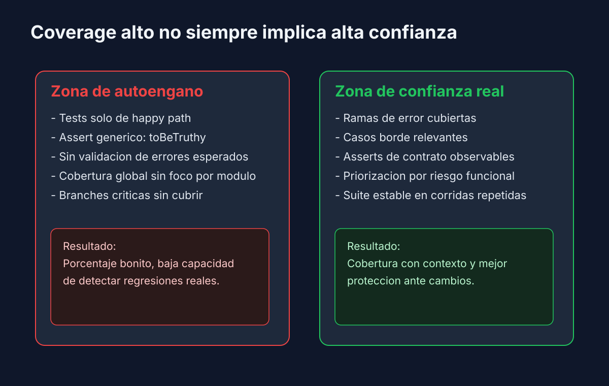

# 02 - Interpretar Metricas Sin Autoengano

## Objetivo

Leer reportes de cobertura con pensamiento critico para evitar decisiones basadas solo en porcentajes.



---

## Errores comunes

1. **Confundir cantidad con calidad**: 90% no implica suite robusta.
2. **Optimizar solo lo facil**: subir lineas tocando codigo trivial.
3. **Ignorar branches**: los defectos suelen vivir en rutas alternativas.
4. **No considerar criticidad funcional**: una rama de pago pesa mas que un helper de formato.

---

## Preguntas utiles al leer coverage

- Que reglas de negocio importantes aun no estan verificadas?
- Que errores esperados no tienen test?
- Que tests solo validan el happy path?
- Que modulos tienen mucha cobertura pero assertions debiles?

---

## Señales de buena interpretacion

- Se incorpora al menos un test por caso borde relevante.
- Se cubren rutas de fallo con mensajes/errores concretos.
- Se evita inflar numeros con tests redundantes.
- Las mejoras se relacionan con incidentes reales o riesgos conocidos.

---

## Ejemplo: 100% de lineas, bug real sin detectar

`lines` y `statements` cuentan si una linea se ejecuto, no si se ejecuto con **todas** las combinaciones de condiciones que importan. Un ternario anidado en una sola linea puede quedar "cubierto" con solo dos de sus tres rutas posibles.

```javascript
// pricing.js - calcula precio de entrada al Acuario
function calculateTicketPrice(basePrice, isMember, hasGroupDiscount) {
  const discount = isMember && hasGroupDiscount
    ? 1.3 // bug: deberia ser 0.3 (30%), no 130%
    : isMember || hasGroupDiscount
      ? 0.15
      : 0;

  return basePrice * (1 - discount);
}

module.exports = { calculateTicketPrice };
```

```javascript
// pricing.test.js
const { calculateTicketPrice } = require("./pricing");

test("should apply 15% off when visitor is member only", () => {
  expect(calculateTicketPrice(100, true, false)).toBe(85);
});

test("should charge full price when visitor has no discounts", () => {
  expect(calculateTicketPrice(100, false, false)).toBe(100);
});
```

Estos dos tests ejecutan la unica sentencia `return` de la funcion en cada corrida, asi que `statements`, `lines` y `functions` marcan **100%**. Nunca se llama con `isMember = true` y `hasGroupDiscount = true` a la vez, que es la rama con el bug: `calculateTicketPrice(100, true, true)` devuelve `-30` (precio negativo) en produccion.

`branches` es la unica metrica que delata el hueco: el reporte marca la rama `isMember && hasGroupDiscount` como no ejecutada, aunque `lines` diga 100%. Un test que combine ambos flags rompe inmediatamente y expone el typo.

---

## Archivos invisibles: `collectCoverageFrom` y `coverageThreshold`

Por defecto, Jest solo mide los archivos que **algun test importa**. Un modulo sin ningun test no aparece en el reporte, asi que el porcentaje global sale alto justamente porque falta lo peor. Supongamos que junto a `pricing.js` existe `refund.js` (reembolsos del Acuario) y nadie le escribio tests. Con `pnpm test:coverage` sin configuracion:

```text
------------|---------|----------|---------|---------|-------------------
File        | % Stmts | % Branch | % Funcs | % Lines | Uncovered Line #s
------------|---------|----------|---------|---------|-------------------
All files   |     100 |     87.5 |     100 |     100 |
 pricing.js |     100 |     87.5 |     100 |     100 | 2
------------|---------|----------|---------|---------|-------------------
```

`refund.js` no existe para el reporte. La solucion es declarar que archivos **deben** medirse y un umbral minimo que haga fallar el comando:

```javascript
// jest.config.js (tambien vale la clave "jest" en package.json)
module.exports = {
  // Todos los .js de la raiz cuentan, los importe un test o no.
  collectCoverageFrom: ["*.js", "!*.test.js", "!jest.config.js"],
  // Si una metrica queda por debajo, Jest termina con codigo de salida 1.
  coverageThreshold: {
    global: { branches: 80, lines: 80 },
  },
};
```

Salida real con esa configuracion:

```text
------------|---------|----------|---------|---------|-------------------
File        | % Stmts | % Branch | % Funcs | % Lines | Uncovered Line #s
------------|---------|----------|---------|---------|-------------------
All files   |   42.85 |       70 |      50 |   42.85 |
 pricing.js |     100 |     87.5 |     100 |     100 | 2
 refund.js  |       0 |        0 |       0 |       0 | 2-9
------------|---------|----------|---------|---------|-------------------
Jest: Coverage for branches (70%) does not meet "global" threshold (80%)
Jest: Coverage for lines (42.85%) does not meet "global" threshold (80%)
```

El 100% de lineas era un autoengano: el proyecto real esta al 42.85%. Con el umbral, `pnpm test:coverage` falla en local y en CI hasta que alguien cubra `refund.js` o baje el umbral de forma explicita y justificada.

Los patrones de `collectCoverageFrom` son globs relativos a la raiz del proyecto; en proyectos con carpeta `src/` lo habitual es `["src/**/*.js", "!src/**/*.test.js"]`. `coverageThreshold` acepta tambien claves por ruta (por ejemplo `"./src/pricing.js": { branches: 100 }`) para exigir mas en modulos criticos.

---

## Leer el reporte HTML de Istanbul (rojo / amarillo / verde)

Al correr `pnpm test:coverage`, Jest genera `coverage/lcov-report/index.html`. Abrirlo en el navegador muestra el arbol de archivos con porcentajes; entrar a un archivo muestra el codigo fuente coloreado linea por linea.

| Color | Significado |
|---|---|
| Verde | Sentencia y todas sus ramas se ejecutaron al menos una vez. |
| Amarillo | La linea se ejecuto, pero **una rama** de una condicion no (ej. un `if` sin `else`, o un lado de un ternario/`&&`/`??`). |
| Rojo | La sentencia, funcion o rama nunca se ejecuto. |

Ademas de los colores, Istanbul anota marcadores directamente sobre el codigo:

- `I` (if): el bloque `if` correspondiente no se evaluo con ese valor.
- `E` (else): la rama `else` (implicita o explicita) nunca se tomo.
- Numeros pequeños junto a una linea: cuantas veces se ejecuto (util para detectar tests redundantes que repiten el mismo camino).

En el ejemplo anterior, la linea del ternario aparece en **amarillo**, con un marcador sobre la rama `isMember && hasGroupDiscount ? 1.3` indicando que nunca se tomo ese camino, aunque la linea en si se pinte como ejecutada.

### Regla practica al leer el reporte

1. No cierres una revision de coverage mirando solo el resumen (`% Stmts`, `% Branch`) de la carpeta raiz: entra a los modulos criticos.
2. Prioriza amarillos y rojos en archivos con reglas de negocio antes que en utilidades.
3. Un archivo 100% verde en `lines` pero con amarillos en `branches` sigue teniendo huecos reales.

---

## Mini checklist operativo

- [ ] Configurar `collectCoverageFrom` para que ningun archivo quede fuera del reporte.
- [ ] Definir `coverageThreshold` para que el comando falle si la cobertura baja.
- [ ] Revisar `branches` primero en modulos criticos.
- [ ] Agregar pruebas de error/validacion.
- [ ] Refactorizar tests fragiles antes de agregar mas cantidad.
- [ ] Repetir ejecucion para verificar estabilidad (no flaky).
- [ ] Abrir el reporte HTML y revisar amarillos/rojos en modulos de alto riesgo, no solo el resumen global.
