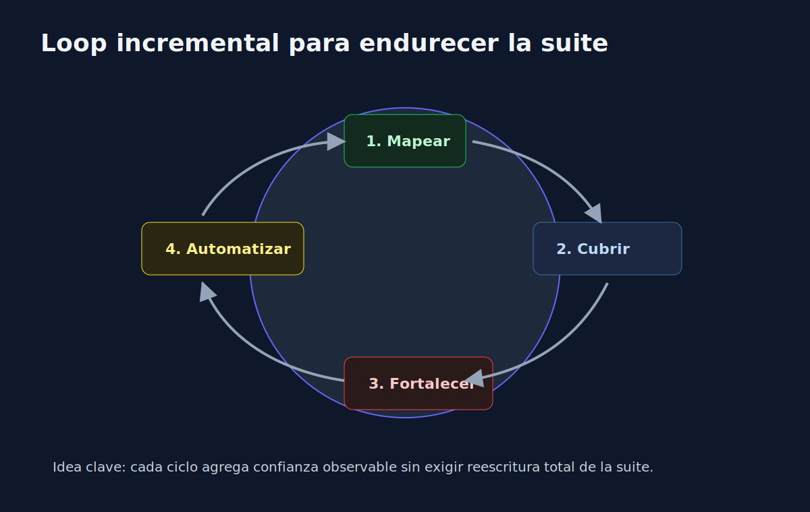

# 03 - Mejorar Calidad de Suite de Forma Incremental

## Objetivo

Aplicar una estrategia progresiva para endurecer suites de tests sin bloquear el avance del equipo.

---

## Enfoque incremental en 4 pasos

1. **Mapear riesgo**: identifica modulos mas sensibles (dinero, identidad, estados).
2. **Cerrar huecos criticos**: agrega tests para ramas de fallo y bordes de dominio.
3. **Fortalecer asserts**: valida comportamiento observable, no detalles internos fragiles.
4. **Automatizar guardrails**: aplica umbrales de coverage y ejecucion estable en CI.

---

## Ejemplo de criterio de prioridad

Prioridad alta:

- validaciones de entrada,
- transformaciones de datos de negocio,
- reglas condicionales con impacto economico,
- manejo de errores que afectan UX/API.

Prioridad baja:

- getters triviales,
- wrappers sin logica,
- codigo de bajo impacto con bajo riesgo.

---

## Anti-patrones a evitar

- Tests que solo validan que "no crashea".
- Snapshots gigantes sin foco.
- Assert unico y ambiguo para multiples reglas.
- Dependencia de reloj/sistema/red en unit tests.

---

## Resultado esperado al cerrar la semana

Una suite que no solo "cubre" codigo, sino que ofrece confianza operativa para cambiarlo y desplegar con menor riesgo.
