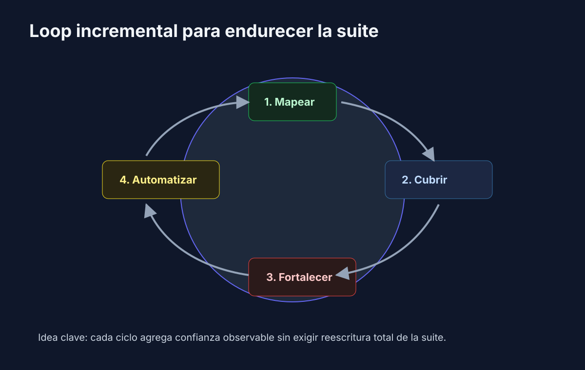
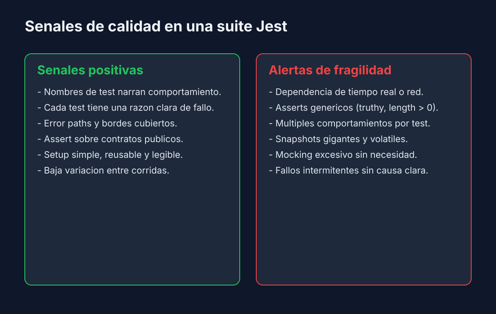

# 03 - Mejorar Calidad de Suite de Forma Incremental

## Objetivo

Aplicar una estrategia progresiva para endurecer suites de tests sin bloquear el avance del equipo.



---

## Enfoque incremental en 4 pasos

1. **Mapear riesgo**: identifica módulos más sensibles (dinero, identidad, estados).
2. **Cerrar huecos críticos**: agrega tests para ramas de fallo y bordes de dominio.
3. **Fortalecer asserts**: valida comportamiento observable, no detalles internos frágiles.
4. **Automatizar guardrails**: aplica umbrales de coverage (`coverageThreshold` + `collectCoverageFrom`, ver [teoría 02](./02-interpretar-metricas-sin-autoengano.md)) y ejecución estable en CI.

---

## Ejemplo de criterio de prioridad

Prioridad alta:

- validaciones de entrada,
- transformaciones de datos de negocio,
- reglas condicionales con impacto económico,
- manejo de errores que afectan UX/API.

Prioridad baja:

- getters triviales,
- wrappers sin lógica,
- código de bajo impacto con bajo riesgo.

---

## Anti-patrones a evitar



- Tests que solo validan que "no crashea".
- Snapshots gigantes sin foco.
- Assert único y ambiguo para múltiples reglas.
- Dependencia de reloj/sistema/red en unit tests.

---

## Ejemplo: de test débil a test que realmente protege

Un test débil suma cobertura pero no detecta regresiones: sigue en verde aunque se borre la lógica interna. La prueba de fuego es simple: si reemplazas el cuerpo de la función por un valor fijo, ¿el test falla?

```javascript
// feeding-alert.js - decide si una especie del Acuario necesita alerta de alimentación
function needsFeedingAlert(hoursSinceLastFeeding, species) {
  const thresholds = { shark: 48, jellyfish: 72, default: 24 };
  const limit = thresholds[species] ?? thresholds.default;
  return hoursSinceLastFeeding >= limit;
}

module.exports = { needsFeedingAlert };
```

**Antes (test débil):**

```javascript
test("should return a boolean when called", () => {
  const result = needsFeedingAlert(50, "shark");
  expect(typeof result).toBe("boolean");
});
```

Este test pasa aunque reemplaces toda la función por `return true;`. No verifica el valor esperado, ni el umbral por especie, ni el caso "no necesita alerta". Suma a `functions`/`lines` coverage sin aportar detección real.

**Después (test fortalecido):**

```javascript
test("should flag alert when shark was not fed for 48+ hours", () => {
  expect(needsFeedingAlert(50, "shark")).toBe(true);
});

test("should not flag alert when shark was fed within its threshold", () => {
  expect(needsFeedingAlert(40, "shark")).toBe(false);
});

test("should use default threshold when species is unknown", () => {
  expect(needsFeedingAlert(30, "otter")).toBe(true);
});
```

Ahora, si alguien hardcodea `return true;` o borra la lógica de `thresholds`, el segundo test (caso `false`) falla de inmediato. La suite dejó de ser un contador de líneas ejecutadas y pasó a ser una red de seguridad real.

---

## Heurística de priorización: que módulo cubrir primero

No todo el código merece la misma inversión de tests. Cruza dos ejes: **frecuencia de cambio** (qué tanto se toca el archivo) y **riesgo de negocio** (qué tan grave es un defecto ahí).

| | Riesgo de negocio alto | Riesgo de negocio bajo |
|---|---|---|
| **Cambia seguido** | Prioridad 1: cubrir ya (ej. pricing, reservas, control de aforo) | Prioridad 3: cubrir cuando haya tiempo |
| **Cambia poco** | Prioridad 2: cubrir antes del próximo refactor grande | Prioridad 4: baja prioridad (helpers estables) |

Para estimar frecuencia de cambio sin adivinar, revisa el historial de commits:

```bash
git log --since="3 months ago" --name-only --pretty=format: -- src/ \
  | sort | uniq -c | sort -rn | head -10
```

Los archivos que aparecen más veces son los que más riesgo de regresión acumulan con cada cambio; si además manejan dinero, identidad o estados críticos, van primero en la lista de hardening.

---

## Resultado esperado al cerrar la semana

Una suite que no solo "cubre" código, sino que ofrece confianza operativa para cambiarlo y desplegar con menor riesgo.
