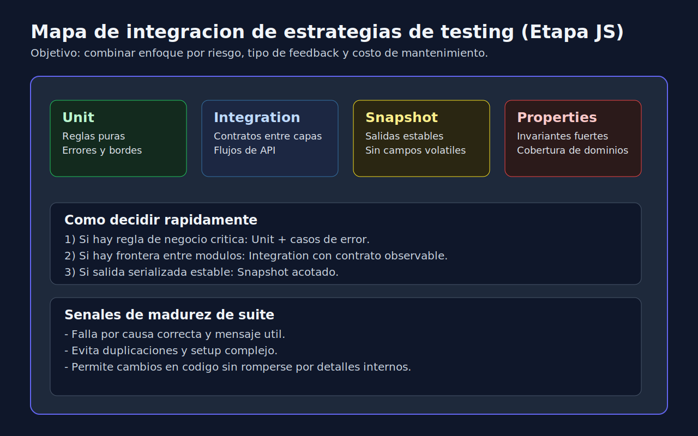

# 01 - Estrategia Integrada de Testing en JavaScript

## Objetivo

Consolidar lo aprendido en etapa JavaScript para construir una suite balanceada, mantenible y orientada a riesgo.

---

## Lenguaje de esta semana

**Aplica a**: JavaScript (Jest) con enfoque de cierre de etapa.

---

## Capas recomendadas de suite

1. **Unit tests**: validan reglas de negocio en funciones y servicios.
2. **Integration tests**: validan contratos entre componentes (API, repositorio, adapters).
3. **Snapshot tests**: validan estructuras estables y contratos visuales/serializados.
4. **Property-based tests**: validan invariantes sobre entradas amplias.

---

## Regla de equilibrio

No todas las piezas necesitan todos los tipos de test.
Selecciona por riesgo:

- alta criticidad -> unit + integration + bordes,
- salida estructurada estable -> sumar snapshot,
- transformaciones generales -> sumar properties.

---

## Matriz rapida de decision

| Tipo de modulo | Riesgo de fallo | Test minimo recomendado | Test adicional sugerido |
|---|---|---|---|
| Validaciones de entrada | Alto | Unit con errores y bordes | Property para invariantes |
| Orquestacion de servicios | Alto | Integration con doubles controlados | Contract test de respuesta |
| Formateo de payload estable | Medio | Unit de estructura clave | Snapshot acotado |
| Utilidades matematicas/texto | Medio | Unit parametrizado | Property-based |
| Wrappers simples | Bajo | Unit basico | Solo si hay historial de fallos |

---

## Ejemplo de composicion por caso

Caso: `createInvoiceSummary`.

1. Unit tests:
	- monto invalido,
	- descuento fuera de rango,
	- redondeo esperado.
2. Integration test:
	- orquestacion con repositorio y mapper.
3. Snapshot:
	- payload final para contrato de respuesta.
4. Property test:
	- `total >= 0` para cualquier entrada valida.

Resultado: si falla, el equipo diagnostica rapido si el problema es regla, integracion o formato.

---

## Como evitar redundancia

Redundante:

- test unitario y test integration validando exactamente el mismo assert de detalle interno.

No redundante:

- unit valida calculo interno,
- integration valida contrato externo observable.

Pregunta de control:

"Si elimino este test, pierdo una senal unica de regresion?"

Si la respuesta es no, probablemente ese test sobra o debe fusionarse.

---

## Criterio de mantenimiento

Una suite integrada madura no es la mas grande; es la que:

- detecta regresiones criticas temprano,
- permite refactor sin ruido innecesario,
- conserva feedback rapido en cada PR.

---

## Anti-patrones en cierre de etapa

- Duplicar tests con el mismo valor diagnostico.
- Cubrir solo happy path y llamar eso "completo".
- Agregar snapshots de objetos gigantes sin foco.
- Forzar properties en codigo sin invariantes claras.

---

## Checklist de estrategia

- [ ] Cada modulo critico tiene al menos una prueba de error.
- [ ] Hay evidencia de decisiones por riesgo, no por moda.
- [ ] Los tests fallan por una razon clara.
- [ ] La suite se ejecuta estable en local y CI.
