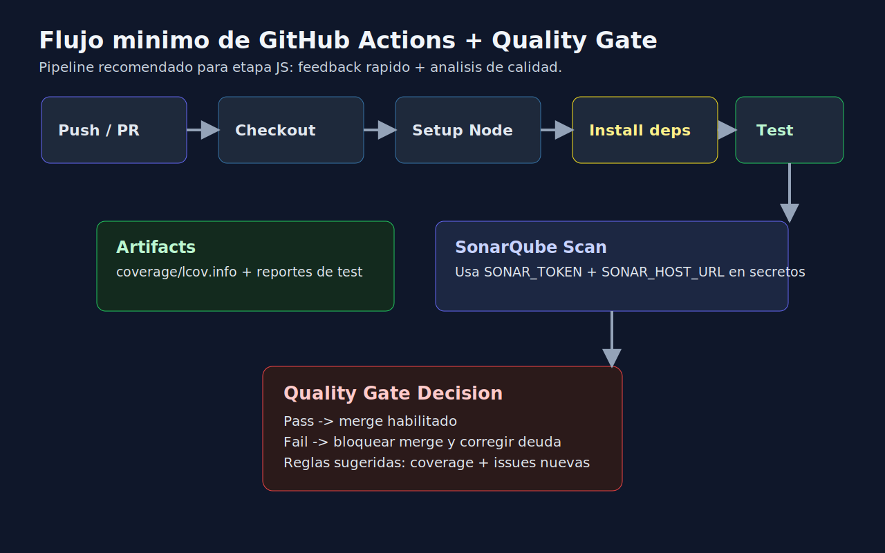
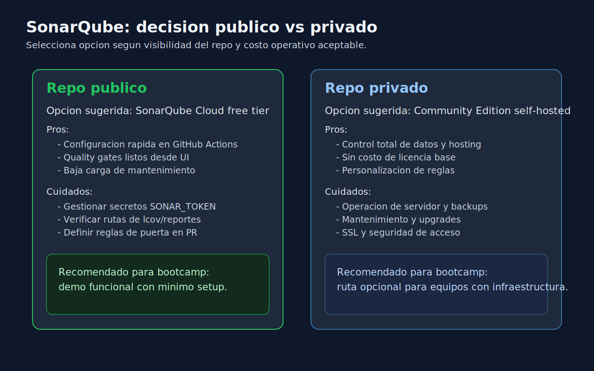

# 02 - Plantilla Minima GitHub Actions + SonarQube

## Objetivo

Definir una configuracion base para automatizar tests, coverage y quality gate minimo en proyectos JavaScript.



---

## Lenguaje de esta semana

**Aplica a**: JavaScript (Jest) y CI en GitHub Actions.

---

## Escenario recomendado segun repositorio



- **Repositorio publico**: SonarQube Cloud free tier.
- **Repositorio privado**: SonarQube Community Edition autohospedado (opcional).

---

## Plantilla minima de workflow

```yaml
name: js-quality

on:
  push:
    branches: [main]
  pull_request:

jobs:
  test-and-quality:
    runs-on: ubuntu-latest

    steps:
      - name: Checkout
        uses: actions/checkout@v4
        with:
          fetch-depth: 0

      - name: Setup Node
        uses: actions/setup-node@v4
        with:
          node-version: 20
          cache: yarn

      - name: Install dependencies
        run: yarn install --frozen-lockfile

      - name: Run tests with coverage
        run: yarn test --coverage

      - name: SonarQube Scan
        uses: SonarSource/sonarqube-scan-action@v5
        env:
          SONAR_TOKEN: ${{ secrets.SONAR_TOKEN }}
          SONAR_HOST_URL: ${{ secrets.SONAR_HOST_URL }}
```

---

## Plantilla minima de `sonar-project.properties`

```properties
sonar.projectKey=bootcamp-js-sample
sonar.projectName=Bootcamp JS Sample
sonar.sources=src
sonar.tests=src
sonar.test.inclusions=**/*.test.js
sonar.javascript.lcov.reportPaths=coverage/lcov.info
sonar.sourceEncoding=UTF-8
```

---

## Notas clave para que funcione

1. El paso de tests debe generar `coverage/lcov.info`.
2. `SONAR_TOKEN` es obligatorio en secretos de GitHub.
3. En cloud publico, `SONAR_HOST_URL` puede apuntar a SonarQube Cloud.
4. En servidor propio, `SONAR_HOST_URL` apunta al host interno/autohospedado.

---

## Errores frecuentes

- No subir `fetch-depth: 0` y perder contexto de analisis.
- Ejecutar scanner sin coverage previo.
- Configurar rutas de tests/cobertura que no existen.
- Esperar quality gate util sin definir reglas minimas de calidad.
