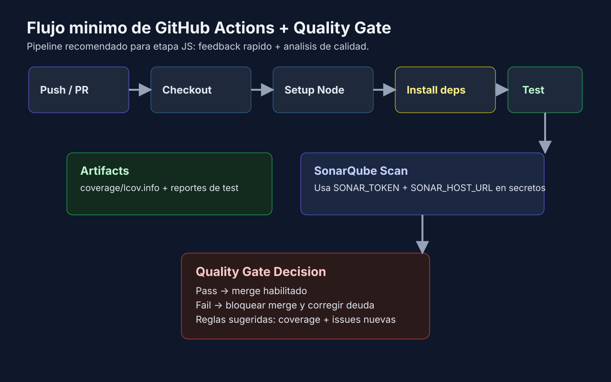
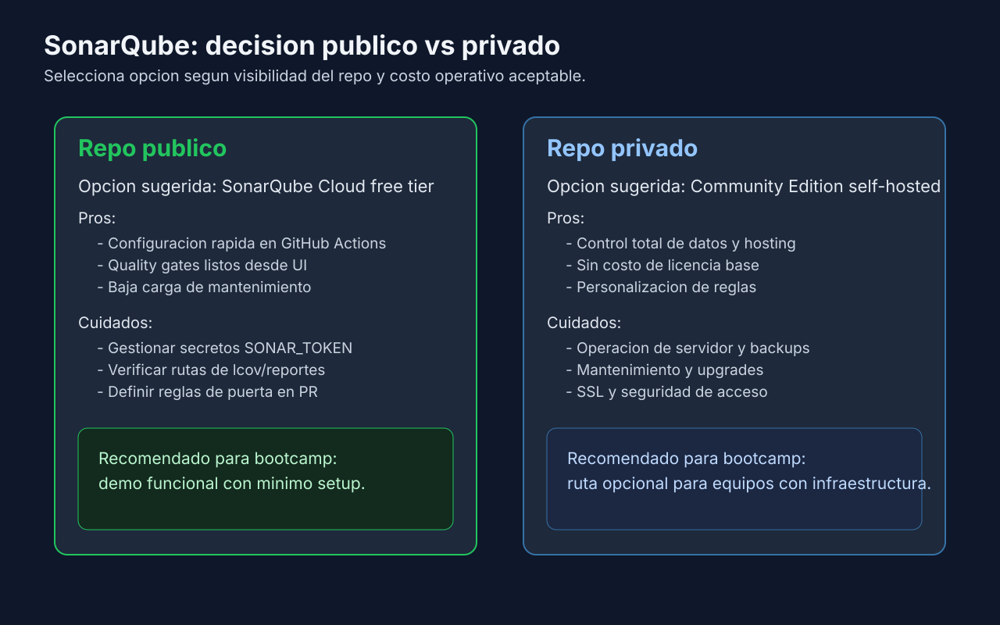

# 02 - Plantilla Minima GitHub Actions + SonarQube

## Objetivo

Definir una configuracion base para automatizar tests, coverage y quality gate minimo en proyectos JavaScript.



---

## Lenguaje de esta semana

**Aplica a**: JavaScript (Jest) y CI en GitHub Actions.

---

## Escenario recomendado segun repositorio



- **Repositorio publico**: SonarQube Cloud free tier.
- **Repositorio privado**: SonarQube Community Edition autohospedado (opcional).

---

## Plantilla minima de workflow

```yaml
name: js-quality

on:
  push:
    branches: [main]
  pull_request:

jobs:
  test-and-quality:
    runs-on: ubuntu-latest

    steps:
      - name: Checkout
        # actions/checkout@v7.0.1 (SHA pinado: el tag es mutable, el SHA no)
        uses: actions/checkout@3d3c42e5aac5ba805825da76410c181273ba90b1
        with:
          fetch-depth: 0

      - name: Setup pnpm
        # pnpm/action-setup@v6.1.0 (sin "version": lee "packageManager" de package.json)
        uses: pnpm/action-setup@ea17c68df8912ef543352723c149a84f56e3d413

      - name: Setup Node
        # actions/setup-node@v7.0.0
        # Sin "cache: pnpm": esa opcion exige pnpm-lock.yaml y este repo no versiona lockfiles
        uses: actions/setup-node@820762786026740c76f36085b0efc47a31fe5020
        with:
          node-version: 22

      - name: Install dependencies
        run: pnpm install

      - name: Run tests with coverage
        run: pnpm test:coverage

      - name: SonarQube Scan
        # SonarSource/sonarqube-scan-action@v8.2.2
        # Con sonar.qualitygate.wait=true este paso falla si el quality gate no se cumple
        uses: SonarSource/sonarqube-scan-action@ba9859eae8dd6bd29e412f25ddbbef3d032000f4
        env:
          SONAR_TOKEN: ${{ secrets.SONAR_TOKEN }}
          # Solo para SonarQube Server/Community autohospedado (en Cloud no hace falta):
          # SONAR_HOST_URL: ${{ secrets.SONAR_HOST_URL }}
```

---

## Plantilla minima de `sonar-project.properties`

```properties
# Identificacion del proyecto (SonarQube Cloud: copia los valores de tu organizacion y proyecto)
sonar.organization=your-organization-key
sonar.projectKey=bootcamp-js-quality
sonar.projectName=Bootcamp JS Quality

# Codigo fuente y tests viven en src/: los tests se excluyen de sources
# para que ningun archivo se indexe dos veces ("File can't be indexed twice").
sonar.sources=src
sonar.exclusions=**/*.test.js
sonar.tests=src
sonar.test.inclusions=**/*.test.js

# Cobertura generada por `pnpm test:coverage` (Jest escribe coverage/lcov.info)
sonar.javascript.lcov.reportPaths=coverage/lcov.info
sonar.sourceEncoding=UTF-8

# El scanner espera el resultado del quality gate y falla el job si no se cumple
sonar.qualitygate.wait=true
```

---

## Notas clave para que funcione

1. El paso de tests (`pnpm test:coverage`) debe generar `coverage/lcov.info` antes del scan.
2. `SONAR_TOKEN` es obligatorio en los secretos de GitHub.
3. En SonarQube Cloud (repo publico) basta con `SONAR_TOKEN` y `sonar.organization`; el host por defecto ya es Cloud.
4. En servidor propio (Community Edition), agrega el secreto `SONAR_HOST_URL` con la URL interna.
5. `sonar.qualitygate.wait=true` hace que el scanner espere el resultado del quality gate y marque el job en rojo si falla. Sin esa linea el pipeline pasa aunque el gate falle.
6. `sonar.sources` y `sonar.tests` apuntan a la misma carpeta, asi que los tests se excluyen de `sources` con `sonar.exclusions`. Si no, el analisis falla con `File can't be indexed twice`.
7. Las actions se fijan por SHA (con la version en un comentario) porque un tag como `v7` puede moverse; el SHA es inmutable.
8. `pnpm/action-setup` sin `version` lee el campo `packageManager` de `package.json` (su sucesor `pnpm/setup` solo soporta pnpm 11+, y este bootcamp fija pnpm 10). No usamos `cache: pnpm` en `actions/setup-node` porque exige `pnpm-lock.yaml` y este bootcamp no versiona lockfiles; si tu proyecto si lo versiona, agrega `cache: pnpm`.

---

## Errores frecuentes

- No subir `fetch-depth: 0` y perder contexto de analisis.
- Ejecutar scanner sin coverage previo.
- Configurar rutas de tests/cobertura que no existen (por ejemplo `sonar.sources=src` cuando el codigo esta en la raiz).
- Olvidar `sonar.exclusions` cuando tests y codigo comparten carpeta.
- Esperar quality gate util sin definir reglas minimas de calidad.
