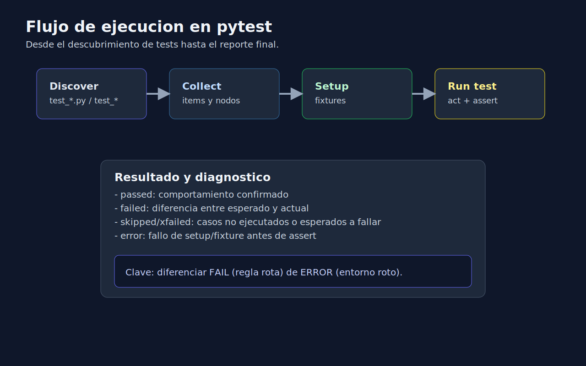

# 01 - Introduccion a pytest y Flujo de Ejecucion

## Objetivo

Comprender como funciona `pytest` desde cero y como se organiza una suite basica en Python.



---

## Lenguaje de esta semana

**Aplica a**: Python.

---

## Que es pytest

`pytest` es un framework de testing para Python orientado a simplicidad, legibilidad y extensibilidad.

Ventajas iniciales:

- deteccion automatica de tests,
- asserts nativos de Python,
- mensajes de error claros,
- soporte nativo para fixtures.

---

## Convenciones basicas

- Archivos: `test_*.py` o `*_test.py`.
- Funciones de test: `test_*`.
- Nombres descriptivos en `snake_case`.

Ejemplo minimo:

```python
def test_add_returns_sum_when_inputs_are_valid():
    result = 2 + 3
    assert result == 5
```

---

## Flujo de ejecucion simplificado

1. `pytest` descubre archivos y funciones de test.
2. Ejecuta setup (si hay fixtures).
3. Corre cada test de manera aislada.
4. Reporta `passed`, `failed`, `skipped`.

---

## Comandos utiles de inicio

```bash
pytest
pytest -q
pytest -k "keyword"
pytest -x
```

- `-q`: salida resumida.
- `-k`: filtra por nombre.
- `-x`: detiene en el primer fallo.

---

## Errores comunes al iniciar

- Escribir funciones sin prefijo `test_`.
- Mezclar muchos comportamientos en un solo test.
- Crear asserts ambiguos (`assert result`).
- No aislar datos entre pruebas.

---

## Criterio profesional desde el inicio

Un test util responde: "que comportamiento garantiza este test?"
Si no puedes responderlo en una frase, probablemente el test esta mal enfocado.

---

## Checklist rapido

- [ ] Se ejecuta `pytest` sin errores de descubrimiento.
- [ ] Los nombres de test describen comportamiento.
- [ ] Existe al menos un test de error, no solo happy path.
