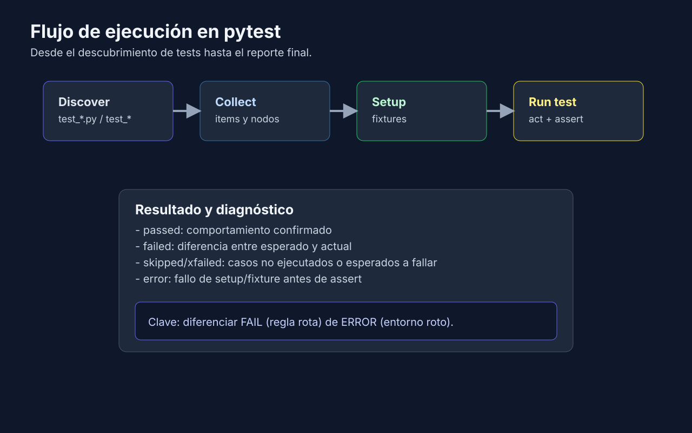
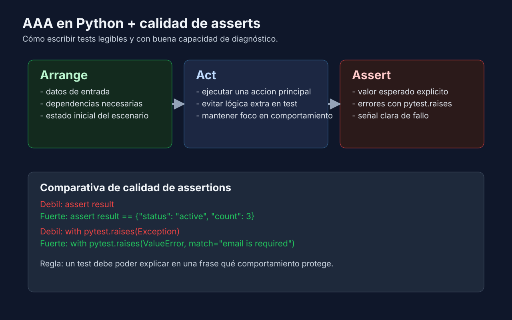

# 01 - Repaso de la semana 04 y entorno de pytest

## Objetivo

Recuperar en pocos minutos lo visto en la semana 04 y dominar el entorno de pytest que usarás toda la etapa 2: resultados posibles de un test (incluido `error`), configuración en `pyproject.toml` y comandos para inspeccionar fixtures.



---

## Lenguaje de esta semana

**Aplica a**: Python (Python 3.14, pytest 9, `uv`).

---

## Repaso express de la semana 04



- **Entorno**: cada carpeta con `pyproject.toml` se prepara con `uv sync` y se ejecuta con `uv run pytest` (instalación de Python 3.14 y `uv` en la [semana 04](../../week-04-primeros_tests_automatizados_con_python/1-teoria/01-setup-pytest.md)).
- **Descubrimiento**: archivos `test_*.py`, funciones `test_*`, métodos `test_*` dentro de clases `Test*`.
- **Nombres**: `test_[context]_[expected]_when_[condition]` en `snake_case`.
- **AAA**: `# Arrange / # Act / # Assert` visibles en cada test.
- **Asserts**: `assert` nativo contra un valor concreto; errores esperados con `pytest.raises(ValueError, match="...")`.
- **Filtros**: `-v`, `-q`, `-x` y `-k "palabra"`.

Si alguno de estos puntos no te resulta familiar, repasa la [teoría de la semana 04](../../week-04-primeros_tests_automatizados_con_python/README.md) antes de seguir. Esta semana se centra en **fixtures** y en el **entorno de pytest**.

---

## Los seis resultados de un test

| Resultado | Letra | Significado |
|---|---|---|
| `passed` | `.` | El test terminó y todos sus asserts se cumplieron. |
| `failed` | `F` | El **cuerpo del test** falló: un assert no se cumplió o saltó una excepción inesperada dentro del test. |
| `error` | `E` | Falló el **setup o el teardown de una fixture**: el test ni siquiera llegó a ejecutarse (o se ejecutó, pero su limpieza falló). |
| `skipped` | `s` | El test se saltó a propósito (`@pytest.mark.skip`). |
| `xfailed` | `x` | Se esperaba que fallara (`@pytest.mark.xfail`) y falló. |
| `xpassed` | `X` | Se esperaba que fallara y pasó: revisa si el bug ya está corregido. |

`skip` y `xfail` se estudian a fondo en la semana 17. Lo importante ahora es la diferencia entre **failed** y **error**:

- **failed**: la regla de negocio está rota o la expectativa del test es incorrecta. Revisa el código bajo prueba o el assert.
- **error**: el escenario no se pudo preparar o limpiar. Revisa la fixture (conexión, archivo, dependencia entre fixtures), no la regla de negocio.

Ejemplo con los seis resultados en un mismo archivo:

```python
import pytest


@pytest.fixture
def broken_connection():
    raise ConnectionError("database is not reachable")


def test_total_is_sum_when_items_are_valid():
    assert 2 + 3 == 5


def test_total_applies_discount_when_customer_is_premium():
    assert 100 * 0.9 == 80


@pytest.mark.skip(reason="pending payment gateway")
def test_payment_is_accepted_when_card_is_valid():
    assert True


@pytest.mark.xfail(reason="known rounding bug")
def test_total_rounds_to_cents_when_price_has_decimals():
    assert round(2.675, 2) == 2.68


@pytest.mark.xfail(reason="bug fixed already?")
def test_total_is_zero_when_cart_is_empty():
    assert sum([]) == 0


def test_items_are_loaded_when_database_is_available(broken_connection):
    assert broken_connection is not None
```

Salida real de `uv run pytest` (con `addopts = ["-ra"]`, ver más abajo):

```text
tests/test_outcomes.py .FsxXE                                            [100%]

==================================== ERRORS ====================================
______ ERROR at setup of test_items_are_loaded_when_database_is_available ______

    @pytest.fixture
    def broken_connection():
>       raise ConnectionError("database is not reachable")
E       ConnectionError: database is not reachable

tests/test_outcomes.py:6: ConnectionError
=================================== FAILURES ===================================
_____________ test_total_applies_discount_when_customer_is_premium _____________

    def test_total_applies_discount_when_customer_is_premium():
>       assert 100 * 0.9 == 80
E       assert (100 * 0.9) == 80

tests/test_outcomes.py:14: AssertionError
=========================== short test summary info ============================
SKIPPED [1] tests/test_outcomes.py:17: pending payment gateway
XFAIL tests/test_outcomes.py::test_total_rounds_to_cents_when_price_has_decimals - known rounding bug
XPASS tests/test_outcomes.py::test_total_is_zero_when_cart_is_empty - bug fixed already?
ERROR tests/test_outcomes.py::test_items_are_loaded_when_database_is_available - ConnectionError: database is not reachable
FAILED tests/test_outcomes.py::test_total_applies_discount_when_customer_is_premium - assert (100 * 0.9) == 80
==== 1 failed, 1 passed, 1 skipped, 1 xfailed, 1 xpassed, 1 error in 0.02s =====
```

Fíjate en el encabezado `ERROR at setup of ...`: pytest te dice en qué fase falló. Si el fallo ocurre después del `yield` de una fixture, verás `ERROR at teardown of ...`.

---

## Configuración en `pyproject.toml`

Desde pytest 9 la configuración va en la tabla nativa `[tool.pytest]` del `pyproject.toml` de cada ejercicio:

```toml
[tool.pytest]
pythonpath = ["."]
testpaths = ["tests"]
addopts = ["-ra"]
```

- `pythonpath`: carpetas que se agregan a `sys.path` para importar el código bajo prueba desde los tests.
- `testpaths`: dónde buscar tests cuando ejecutas `uv run pytest` sin argumentos. Evita que pytest recorra carpetas que no son de tests.
- `addopts`: opciones que se agregan siempre a la línea de comandos. `-ra` muestra al final un resumen de todo lo que no sea `passed` (skipped, xfailed, xpassed, error y failed).

Una sola fuente de configuración: si existe un `pytest.ini` en la misma carpeta, pytest lo usa e ignora el `pyproject.toml`.

---

## Inspeccionar fixtures desde la terminal

| Comando | Qué muestra |
|---|---|
| `uv run pytest --setup-show` | Orden real de SETUP y TEARDOWN de cada fixture, con su scope (`F`, `C`, `M`, `P`, `S`). |
| `uv run pytest --fixtures` | Todas las fixtures disponibles (integradas y propias), con su scope, archivo y docstring. |
| `uv run pytest -s` | Desactiva la captura de salida: ves los `print` de tests y fixtures en el momento en que ocurren. |

Final de la salida real de `uv run pytest --fixtures` en el ejercicio 02:

```text
------------------------ fixtures defined from conftest ------------------------
clean_museum_env -- tests/conftest.py:20
    Elimina MUSEUM_NAME para que ningún test dependa del entorno de la máquina.

sample_exhibits -- tests/conftest.py:7
    Tres piezas del Museo listas para exportar o imprimir.
```

El docstring de la fixture es la documentación que ve el resto del equipo: escríbelo siempre en las fixtures compartidas.

---

## Checklist rápido

- [ ] Distingo `failed` (regla rota) de `error` (setup o teardown roto).
- [ ] Mi `pyproject.toml` define `pythonpath` y, si hay carpeta `tests/`, `testpaths`.
- [ ] Sé usar `--setup-show` y `--fixtures` para entender qué fixtures usa un test.

---

→ [Fixtures a fondo: yield, scopes y composición](./02-fixtures-yield-scopes-y-composicion.md) | [Volver al README](../README.md)
