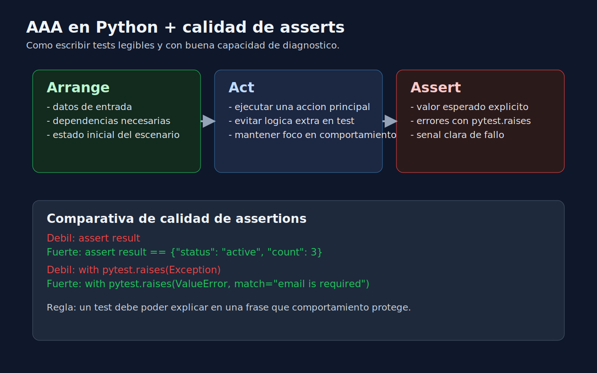

# 02 - Asserts Efectivos y Patron AAA en Python

## Objetivo

Escribir tests que fallen por la razon correcta usando asserts claros y estructura AAA.



---

## Lenguaje de esta semana

**Aplica a**: Python.

---

## Patron AAA

1. **Arrange**: preparar datos y dependencias.
2. **Act**: ejecutar la accion bajo prueba.
3. **Assert**: verificar el resultado esperado.

Ejemplo:

```python
def test_calculate_discount_returns_expected_total_when_percent_is_valid():
    # Arrange
    price = 100
    percent = 20

    # Act
    result = calculate_discount(price, percent)

    # Assert
    assert result == 80
```

---

## Asserts debiles vs fuertes

Debil:

```python
assert result
```

Fuerte:

```python
assert result == {"status": "active", "count": 3}
```

El assert fuerte describe contrato esperado y acelera diagnostico.

---

## Asserts para errores esperados

```python
import pytest


def test_create_user_raises_error_when_email_is_empty():
    with pytest.raises(ValueError, match="email is required"):
        create_user(email="")
```

Recomendaciones:

- valida tipo de excepcion,
- valida mensaje relevante con `match`.

---

## Heuristicas de calidad de assert

- Debe fallar si la regla de negocio se rompe.
- Debe evitar detalles internos de implementacion.
- Debe comunicar claramente la expectativa.

---

## Anti-patrones frecuentes

- Un test con 5 reglas no relacionadas.
- Asserts redundantes sin valor diagnostico.
- Assert del tipo "no explota" sin validar resultado.
- Copiar/pegar setup en cada test sin necesidad.

---

## Mini checklist

- [ ] Cada test tiene AAA visible.
- [ ] Los asserts comparan valor esperado concreto.
- [ ] Errores esperados usan `pytest.raises`.
- [ ] Cada test tiene una razon principal de fallo.
