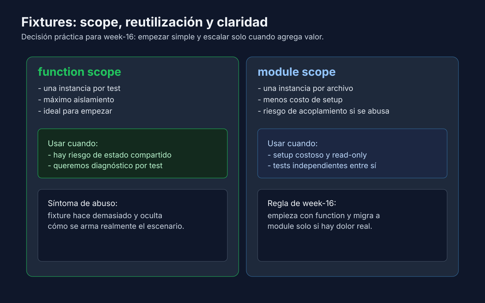

# 02 - Fixtures a fondo: yield, scopes y composición

## Objetivo

Pasar de las funciones helper de la semana 04 a fixtures que preparan **y limpian** estado, elegir su scope con criterio y componerlas entre sí.



---

## Lenguaje de esta semana

**Aplica a**: Python.

---

## De helper a fixture

En la semana 04 centralizaste setup con funciones helper (`build_user()`). Una fixture hace lo mismo, pero pytest la ejecuta por ti y se la entrega al test que la pide como parámetro:

```python
import pytest


@pytest.fixture
def sample_user():
    return {"id": "u-1", "name": "Ada", "active": True}


def test_user_is_active_when_created_by_default(sample_user):
    # Assert
    assert sample_user["active"] is True
```

La ventaja real aparece cuando el setup necesita **limpieza** o cuando conviene **reutilizar** una instancia entre tests: eso es lo que resuelven `yield` y los scopes.

---

## Fixtures con `yield`: setup y teardown

Todo lo que va antes de `yield` es setup; el valor entregado es lo que recibe el test; lo que va después es teardown.

```python
import pytest


class TicketStore:
    def __init__(self):
        self.is_open = False
        self.tickets = []

    def open(self):
        self.is_open = True

    def close(self):
        self.tickets.clear()
        self.is_open = False


@pytest.fixture
def ticket_store():
    store = TicketStore()
    store.open()
    print("\n[setup] store abierto")
    yield store
    store.close()
    print("[teardown] store cerrado")


def test_store_is_empty_when_opened(ticket_store):
    assert ticket_store.tickets == []


def test_store_keeps_ticket_when_added(ticket_store):
    ticket_store.tickets.append("T-1")
    assert ticket_store.tickets == ["T-1"]
```

Salida real de `uv run pytest -s -q` (`-s` deja ver los `print`):

```text
[setup] store abierto
.[teardown] store cerrado

[setup] store abierto
.[teardown] store cerrado

2 passed in 0.01s
```

Reglas clave:

- El teardown se ejecuta **aunque el test falle**: es el lugar para cerrar conexiones, borrar archivos o restaurar estado. Por eso la limpieza no depende de que el test llegue al final.
- Si el setup (antes de `yield`) lanza una excepción, el test no se ejecuta y el resultado es `error`, no `failed`.
- Si el teardown lanza una excepción, verás `ERROR at teardown of ...` además del resultado del test.
- Usa `yield` solo cuando haya algo que limpiar; si la fixture solo construye datos, `return` es suficiente.

---

## Scopes: cuándo se crea y se destruye cada fixture

| Scope | Se crea una vez por... | Letra en `--setup-show` | Úsalo para |
|---|---|---|---|
| `function` (por defecto) | test | `F` | Estado que el test modifica. Máximo aislamiento. |
| `class` | clase `Test*` | `C` | Datos de solo lectura comunes a un grupo de tests. |
| `module` | archivo de test | `M` | Setup costoso de solo lectura usado en un archivo. |
| `package` | paquete (carpeta) de tests | `P` | Setup costoso compartido por todos los archivos de una carpeta. |
| `session` | ejecución completa de pytest | `S` | Recursos globales caros y de solo lectura (configuración, contenedores). |

Ejemplo con los cinco scopes. `tests/conftest.py`:

```python
import pytest


@pytest.fixture(scope="session")
def app_config():
    return {"currency": "EUR"}


@pytest.fixture(scope="package")
def price_catalog(app_config):
    return {"ticket": 12, "currency": app_config["currency"]}
```

`tests/test_scopes.py`:

```python
import pytest


@pytest.fixture(scope="module")
def discount_rules():
    return {"student": 0.5}


@pytest.fixture(scope="class")
def student_profile(discount_rules):
    return {"type": "student", "rate": discount_rules["student"]}


@pytest.fixture
def cart(price_catalog):
    return {"items": [], "catalog": price_catalog}


class TestStudentPricing:
    def test_rate_is_half_when_visitor_is_student(self, student_profile):
        assert student_profile["rate"] == 0.5

    def test_cart_starts_empty_when_student_opens_it(self, student_profile, cart):
        assert cart["items"] == []


def test_cart_uses_catalog_currency_when_created(cart):
    assert cart["catalog"]["currency"] == "EUR"
```

Salida real de `uv run pytest --setup-show`:

```text
tests/test_scopes.py 
    SETUP    M discount_rules
      SETUP    C student_profile (fixtures used: discount_rules)
        tests/test_scopes.py::TestStudentPricing::test_rate_is_half_when_visitor_is_student (fixtures used: discount_rules, student_profile) .
SETUP    S app_config
  SETUP    P price_catalog (fixtures used: app_config)
        SETUP    F cart (fixtures used: price_catalog)
        tests/test_scopes.py::TestStudentPricing::test_cart_starts_empty_when_student_opens_it (fixtures used: app_config, cart, discount_rules, price_catalog, student_profile) .
        TEARDOWN F cart
      TEARDOWN C student_profile
        SETUP    F cart (fixtures used: price_catalog)
        tests/test_scopes.py::test_cart_uses_catalog_currency_when_created (fixtures used: app_config, cart, price_catalog) .
        TEARDOWN F cart
    TEARDOWN M discount_rules
  TEARDOWN P price_catalog
TEARDOWN S app_config
```

Cómo leerla:

- Las fixtures se crean **solo cuando un test las pide**: `app_config` no aparece hasta el segundo test, el primero que necesita `cart`.
- `cart` (`F`) se crea y destruye en cada test que la usa.
- `student_profile` (`C`) se destruye al terminar la clase `TestStudentPricing`.
- `discount_rules` (`M`), `price_catalog` (`P`) y `app_config` (`S`) se destruyen al final del archivo, del paquete y de la sesión.

Criterio: empieza siempre con `function`. Amplía el scope solo cuando el setup sea costoso **y** el valor sea de solo lectura; un scope amplio con estado mutable hace que un test dependa del orden de ejecución.

---

## Fixtures que usan otras fixtures

Una fixture pide otras fixtures como parámetros, igual que un test. Así cada fixture hace una sola cosa y los escenarios se construyen por capas:

```python
@pytest.fixture
def registry():
    registry = SessionRegistry()
    registry.open()
    yield registry
    registry.close()


@pytest.fixture
def registry_with_show(registry):
    registry.add_session("Sistema solar", seats=10)
    return registry
```

pytest crea primero `registry`, después `registry_with_show`, y al terminar el test ejecuta el teardown de `registry`. Lo practicarás en el ejercicio 01.

La regla de composición: una fixture solo puede usar fixtures de scope **igual o más amplio**. Una fixture `module` no puede pedir una `function`, porque la `function` desaparece tras cada test:

```python
import pytest


@pytest.fixture
def visitor():
    return {"name": "Ada"}


@pytest.fixture(scope="module")
def guided_tour(visitor):
    return {"guide": "Luis", "visitors": [visitor]}


def test_tour_has_one_visitor_when_created(guided_tour):
    assert len(guided_tour["visitors"]) == 1
```

Salida real (extracto): el resultado es `error`, porque falla el setup, no el test.

```text
E                                                                        [100%]
==================================== ERRORS ====================================
___________ ERROR at setup of test_tour_has_one_visitor_when_created ___________
ScopeMismatch: You tried to access the function scoped fixture visitor with a module scoped request object. Requesting fixture stack:
tests/test_mismatch.py:9:  def guided_tour(visitor)
Requested fixture:
tests/test_mismatch.py:4:  def visitor()
```

---

## Riesgos si abusas de fixtures

- Cadenas de 4 o 5 fixtures para un dato simple: el lector tiene que saltar entre funciones para entender el escenario.
- Fixtures con scope amplio que se modifican en un test: el siguiente test hereda el cambio.
- Una fixture "para todo" con parámetros y condicionales: mejor varias fixtures pequeñas.

Regla: usa una fixture cuando evita duplicación real, necesita teardown o comparte un recurso costoso; para un dato que solo usa un test, déjalo en el Arrange.

---

## Checklist

- [ ] Uso `yield` cuando hay algo que limpiar y `return` cuando no.
- [ ] Mis fixtures usan scope `function` salvo que haya un motivo medido para ampliarlo.
- [ ] Sé leer `--setup-show` y explicar cuándo se crea y destruye cada fixture.
- [ ] Ninguna fixture depende de otra de scope más estrecho.

---

← [Repaso de la semana 04 y entorno de pytest](./01-repaso-y-entorno-pytest.md) | [Volver al README](../README.md) | → [conftest.py, autouse y fixtures integradas](./03-conftest-autouse-y-fixtures-integradas.md)
