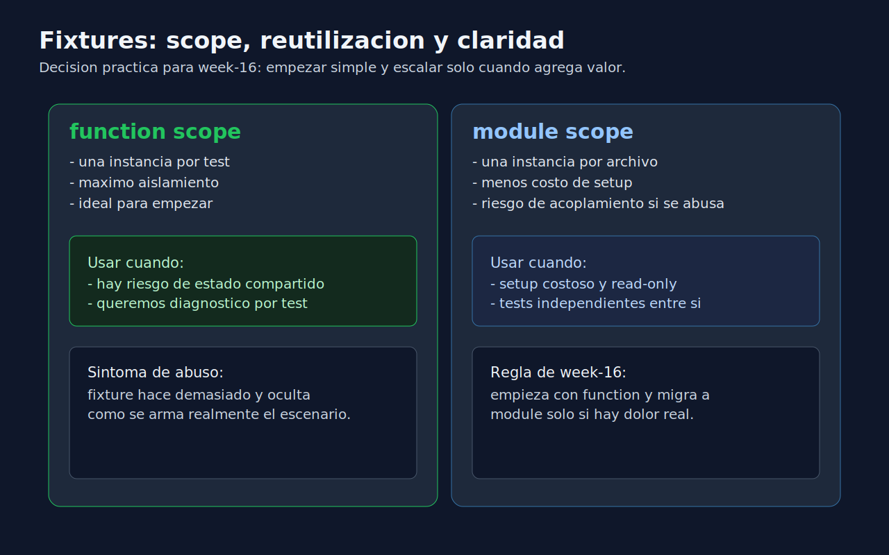

# 03 - Fixtures Basicas para Reducir Duplicacion

## Objetivo

Usar fixtures de `pytest` para compartir setup, simplificar tests y mejorar mantenibilidad.



---

## Lenguaje de esta semana

**Aplica a**: Python.

---

## Que es una fixture

Una fixture es una funcion decorada con `@pytest.fixture` que prepara y entrega datos/dependencias para tests.

Ejemplo:

```python
import pytest


@pytest.fixture
def sample_user():
    return {"id": "u-1", "name": "Ada", "active": True}
```

Uso en test:

```python
def test_user_is_active_by_default(sample_user):
    assert sample_user["active"] is True
```

---

## Beneficios directos

- evita duplicar setup,
- mejora legibilidad,
- facilita cambios de datos compartidos,
- permite evolucionar a escenarios mas complejos.

---

## Scope basico (idea inicial)

- `function`: nueva instancia por test.
- `module`: una instancia por archivo.

Para empezar en week-16, prioriza `function` por aislamiento.

---

## Cuando mover a `conftest.py`

Mueve una fixture a `conftest.py` cuando:

- se usa en multiples archivos,
- representa un setup transversal del modulo,
- quieres evitar imports repetitivos de fixtures.

---

## Ejemplo de refactor con fixture

Antes (duplicado):

```python
def test_a():
    user = {"id": "u-1", "name": "Ada"}
    assert user["name"] == "Ada"


def test_b():
    user = {"id": "u-1", "name": "Ada"}
    assert user["id"] == "u-1"
```

Despues (reusable):

```python
import pytest


@pytest.fixture
def user():
    return {"id": "u-1", "name": "Ada"}


def test_a(user):
    assert user["name"] == "Ada"


def test_b(user):
    assert user["id"] == "u-1"
```

---

## Riesgos si abusas de fixtures

- ocultar demasiado setup y perder claridad,
- encadenar fixtures sin necesidad,
- usar fixtures para todo en lugar de datos locales simples.

Regla: usa fixture cuando realmente mejora claridad o evita duplicacion significativa.

---

## Checklist minimo

- [ ] Al menos una fixture en ejercicios de la semana.
- [ ] Fixture con nombre descriptivo.
- [ ] Tests siguen siendo faciles de leer sin "magia" oculta.
