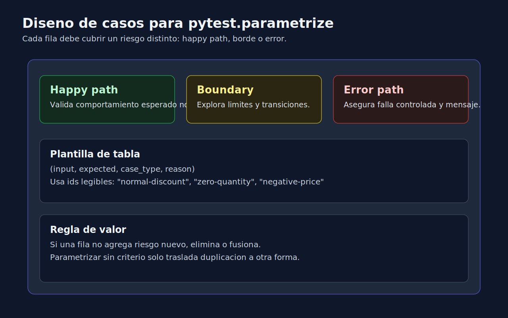

# 01 - Parametrizacion Efectiva con pytest

## Objetivo

Aprender a diseñar pruebas parametrizadas que reduzcan duplicacion sin perder claridad diagnostica.



---

## Lenguaje de esta semana

**Aplica a**: Python.

---

## Cuando usar `@pytest.mark.parametrize`

Usa parametrizacion cuando varias pruebas comparten:

- misma logica de test,
- distinta combinacion de entradas/salidas,
- mismo criterio de validacion.

No la uses si cada caso requiere setup muy distinto o asserts completamente diferentes.

---

## Estructura base

```python
import pytest


@pytest.mark.parametrize(
    "price,is_premium,expected",
    [
        (100, False, 100),
        (100, True, 90),
        (50, True, 45),
    ],
)
def test_calculate_total_returns_expected(price, is_premium, expected):
    result = calculate_total(price=price, is_premium=is_premium)
    assert result == expected
```

---

## Diseño de tabla de casos

Incluye al menos tres tipos:

1. **Happy path**: comportamiento esperado normal.
2. **Boundary**: valores limites.
3. **Error path**: entradas invalidas o inconsistentes.

---

## Mejora de legibilidad con ids

```python
@pytest.mark.parametrize(
    "qty,expected_status",
    [(0, "empty"), (1, "available")],
    ids=["zero-quantity", "positive-quantity"],
)
def test_item_status_depends_on_quantity(qty, expected_status):
    assert resolve_status(qty) == expected_status
```

Los `ids` ayudan a leer reportes y detectar rapido que caso fallo.

---

## Errores frecuentes

- Parametrizar demasiadas columnas en una sola prueba.
- Mezclar casos de exito y error sin estructura.
- Repetir casos equivalentes sin nuevo valor.
- No documentar por que cada fila existe.

---

## Heuristica practica

Cada fila de `parametrize` debe responder:

"Que riesgo nuevo cubre este caso que el anterior no cubria?"

Si no hay respuesta clara, el caso probablemente sobra.

---

## Checklist

- [ ] Tabla cubre happy path, borde y error.
- [ ] Los nombres/ids facilitan diagnostico.
- [ ] No hay filas duplicadas sin valor.
