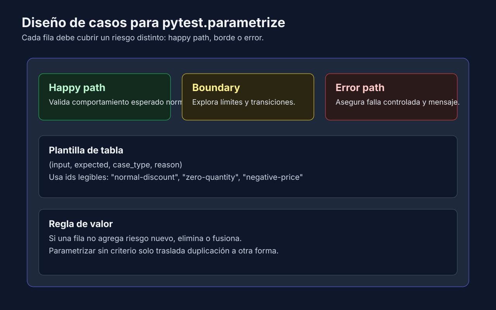

# 01 - Parametrización Efectiva con pytest

## Objetivo

Aprender a diseñar pruebas parametrizadas que reduzcan duplicación sin perder claridad diagnóstica.



---

## Lenguaje de esta semana

**Aplica a**: Python.

---

## Cuándo usar `@pytest.mark.parametrize`

Usa parametrización cuando varias pruebas comparten:

- misma lógica de test,
- distinta combinación de entradas/salidas,
- mismo criterio de validación.

No la uses si cada caso requiere setup muy distinto o asserts completamente diferentes.

---

## Estructura base

```python
import pytest


def calculate_total(price: float, is_premium: bool) -> float:
    return price * 0.9 if is_premium else price


@pytest.mark.parametrize(
    "price,is_premium,expected",
    [
        (100, False, 100),
        (100, True, 90),
        (50, True, 45),
    ],
)
def test_calculate_total_returns_expected_when_membership_varies(
    price, is_premium, expected
):
    # Act
    result = calculate_total(price=price, is_premium=is_premium)

    # Assert
    assert result == expected
```

El primer argumento nombra los parámetros (separados por comas) y el segundo es la lista de filas. pytest genera un test por fila.

---

## Diseño de tabla de casos

Incluye al menos tres tipos:

1. **Happy path**: comportamiento esperado normal.
2. **Boundary**: valores límite. Si hay un rango, prueba **cada** límite (justo por debajo y justo en el valor), no solo uno.
3. **Error path**: entradas inválidas o inconsistentes.

---

## Mejora de legibilidad con `ids`

Sin `ids`, pytest nombra cada caso con sus valores (`test_x[0-empty]`). Con `ids=` le das un nombre de negocio:

```python
import pytest


def resolve_status(qty: int) -> str:
    return "available" if qty > 0 else "empty"


@pytest.mark.parametrize(
    "qty,expected_status",
    [(0, "empty"), (1, "available")],
    ids=["zero-quantity", "positive-quantity"],
)
def test_resolve_status_returns_expected_when_quantity_varies(qty, expected_status):
    # Act
    status = resolve_status(qty)

    # Assert
    assert status == expected_status
```

```text
$ uv run pytest -v
test_status.py::test_resolve_status_returns_expected_when_quantity_varies[zero-quantity] PASSED [ 50%]
test_status.py::test_resolve_status_returns_expected_when_quantity_varies[positive-quantity] PASSED [100%]
```

Los `ids` ayudan a leer reportes, detectar rápido qué caso falló y seleccionarlo con `-k` (ver teoría 03).

---

## `pytest.param`: id y marks por fila

`ids=` obliga a mantener dos listas alineadas. `pytest.param` junta en cada fila los valores, su `id` y, si hace falta, `marks` que solo aplican a ese caso:

```python
import pytest


def resolve_status(qty: int) -> str:
    return "available" if qty > 0 else "empty"


@pytest.mark.parametrize(
    "qty,expected_status",
    [
        pytest.param(0, "empty", id="zero-quantity"),
        pytest.param(1, "available", id="positive-quantity"),
        pytest.param(
            -1,
            "invalid",
            id="negative-quantity",
            marks=pytest.mark.xfail(reason="bug conocido: -1 se trata como empty"),
        ),
    ],
)
def test_resolve_status_returns_expected_when_quantity_varies(qty, expected_status):
    # Act
    status = resolve_status(qty)

    # Assert
    assert status == expected_status
```

```text
$ uv run pytest -q
..x                                                                      [100%]
2 passed, 1 xfailed in 0.02s
```

Usa `ids=` cuando todas las filas son homogéneas y `pytest.param` cuando alguna fila necesita un mark propio (`xfail`, `skip`, `slow`...). Los marks integrados se explican en la teoría 02.

---

## Errores frecuentes

- Parametrizar demasiadas columnas en una sola prueba.
- Mezclar casos de éxito y error sin estructura.
- Repetir casos equivalentes sin nuevo valor.
- Probar solo uno de los límites de un rango.
- No documentar por qué cada fila existe.

---

## Heurística práctica

Cada fila de `parametrize` debe responder:

"¿Qué riesgo nuevo cubre este caso que el anterior no cubría?"

Si no hay respuesta clara, el caso probablemente sobra.

---

## Checklist

- [ ] La tabla cubre happy path, cada borde y error.
- [ ] Los nombres/ids facilitan el diagnóstico.
- [ ] No hay filas duplicadas sin valor.
