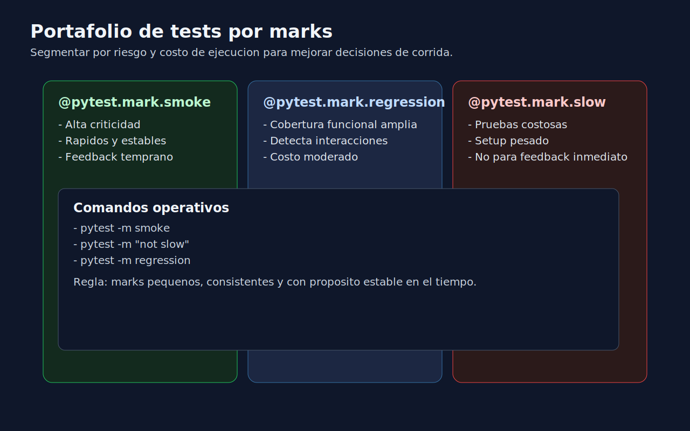

# 02 - Marks para Organizar y Priorizar Suites

## Objetivo

Usar marks de pytest para estructurar el portafolio de pruebas por nivel de riesgo y costo de ejecucion.



---

## Lenguaje de esta semana

**Aplica a**: Python.

---

## Que son los marks

Los marks son etiquetas que clasifican pruebas para:

- ejecutar subconjuntos relevantes,
- separar feedback rapido vs completo,
- priorizar validaciones criticas.

Ejemplo:

```python
import pytest


@pytest.mark.smoke
def test_health_endpoint_returns_ok():
    assert health_check() == "ok"


@pytest.mark.regression
def test_invoice_total_applies_tax_rules():
    assert calculate_invoice_total(100) == 119
```

---

## Taxonomia minima sugerida

- `smoke`: pruebas criticas y rapidas.
- `regression`: comportamiento amplio del sistema.
- `slow`: pruebas costosas o de mayor tiempo.

---

## Configurar marks en `pytest.ini`

```ini
[pytest]
markers =
    smoke: pruebas criticas de validacion rapida
    regression: pruebas de cobertura funcional amplia
    slow: pruebas de ejecucion lenta
```

---

## Comandos de ejecucion selectiva

```bash
pytest -m smoke
pytest -m "regression and not slow"
pytest -m "not slow"
```

---

## Buenas practicas

- Mantener definicion de marks documentada.
- Evitar marks redundantes por test.
- Revisar periodicamente la distribucion de pruebas por categoria.
- Alinear `smoke` con flujos de mayor impacto de negocio.

---

## Anti-patrones

- Marcar casi todo como `smoke`.
- Usar marks sin criterio de riesgo.
- Tener `slow` sin justificacion tecnica.
- Cambiar marks sin actualizar estrategia de CI.

---

## Checklist

- [ ] Existe taxonomia corta y entendible.
- [ ] Cada mark tiene proposito real.
- [ ] Los comandos `-m` devuelven suites coherentes.
