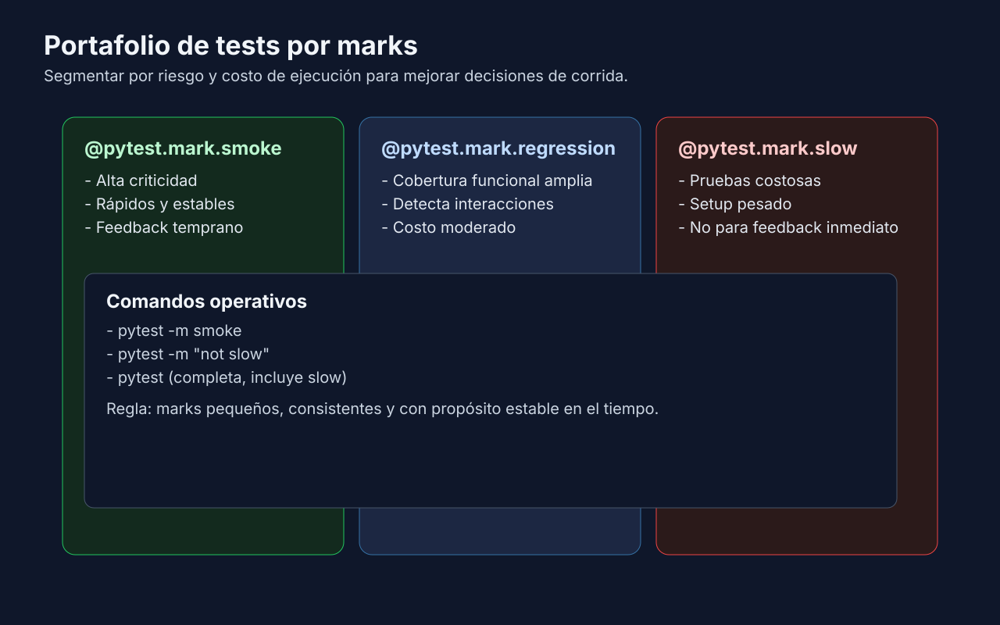

# 02 - Marks para Organizar y Priorizar Suites

## Objetivo

Usar marks de pytest para estructurar el portafolio de pruebas por nivel de riesgo y costo de ejecución, y conocer los marks integrados `skip`, `skipif` y `xfail`.



---

## Lenguaje de esta semana

**Aplica a**: Python.

---

## Qué son los marks

Los marks son etiquetas que clasifican pruebas para:

- ejecutar subconjuntos relevantes,
- separar feedback rápido vs. completo,
- priorizar validaciones críticas.

Ejemplo:

```python
import pytest


def health_check() -> str:
    return "ok"


def calculate_invoice_total(net: float) -> float:
    return round(net * 1.19, 2)


@pytest.mark.smoke
def test_health_check_returns_ok_when_service_is_up():
    assert health_check() == "ok"


@pytest.mark.regression
def test_calculate_invoice_total_adds_tax_when_net_is_positive():
    assert calculate_invoice_total(100) == 119
```

Un test puede llevar varios marks (por ejemplo `regression` y `slow`).

---

## Taxonomía mínima sugerida

- `smoke`: pruebas críticas y rápidas.
- `regression`: comportamiento amplio del sistema.
- `slow`: pruebas costosas o de mayor tiempo.

---

## Registrar marks en `pyproject.toml`

Los marks propios se registran en la tabla `[tool.pytest]` del `pyproject.toml` del proyecto (la misma donde ya están `pythonpath` y `testpaths`):

```toml
[tool.pytest]
pythonpath = ["."]
markers = [
    "smoke: pruebas críticas de validación rápida",
    "regression: pruebas de cobertura funcional amplia",
    "slow: pruebas de ejecución lenta",
]
```

`uv run pytest --markers` lista los marks registrados junto a los integrados.

> No mantengas un `pytest.ini` en paralelo: pytest busca primero `pytest.ini` y, si lo encuentra, **ignora** la configuración de `pyproject.toml`. Una sola fuente de configuración.

---

## Marks mal escritos: `--strict-markers` y `strict = true`

Un mark no registrado no rompe nada por defecto: pytest solo emite un aviso y el test **sigue corriendo**, aunque nunca entre en `-m smoke`. Con este test (`smok` en lugar de `smoke`):

```python
import pytest


@pytest.mark.smok
def test_health_check_returns_ok_when_service_is_up():
    assert "ok" == "ok"
```

Sin modo estricto, la suite queda en verde con un aviso fácil de pasar por alto:

```text
$ uv run pytest -q
.                                                                        [100%]
=============================== warnings summary ===============================
test_typo.py:4
  ./test_typo.py:4: PytestUnknownMarkWarning: Unknown pytest.mark.smok - is this a typo?  You can register custom marks to avoid this warning - for details, see https://docs.pytest.org/en/stable/how-to/mark.html
    @pytest.mark.smok

-- Docs: https://docs.pytest.org/en/stable/how-to/capture-warnings.html
1 passed, 1 warning in 0.00s
```

Con `--strict-markers`, el mismo error detiene la colección:

```text
$ uv run pytest -q --strict-markers

==================================== ERRORS ====================================
________________________ ERROR collecting test_typo.py _________________________
'smok' not found in `markers` configuration option
=========================== short test summary info ============================
ERROR test_typo.py - Failed: 'smok' not found in `markers` configuration option
!!!!!!!!!!!!!!!!!!!! Interrupted: 1 error during collection !!!!!!!!!!!!!!!!!!!!
1 error in 0.06s
```

Para no depender de recordar el flag, pytest 9 ofrece la opción `strict` en la configuración:

```toml
[tool.pytest]
strict = true
```

`strict = true` activa de una vez:

| Opción | Qué hace |
|---|---|
| `strict_markers` | Error si se usa un mark no registrado (equivale a `--strict-markers`). |
| `strict_config` | Error si la configuración tiene claves desconocidas: con `marker` en lugar de `markers`, pytest se detiene con `ERROR: Unknown config option: marker`. |
| `strict_xfail` | Los `xfail` sin `strict` explícito se comportan como `strict=True`. |
| `strict_parametrization_ids` | Error si dos casos de `parametrize` generan el mismo id. |

Recomendación: usa `strict = true` con pytest **fijado a una versión exacta** (como `pytest==9.1.1` en `[dependency-groups]`). Las versiones futuras pueden añadir comprobaciones nuevas a `strict`, y con una versión fija no te sorprenden al actualizar: las activas tú al subir la versión.

---

## Marks integrados: `skip`, `skipif` y `xfail`

pytest trae marks que no hace falta registrar:

- `skip(reason=...)`: no ejecuta el test. Útil para funcionalidad pendiente; conviene que sea temporal.
- `skipif(condición, reason=...)`: salta el test solo si la condición es verdadera (plataforma, versión de Python, dependencia opcional).
- `xfail(reason=..., strict=...)`: ejecuta el test y **espera** que falle, por ejemplo por un bug conocido aún sin corregir.

```python
import os
import sys

import pytest


def ticket_price(age: int) -> int:
    if age < 0:
        raise ValueError("age must be non-negative")
    if age < 12:
        return 0  # bug conocido: la regla vigente dice 5 para menores de 12
    return 10


@pytest.mark.skip(reason="la tarifa de grupos aún no está implementada")
def test_ticket_price_applies_group_discount_when_group_has_ten_people():
    ...


@pytest.mark.skipif(sys.platform == "win32", reason="en Windows os.sep es una barra invertida")
def test_report_path_uses_forward_slash_when_platform_is_posix():
    # Arrange
    folder, filename = "reports", "tickets.csv"

    # Act
    path = os.path.join(folder, filename)

    # Assert
    assert path == "reports/tickets.csv"


@pytest.mark.xfail(reason="bug conocido: menores de 12 deberían pagar 5", strict=True)
def test_ticket_price_returns_five_when_visitor_is_a_child():
    # Arrange
    age = 8

    # Act
    price = ticket_price(age)

    # Assert
    assert price == 5
```

`-rsx` añade al resumen el motivo de cada skip (`s`) y xfail (`x`):

```text
$ uv run pytest -q -rsx
s.x                                                                      [100%]
=========================== short test summary info ============================
SKIPPED [1] test_builtin_marks.py:15: la tarifa de grupos aún no está implementada
XFAIL test_builtin_marks.py::test_ticket_price_returns_five_when_visitor_is_a_child - bug conocido: menores de 12 deberían pagar 5
1 passed, 1 skipped, 1 xfailed in 0.02s
```

En Linux o macOS el test con `skipif` se ejecuta (`.`); en Windows aparecería como `s`.

### Por qué `strict=True` en `xfail`

Sin `strict`, si alguien corrige el bug el test pasa como `XPASS` y la suite sigue en verde: el `xfail` queda olvidado para siempre. Con `strict=True`, un `XPASS` es un fallo. Tras corregir `ticket_price` para devolver 5:

```text
$ uv run pytest -q -rsx
s.F                                                                      [100%]
=================================== FAILURES ===================================
____________ test_ticket_price_returns_five_when_visitor_is_a_child ____________
[XPASS(strict)] bug conocido: menores de 12 deberían pagar 5
=========================== short test summary info ============================
SKIPPED [1] test_builtin_marks.py:15: la tarifa de grupos aún no está implementada
1 failed, 1 passed, 1 skipped in 0.00s
```

El fallo te obliga a quitar el `xfail`, que ya no describe la realidad. Con `strict = true` en la configuración, todos los `xfail` son estrictos por defecto.

Estos marks también se aplican a un solo caso de una tabla con `pytest.param(..., marks=...)` (ver teoría 01).

---

## Comandos de ejecución selectiva

```bash
uv run pytest -m smoke
uv run pytest -m "regression and not slow"
uv run pytest -m "not slow"
```

La teoría 03 explica qué selecciona cada expresión y cuándo usarla.

---

## Buenas prácticas

- Mantener la definición de marks documentada en `markers`.
- Activar `strict = true` para que un mark mal escrito no pase desapercibido.
- Evitar marks redundantes por test.
- Revisar periódicamente la distribución de pruebas por categoría.
- Alinear `smoke` con flujos de mayor impacto de negocio.
- Dar siempre un `reason` a `skip`, `skipif` y `xfail`.

---

## Anti-patrones

- Marcar casi todo como `smoke`.
- Usar marks sin criterio de riesgo.
- Tener `slow` sin justificación técnica.
- Usar `skip` permanente para esconder tests rotos.
- Usar `xfail` sin `strict` y olvidarlo cuando el bug se corrige.
- Cambiar marks sin actualizar la estrategia de CI.

---

## Checklist

- [ ] Existe una taxonomía corta y entendible.
- [ ] Los marks están registrados en `[tool.pytest]` y el modo estricto está activo.
- [ ] Cada mark tiene propósito real.
- [ ] Cada `skip`/`skipif`/`xfail` tiene un `reason` claro.
- [ ] Los comandos `-m` devuelven suites coherentes.
