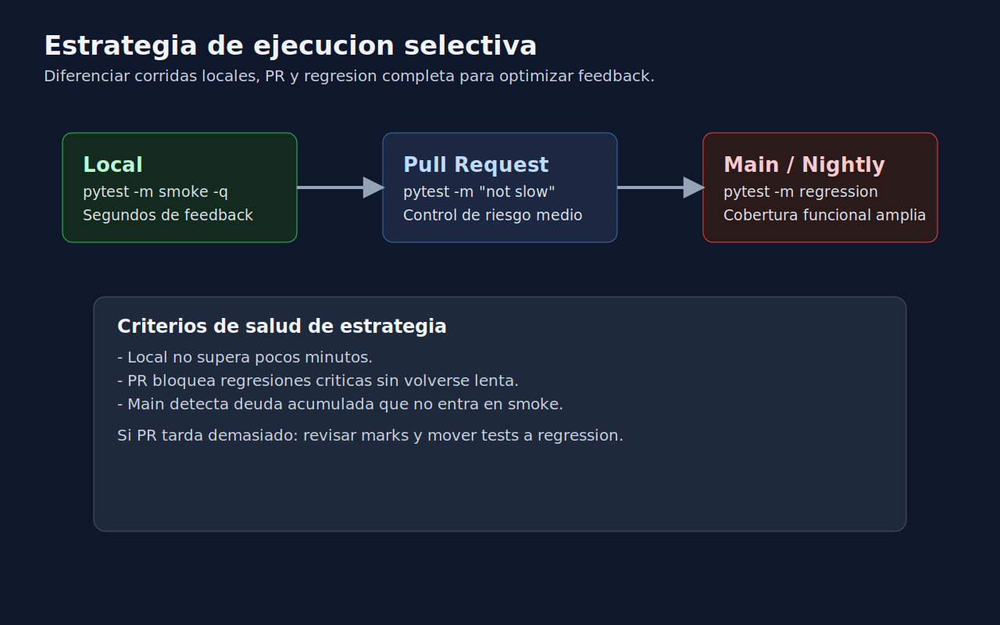

# 03 - Estrategia de Ejecucion Selectiva en CI Local

## Objetivo

Definir una estrategia pragmatica para ejecutar diferentes subconjuntos de tests segun el contexto: desarrollo local, pre-merge y regresion completa.

---

## Lenguaje de esta semana

**Aplica a**: Python.

---

## Tres niveles sugeridos

1. **Local rapido** (feedback inmediato):
   - `pytest -m smoke -q`
2. **Pre-merge** (control de riesgo):
   - `pytest -m "not slow"`
3. **Regresion completa** (seguridad amplia):
   - `pytest -m regression`

---

## Estrategia minima para CI

Pipeline recomendado:

- En pull request: `smoke` + `not slow`.
- En merge a `main`: `regression` completa.

Objetivo: reducir tiempo de espera en PR sin perder proteccion en rama principal.

---

## Ejemplo de tabla operativa

| Contexto | Comando | Objetivo |
|---|---|---|
| Desarrollo local | `pytest -m smoke -q` | Feedback en segundos |
| PR | `pytest -m "not slow"` | Bloquear regresiones evidentes |
| Main nocturno | `pytest -m regression` | Validacion funcional amplia |

---

## Como decidir que test es smoke

Un test `smoke` debe cumplir al menos dos condiciones:

- protege flujo de negocio critico,
- ejecucion rapida,
- bajo flakiness,
- diagnostico claro si falla.

---

## Señales de estrategia sana

- el equipo usa los comandos de forma consistente,
- los tiempos de CI son razonables,
- los fallos en PR son accionables,
- la regresion completa detecta deuda no visible en smoke.

---

## Riesgos a vigilar

- Smoke demasiado pequena y ciega.
- Smoke demasiado grande y lenta.
- Tests sin mark, fuera de estrategia.
- No revisar periodicidad de suite regression.

---

## Checklist de cierre

- [ ] Comandos de ejecucion definidos y documentados.
- [ ] Taxonomia de marks alineada a riesgo.
- [ ] Existe diferencia clara entre PR y main.
- [ ] Equipo entiende por que cada test pertenece a su categoria.
