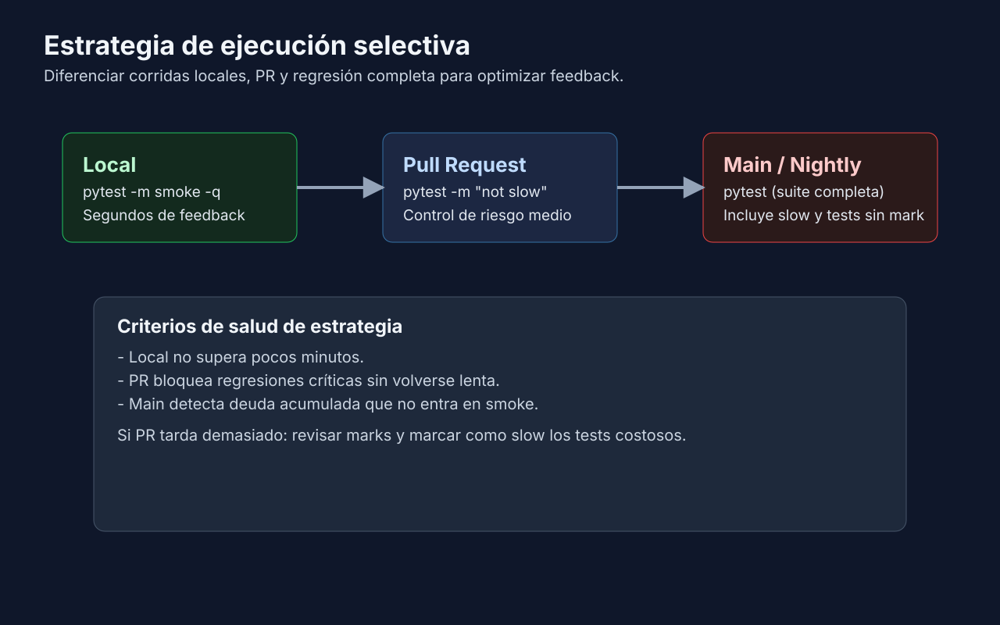

# 03 - Estrategia de Ejecución Selectiva en CI Local

## Objetivo

Definir una estrategia pragmática para ejecutar diferentes subconjuntos de tests según el contexto: desarrollo local, pre-merge y regresión completa, usando expresiones `-m` (marks) y `-k` (nombres) correctas.



---

## Lenguaje de esta semana

**Aplica a**: Python.

---

## Qué selecciona cada expresión `-m`

`-m` evalúa una expresión booleana (`and`, `or`, `not`, paréntesis) sobre los marks de cada test. Lo que **no** cumple la expresión queda como `deselected`. Ejemplos sobre la suite del ejercicio 02 (6 tests: 1 `smoke`, 4 casos `regression`, 1 `regression` + `slow`):

| Comando | Qué selecciona | Resultado |
|---|---|---|
| `pytest` | Todo, incluidos los tests sin mark | 6 tests |
| `pytest -m smoke` | Solo tests marcados `smoke` | 1 seleccionado, 5 deselected |
| `pytest -m regression` | Solo tests marcados `regression` (incluye el `slow`) | 5 seleccionados, 1 deselected |
| `pytest -m "not slow"` | Todo lo que no es `slow`: `smoke`, `regression` rápidos **y tests sin mark** | 5 seleccionados, 1 deselected |
| `pytest -m "regression and not slow"` | `regression` rápidos | 4 seleccionados, 2 deselected |
| `pytest -m "smoke or regression"` | Cualquiera de los dos marks | 6 seleccionados |

Dos consecuencias importantes:

- `pytest -m regression` **no es** la regresión completa: deja fuera los `smoke` que no llevan también `regression` y todos los tests sin mark. La suite completa es `pytest` sin `-m`.
- `-m "not slow"` ya incluye los `smoke` (salvo que alguno sea también `slow`), así que "smoke + not slow" es redundante.

---

## Seleccionar por nombre con `-k`

`-k` evalúa una expresión con `and`, `or`, `not` y paréntesis sobre los **nombres**: cada palabra se busca como subcadena (sin distinguir mayúsculas) en el nombre del test, su archivo, su clase y los ids de `parametrize` entre corchetes.

```bash
uv run pytest -k "negative or missing"             # casos cuyo nombre o id contiene alguna palabra
uv run pytest -k "order_data_varies and not zero"  # una tabla sin el caso zero-total
uv run pytest -m regression -k "not zero"          # -m y -k se combinan con AND
```

Sobre la misma suite:

```text
$ uv run pytest -q -k "negative or missing"
..                                                                       [100%]
2 passed, 4 deselected in 0.01s
$ uv run pytest -q -k "order_data_varies and not zero"
...                                                                      [100%]
3 passed, 3 deselected in 0.00s
```

| Filtro | Criterio | Uso típico |
|---|---|---|
| `-m` | Marks declarados en el código | Estrategia estable de CI (smoke, PR, nocturno) |
| `-k` | Nombres e ids | Enfoque puntual al depurar o al trabajar en una zona del código |

`-k` depende de cómo nombraste los tests: por eso importan los nombres descriptivos y los `ids`.

---

## Tres niveles sugeridos

1. **Local rápido** (feedback inmediato): `uv run pytest -m smoke -q`
2. **Pre-merge / PR** (control de riesgo): `uv run pytest -m "not slow"`: todo lo rápido, incluidos los tests sin mark.
3. **Regresión completa** (seguridad amplia): `uv run pytest`: toda la suite, incluidos los `slow`.

---

## Estrategia mínima para CI

| Contexto | Comando | Objetivo |
|---|---|---|
| Desarrollo local | `uv run pytest -m smoke -q` | Feedback en segundos |
| Pull request | `uv run pytest -m "not slow"` | Bloquear regresiones evidentes sin esperar a los tests lentos |
| Merge a `main` / nocturno | `uv run pytest` | Validación completa, incluidos los `slow` |

Objetivo: reducir el tiempo de espera en PR sin perder protección en la rama principal. Un test que no se ejecuta en ninguno de estos niveles no protege nada: revisa que ninguna expresión deje tests fuera de todos los contextos.

---

## Cómo decidir qué test es smoke

Un test `smoke` debe cumplir al menos dos condiciones:

- protege un flujo de negocio crítico,
- ejecución rápida,
- bajo flakiness,
- diagnóstico claro si falla.

---

## Señales de estrategia sana

- el equipo usa los comandos de forma consistente,
- los tiempos de CI son razonables,
- los fallos en PR son accionables,
- la regresión completa detecta deuda no visible en smoke.

---

## Riesgos a vigilar

- Smoke demasiado pequeña y ciega.
- Smoke demasiado grande y lenta.
- Creer que `-m regression` es la suite completa.
- Marks mal escritos que sacan tests de la selección sin avisar (evítalo con `strict = true`, teoría 02).
- No revisar periódicamente qué tests son `slow`.

---

## Checklist de cierre

- [ ] Comandos de ejecución definidos y documentados.
- [ ] Taxonomía de marks alineada a riesgo.
- [ ] Existe diferencia clara entre PR y main.
- [ ] Cada test entra en al menos un nivel de ejecución.
- [ ] El equipo entiende por qué cada test pertenece a su categoría.
