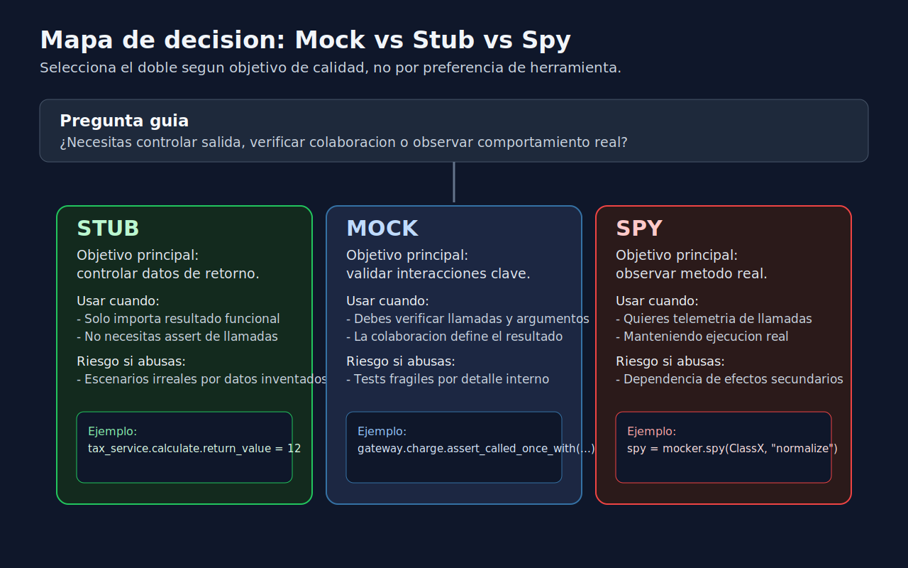

# 01 - Fundamentos de Mocking en Python
> Lenguaje: **Python**

---
## Por que no siempre conviene usar dependencias reales
En unit testing buscamos feedback rapido, estable y preciso.
Cuando una dependencia externa participa en el test (API, DB, clock, filesystem),
la prueba se vuelve mas lenta, mas fragil y mas dificil de diagnosticar.
El mocking permite reemplazar dependencias para:
- controlar entradas y salidas,
- simular errores dificiles de reproducir,
- verificar interacciones relevantes,
- mantener la prueba enfocada en una decision de negocio.
---
## Mock, Stub y Spy (sin confundirlos)
### Stub
Un **stub** devuelve datos predefinidos.
No nos interesa verificar cuantas veces se llamo.
Uso tipico:
- "Si el gateway retorna approved, el servicio confirma la orden".
### Mock
Un **mock** ademas de devolver valores permite verificar interacciones:
- si se llamo,
- con que argumentos,
- cuantas veces.
Uso tipico:
- "Debe enviar una notificacion una sola vez con el id correcto".
### Spy
Un **spy** observa una implementacion real sin reemplazarla por completo.
Permite comprobar llamadas manteniendo comportamiento original.
Uso tipico:
- validar que un metodo de normalizacion se invoco antes de persistir.
---
## Regla practica para elegir el doble
1. Si solo necesitas controlar datos de entrada/salida: **stub**.
2. Si necesitas verificar colaboraciones: **mock**.
3. Si quieres observar una pieza real concreta: **spy**.
Si no necesitas doble, no lo uses.
Menos dobles suele significar menor acoplamiento de tests.
---
## Patron AAA con dobles
```python
def test_should_confirm_order_when_gateway_approves(mocker):
    # Arrange
    gateway = mocker.Mock()
    gateway.charge.return_value = {"status": "approved"}
    service = OrderService(gateway=gateway)
    # Act
    result = service.confirm(order_id="ORD-1", amount=150)
    # Assert
    assert result == "confirmed"
    gateway.charge.assert_called_once_with("ORD-1", 150)
```
Observa que el assert funcional y el assert de interaccion
estan alineados con una sola historia de negocio.
---
## Errores comunes al empezar
- Mockear clases completas cuando solo se necesita un metodo.
- Verificar demasiadas llamadas internas irrelevantes.
- Acoplar tests al "como" y no al "que".
- Usar `MagicMock` por defecto sin pensar en contrato esperado.
---
## Que significa un test fragil
Un test es fragil cuando falla por refactors internos
sin cambiar el comportamiento observable.
Señales de fragilidad:
- asserts sobre orden exacto de llamadas que no importan al negocio,
- multiples `assert_called_with` en detalles secundarios,
- patching profundo de cadenas de objetos.
---
## Mini checklist de calidad
Antes de cerrar un test con mocking, pregunta:
1. ¿Estoy validando comportamiento observable?
2. ¿El doble elegido es el minimo necesario?
3. ¿Este assert fallaria por una regresion real o por ruido interno?
4. ¿Podria leer este test en 20 segundos y entender su intencion?
---
## Conclusiones
Mocking bien aplicado mejora velocidad y foco.
Mocking sin criterio crea ruido y deuda.
La meta no es "usar mocks", sino construir
pruebas que documenten decisiones de calidad.
