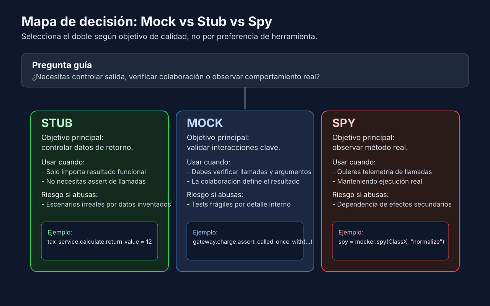

# 01 - Fundamentos de Mocking en Python

> Lenguaje: **Python**



---

## Por qué no siempre conviene usar dependencias reales

En unit testing buscamos feedback rápido, estable y preciso.
Cuando una dependencia externa participa en el test (API, BD, reloj, sistema de archivos),
la prueba se vuelve más lenta, más frágil y más difícil de diagnosticar.

El mocking permite reemplazar dependencias para:

- controlar entradas y salidas,
- simular errores difíciles de reproducir,
- verificar interacciones relevantes,
- mantener la prueba enfocada en una decisión de negocio.

---

## Mock, Stub y Spy (sin confundirlos)

### Stub

Un **stub** devuelve datos predefinidos (`return_value`, `side_effect`).
No verificamos si se llamó, cuántas veces ni con qué argumentos: el test solo comprueba el resultado observable.

Uso típico:

- "Si el gateway retorna approved, el servicio confirma la orden".

### Mock

Un **mock**, además de devolver valores, permite verificar interacciones:

- si se llamó,
- con qué argumentos,
- cuántas veces.

Uso típico:

- "Debe enviar una notificación una sola vez con el id correcto".

En `unittest.mock` el mismo objeto `Mock` puede actuar como stub o como mock: lo que decide el tipo de doble es **qué verifica el test**.

### Spy

Un **spy** observa una implementación real sin reemplazarla.
Permite comprobar llamadas manteniendo el comportamiento original (`mocker.spy`).

Uso típico:

- validar que un método de normalización se invocó antes de persistir.

---

## Regla práctica para elegir el doble

1. Si solo necesitas controlar datos de entrada/salida: **stub**.
2. Si necesitas verificar colaboraciones: **mock**.
3. Si quieres observar una pieza real concreta: **spy**.

Si no necesitas doble, no lo uses.
Menos dobles suele significar menor acoplamiento de tests.

---

## Patrón AAA con dobles

```python
class PaymentGateway:
    def charge(self, order_id: str, amount: float) -> dict:
        raise ConnectionError("llamada HTTP real")


class OrderService:
    def __init__(self, gateway: PaymentGateway):
        self.gateway = gateway

    def confirm(self, order_id: str, amount: float) -> str:
        if amount <= 0:
            return "invalid"
        result = self.gateway.charge(order_id, amount)
        return "confirmed" if result["status"] == "approved" else "rejected"


def test_order_service_returns_confirmed_when_gateway_approves(mocker):
    # Arrange
    gateway = mocker.create_autospec(PaymentGateway, instance=True)
    gateway.charge.return_value = {"status": "approved"}
    service = OrderService(gateway=gateway)

    # Act
    result = service.confirm(order_id="ORD-1", amount=150)

    # Assert
    assert result == "confirmed"
    gateway.charge.assert_called_once_with("ORD-1", 150)
```

Observa que el assert funcional y el assert de interacción
están alineados con una sola historia de negocio.

`mocker.create_autospec(PaymentGateway, instance=True)` crea un doble con la misma API que la clase real.
Un `mocker.Mock()` sin spec aceptaría cualquier método y cualquier firma (ver "Errores comunes").

---

## Verificaciones de llamadas

| Herramienta | Qué comprueba |
|---|---|
| `assert_called_once_with(*args)` | Una sola llamada, con esos argumentos |
| `assert_called_with(*args)` | Solo la **última** llamada |
| `assert_not_called()` | Que no hubo ninguna llamada |
| `call_count` | Número de llamadas |
| `call_args` | Argumentos de la última llamada (`.args`, `.kwargs`) |
| `call_args_list` | Todas las llamadas, en orden, comparables con `call(...)` |

```python
from unittest.mock import call


def test_order_service_does_not_charge_when_amount_is_zero(mocker):
    # Arrange
    gateway = mocker.create_autospec(PaymentGateway, instance=True)
    service = OrderService(gateway=gateway)

    # Act
    result = service.confirm(order_id="ORD-2", amount=0)

    # Assert
    assert result == "invalid"
    gateway.charge.assert_not_called()


def test_order_service_charges_each_order_when_confirming_several(mocker):
    # Arrange
    gateway = mocker.create_autospec(PaymentGateway, instance=True)
    gateway.charge.return_value = {"status": "approved"}
    service = OrderService(gateway=gateway)

    # Act
    service.confirm("ORD-1", 150)
    service.confirm("ORD-2", 90)

    # Assert
    assert gateway.charge.call_count == 2
    assert gateway.charge.call_args_list == [call("ORD-1", 150), call("ORD-2", 90)]
    assert gateway.charge.call_args.args == ("ORD-2", 90)
```

Cuando una verificación falla, el mensaje indica qué se esperaba y qué ocurrió. Mensajes reales de `assert_called_once_with("ORD-1", 100)` y de `assert_not_called()` tras llamar a `confirm("ORD-1", 150)`:

```text
AssertionError: expected call not found.
Expected: charge('ORD-1', 100)
  Actual: charge('ORD-1', 150)

AssertionError: Expected 'charge' to not have been called. Called 1 times.
Calls: [call('ORD-1', 150)].
```

---

## Errores comunes al empezar

- Mockear clases completas cuando solo se necesita un método.
- Verificar demasiadas llamadas internas irrelevantes.
- Acoplar tests al "cómo" y no al "qué".
- Usar `Mock()` o `MagicMock()` sin spec: aceptan cualquier atributo. `gateway.chrage("ORD-1")` (con errata y sin `amount`) no falla con un `Mock()` sin spec. Con `create_autospec` falla de inmediato:

```text
AttributeError: Mock object has no attribute 'chrage'. Did you mean: 'charge'?
TypeError: missing a required argument: 'amount'
```

---

## Qué significa un test frágil

Un test es frágil cuando falla por refactors internos
sin cambiar el comportamiento observable.

Señales de fragilidad:

- asserts sobre el orden exacto de llamadas que no importan al negocio,
- múltiples `assert_called_with` en detalles secundarios,
- patching profundo de cadenas de objetos.

---

## Mini checklist de calidad

Antes de cerrar un test con mocking, pregunta:

1. ¿Estoy validando comportamiento observable?
2. ¿El doble elegido es el mínimo necesario?
3. ¿Este assert fallaría por una regresión real o por ruido interno?
4. ¿Podría leer este test en 20 segundos y entender su intención?

---

## Conclusiones

Mocking bien aplicado mejora velocidad y foco.
Mocking sin criterio crea ruido y deuda.
La meta no es "usar mocks", sino construir
pruebas que documenten decisiones de calidad.
