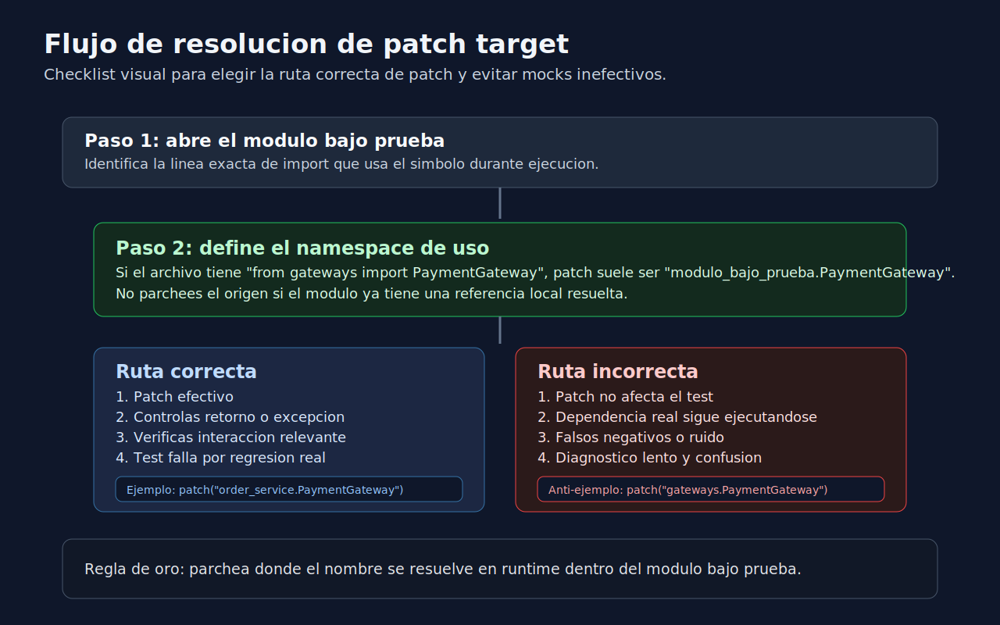

# 02 - Patch en el Target Correcto y Errores Frecuentes
> Lenguaje: **Python**

---
## La regla mas importante de patch
`patch` se aplica donde el simbolo es **usado**,
no donde fue definido originalmente.
Si `order_service.py` hace:
```python
from gateways import PaymentGateway
```
y dentro usa `PaymentGateway()`,
el patch correcto suele ser:
```python
patch("order_service.PaymentGateway")
```
No:
```python
patch("gateways.PaymentGateway")
```
porque el modulo bajo prueba ya resolvio su referencia local.
---
## Modelo mental rapido
1. Abre el archivo que estas probando.
2. Mira exactamente como importa la dependencia.
3. Parcha ese namespace local.
Piensa: "¿donde busca Python este nombre en runtime?"
Esa es la ruta de patch.
---
## Ejemplo con funcion utilitaria
`invoice_service.py`:
```python
from utils.currency import convert
def build_total(amount, rate):
    return convert(amount, rate)
```
Test correcto:
```python
@patch("invoice_service.convert", return_value=120)
def test_build_total_uses_convert(mock_convert):
    result = build_total(100, 1.2)
    assert result == 120
    mock_convert.assert_called_once_with(100, 1.2)
```
---
## Context manager vs decorator
Ambos son validos.
Decorator:
- mas compacto para un patch principal.
Context manager:
- util cuando necesitas varios patches locales
  o distintos comportamientos dentro del mismo test.
---
## side_effect para escenarios complejos
`side_effect` permite:
- lanzar excepciones,
- devolver secuencias,
- ejecutar una funcion custom.
Ejemplo de error esperado:
```python
gateway.charge.side_effect = TimeoutError("gateway timeout")
```
Esto ayuda a probar resiliencia sin depender de fallos reales externos.
---
## Autospec y contratos mas seguros
Cuando sea posible, usa `autospec=True` para reducir errores
por llamadas con firmas incorrectas.
```python
with patch("order_service.PaymentGateway", autospec=True) as gateway_cls:
    ...
```
Beneficio:
- el mock se alinea mejor con la API real,
- evita falsos positivos por metodos inexistentes.
---
## Errores frecuentes y como detectarlos
1. **Patch no surte efecto**:
   casi siempre target incorrecto.
2. **Test pasa pero no valida nada**:
   falta assert funcional o assert de interaccion.
3. **Mock excesivo**:
   demasiadas dependencias parcheadas para un test unitario simple.
4. **Setups gigantes**:
   indica que el SUT podria requerir mejor diseño.
---
## Heuristica de mantenimiento
Si cambiar un detalle interno rompe 20 tests de mocking,
probablemente estas testeando implementacion en lugar de comportamiento.
Recomendacion:
- conserva asserts de negocio,
- limita asserts de colaboracion a interacciones criticas,
- simplifica setup con factories y helpers pequeños.
---
## Conclusiones
Parchar bien es una habilidad de lectura de imports.
Cuando dominas el target correcto,
el mocking deja de ser "magia" y se vuelve una herramienta precisa.
