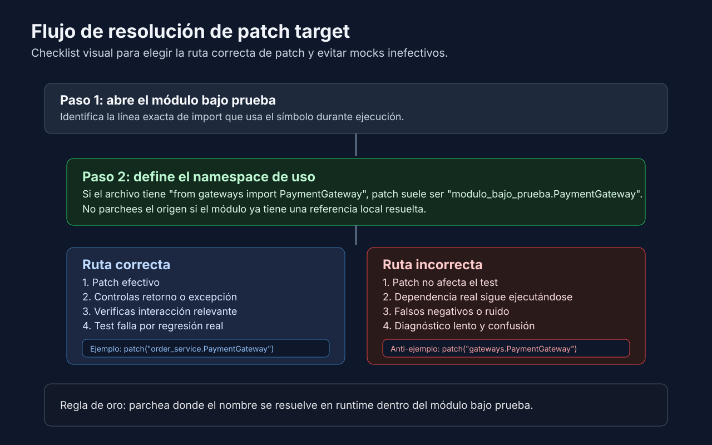

# 02 - Patch en el Target Correcto y Errores Frecuentes

> Lenguaje: **Python**



---

## La regla más importante de patch

`patch` se aplica donde el símbolo es **usado**,
no donde fue definido originalmente.

Si `order_service.py` hace:

```python
from gateways import PaymentGateway
```

y dentro usa `PaymentGateway()`, el patch correcto es:

```python
patch("order_service.PaymentGateway")
```

No:

```python
patch("gateways.PaymentGateway")
```

porque `from gateways import PaymentGateway` copia la referencia al namespace de `order_service` al importarlo.
`patch("gateways.PaymentGateway")` cambia el nombre en `gateways`, pero `order_service` sigue apuntando a la clase real.

Excepción: si el módulo hace `import gateways` y usa `gateways.PaymentGateway()`, el nombre se busca en `gateways` en cada llamada y entonces sí se parchea `gateways.PaymentGateway`.

---

## Modelo mental rápido

1. Abre el archivo que estás probando.
2. Mira exactamente cómo importa la dependencia.
3. Parchea ese namespace local.

Piensa: "¿dónde busca Python este nombre en tiempo de ejecución?"
Esa es la ruta de patch.

---

## Ejemplo: target correcto e incorrecto

`utils/currency.py`:

```python
def convert(amount: float, rate: float) -> float:
    return round(amount * rate, 2)
```

`invoice_service.py`:

```python
from utils.currency import convert


def build_total(amount: float, rate: float) -> float:
    return convert(amount, rate)
```

Test correcto:

```python
from unittest.mock import patch

from invoice_service import build_total


@patch("invoice_service.convert", return_value=120)
def test_build_total_returns_converted_amount_when_convert_is_patched(mock_convert):
    # Act
    result = build_total(100, 1.5)

    # Assert
    assert result == 120
    mock_convert.assert_called_once_with(100, 1.5)
```

Si cambias el target a `"utils.currency.convert"` (donde se define), el patch no surte efecto y se ejecuta la función real. Salida real:

```text
mock_convert = <MagicMock name='convert' id='133787604287904'>

    @patch("utils.currency.convert", return_value=120)
    def test_build_total_returns_converted_amount_when_patching_definition_module(mock_convert):
        # Act
        result = build_total(100, 1.5)

        # Assert
>       assert result == 120
E       assert 150.0 == 120

test_invoice_service.py:22: AssertionError
```

`150.0` es `100 * 1.5`: el cálculo real. El mock existe, pero nadie lo llama.
Es el error más frecuente con `patch`, y es peor cuando la función real no falla: el test puede pasar en verde sin haber aislado nada.

---

## Context manager vs decorator

Ambos son válidos.

Decorator:

- más compacto para un patch principal.

Context manager:

- útil cuando necesitas varios patches locales
  o distintos comportamientos dentro del mismo test.

```python
def test_build_total_returns_converted_amount_when_patched_in_context():
    with patch("invoice_service.convert", return_value=120) as mock_convert:
        result = build_total(100, 1.5)

    assert result == 120
    mock_convert.assert_called_once_with(100, 1.5)
```

---

## side_effect para escenarios complejos

`side_effect` permite:

- lanzar excepciones,
- devolver secuencias,
- ejecutar una función propia.

Ejemplo de error esperado:

```python
gateway.charge.side_effect = TimeoutError("gateway timeout")
```

Y se verifica con `pytest.raises`:

```python
with pytest.raises(TimeoutError, match="gateway timeout"):
    confirm_order("ORD-102", 200)
```

Esto ayuda a probar resiliencia sin depender de fallos reales externos.

---

## Autospec y contratos más seguros

Cuando sea posible, usa `autospec=True` para detectar llamadas con firmas incorrectas.

```python
with patch("order_service.PaymentGateway", autospec=True) as gateway_cls:
    ...
```

Con `pytest-mock`: `mocker.patch("order_service.PaymentGateway", autospec=True)` o `mocker.create_autospec(PaymentGateway, instance=True)` para dependencias inyectadas.

Beneficio:

- el mock se alinea con la API real,
- evita falsos positivos por métodos inexistentes o firmas que cambiaron.

Si la firma real pasa a ser `charge(self, order_id, amount, currency)`, los tests con `autospec` fallan con `TypeError: missing a required argument: 'currency'`, mientras que los tests sin `autospec` siguen en verde. El ejercicio 01 lo muestra paso a paso.

---

## Errores frecuentes y cómo detectarlos

1. **Patch no surte efecto**:
   casi siempre target incorrecto. Señal: se ejecuta la dependencia real o `assert_called...` falla con "Called 0 times".
2. **Test pasa pero no valida nada**:
   falta assert funcional o assert de interacción.
3. **Mock excesivo**:
   demasiadas dependencias parcheadas para un test unitario simple.
4. **Setups gigantes**:
   indica que el SUT podría requerir mejor diseño (por ejemplo, inyectar la dependencia en vez de importarla).

---

## Heurística de mantenimiento

Si cambiar un detalle interno rompe 20 tests de mocking,
probablemente estás testeando implementación en lugar de comportamiento.

Recomendación:

- conserva asserts de negocio,
- limita asserts de colaboración a interacciones críticas,
- simplifica el setup con fixtures y helpers pequeños.

---

## Conclusiones

Parchear bien es una habilidad de lectura de imports.
Cuando dominas el target correcto,
el mocking deja de ser "magia" y se vuelve una herramienta precisa.
