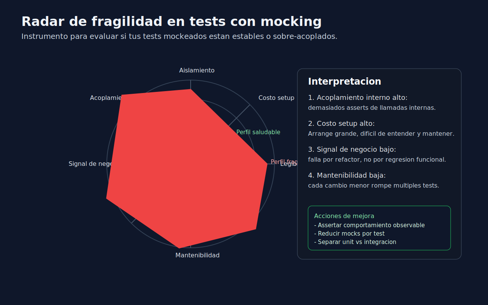

# 03 - pytest-mock para Pruebas Legibles y Mantenibles
> Lenguaje: **Python**

---
## Que aporta pytest-mock
`pytest-mock` entrega el fixture `mocker`,
que simplifica uso de mocks dentro del estilo pytest.
Ventajas:
- sintaxis uniforme con fixtures,
- limpieza automatica entre tests,
- menor ruido que mezclar decoradores en exceso.
---
## Instalacion recomendada
Con `uv`:
```bash
uv add --dev pytest-mock
```
Con `pip` + `venv`:
```bash
pip install pytest-mock
```
---
## Patrones utiles con mocker
### 1. Stub simple
```python
def test_should_return_discounted_total(mocker):
    tax_service = mocker.Mock()
    tax_service.calculate.return_value = 10
    total = checkout_total(subtotal=100, tax_service=tax_service)
    assert total == 110
```
### 2. Patch de funcion
```python
def test_should_send_notification(mocker):
    notifier = mocker.patch("order_service.send_notification")
    finalize_order("ORD-7")
    notifier.assert_called_once_with("ORD-7")
```
### 3. Spy sobre metodo real
```python
def test_should_normalize_before_saving(mocker):
    spy = mocker.spy(UserSerializer, "normalize")
    save_user({"email": "TEST@EXAMPLE.COM"})
    assert spy.call_count == 1
```
---
## Buenas practicas
- Prefiere un mock por colaborador principal.
- Nombra dobles por rol (`payment_gateway_mock`) y no por tipo (`mock1`).
- Valida interacciones solo cuando agregan signal de calidad.
- Usa `pytest.mark.parametrize` para cubrir variaciones sin duplicar setup.
---
## Anti-patrones a evitar
- Assertar cada metodo interno de una cadena de llamadas.
- Copiar setup de mocks en todos los tests sin fixtures reutilizables.
- Usar `mocker.patch` en rutas largas sin validar import real.
- Dejar side effects globales fuera del scope del test.
---
## Diseno de fixtures para mocking
Cuando varios tests comparten colaborador mockeado,
crea fixture explicita:
```python
import pytest
@pytest.fixture
def payment_gateway_stub(mocker):
    gateway = mocker.Mock()
    gateway.charge.return_value = {"status": "approved"}
    return gateway
```
Esto reduce duplicacion y mejora legibilidad del Arrange.
---
## Estrategia de seleccion en CI
Combina marks con mocking para ciclos de feedback:
- `smoke`: unit tests rapidos con dobles controlados.
- `regression`: cobertura mas amplia con interacciones clave.
- `slow`: integraciones reales (menos mocks, mas costo).
Asi puedes ejecutar primero señal rapida y luego profundidad.
---
## Criterio para decidir mock vs real
Usa esta regla:
- dependencia externa no deterministica -> mock.
- logica pura local -> real.
- integracion contractual critica -> test de integracion dedicado.
No intentes resolver todo con unit tests mockeados.
Cada nivel de la piramide cumple un objetivo distinto.
---
## Conclusiones
`pytest-mock` mejora ergonomia, pero la calidad depende del criterio.
Un buen test con dobles:
1. comunica intencion,
2. falla por razones correctas,
3. sobrevive a refactors razonables.
