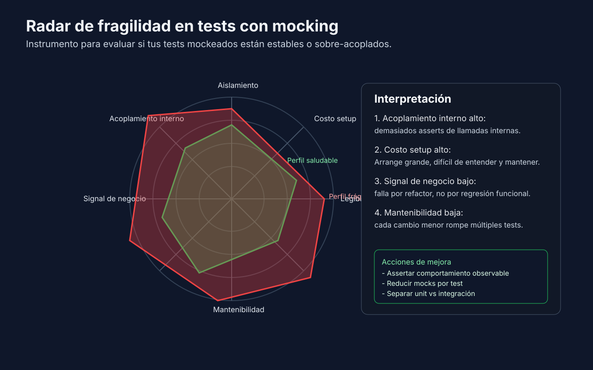

# 03 - pytest-mock para Pruebas Legibles y Mantenibles

> Lenguaje: **Python**



---

## Qué aporta pytest-mock

`pytest-mock` entrega el fixture `mocker`,
que envuelve `unittest.mock` con el estilo de pytest.

Ventajas:

- sintaxis uniforme con fixtures,
- limpieza automática de los patches al terminar cada test,
- menos ruido que apilar decoradores `@patch`.

---

## Instalación

Los `pyproject.toml` de los ejercicios y del proyecto de esta semana ya incluyen `pytest-mock==3.15.1` en el grupo `dev`. Solo necesitas:

```bash
uv sync
uv run pytest
```

En un proyecto propio con `pyproject.toml`, añádelo fijando la versión:

```bash
uv add --dev pytest-mock==3.15.1
```

---

## Patrones útiles con mocker

### 1. Stub simple

```python
class TaxService:
    def calculate(self, subtotal: float) -> float:
        raise ConnectionError("API de impuestos real")


def checkout_total(subtotal: float, tax_service: TaxService) -> float:
    return subtotal + tax_service.calculate(subtotal)


def test_checkout_total_adds_tax_when_tax_service_is_stubbed(mocker):
    # Arrange
    tax_service = mocker.create_autospec(TaxService, instance=True)
    tax_service.calculate.return_value = 10

    # Act
    total = checkout_total(subtotal=100, tax_service=tax_service)

    # Assert
    assert total == 110
```

### 2. Patch de función en el target correcto

`order_service.py` hace `from notifications import send_notification`:

```python
def test_finalize_order_sends_notification_when_order_is_finalized(mocker):
    # Arrange
    send_notification_mock = mocker.patch("order_service.send_notification", autospec=True)

    # Act
    finalize_order("ORD-7")

    # Assert
    send_notification_mock.assert_called_once_with("ORD-7")
```

### 3. Spy sobre método real

```python
class UserSerializer:
    def normalize(self, data: dict) -> dict:
        return {"email": data["email"].lower()}


def save_user(data: dict) -> dict:
    return UserSerializer().normalize(data)


def test_save_user_normalizes_email_when_saving(mocker):
    # Arrange
    normalize_spy = mocker.spy(UserSerializer, "normalize")

    # Act
    saved = save_user({"email": "TEST@EXAMPLE.COM"})

    # Assert
    assert saved == {"email": "test@example.com"}
    assert normalize_spy.call_count == 1
```

### 4. `mocker.stub()` para callbacks

`mocker.stub()` crea un objeto invocable que acepta cualquier argumento. A pesar del nombre, registra las llamadas como un mock: úsalo cuando el SUT recibe una función callback.

```python
def notify_when_done(items: list[str], on_done) -> None:
    on_done(len(items))


def test_notify_when_done_reports_item_count_when_finished(mocker):
    # Arrange
    on_done = mocker.stub(name="on_done")

    # Act
    notify_when_done(["a", "b"], on_done)

    # Assert
    on_done.assert_called_once_with(2)
```

---

## monkeypatch vs patch: cuándo usar cada uno

pytest trae el fixture `monkeypatch` sin instalar nada. Reemplaza valores y los restaura al terminar, pero no crea mocks ni registra llamadas.

| Necesidad | Herramienta |
|---|---|
| Cambiar una variable de entorno | `monkeypatch.setenv` / `monkeypatch.delenv` |
| Sustituir un atributo o función por un valor o función simple | `monkeypatch.setattr` |
| Verificar llamadas, argumentos o número de invocaciones | `mocker.patch` / `patch` (devuelven un `Mock`) |
| Simular errores o secuencias (`side_effect`) o respetar la firma (`autospec`) | `mocker.patch` / `patch` |

```python
def test_orders_api_url_returns_env_value_when_variable_is_set(monkeypatch):
    # Arrange
    monkeypatch.setenv("ORDERS_API_URL", "http://localhost:8000")

    # Act / Assert
    assert orders_api_url() == "http://localhost:8000"


def test_finalize_order_returns_finalized_when_notification_is_replaced(monkeypatch):
    # Arrange: mismo target que con patch, sin verificar la llamada
    monkeypatch.setattr(order_service, "send_notification", lambda order_id: None)

    # Act / Assert
    assert finalize_order("ORD-8") == "finalized"
```

`monkeypatch.setattr` sigue la misma regla de target: se reemplaza el nombre en el módulo que lo usa (`order_service`).

---

## Buenas prácticas

- Prefiere un mock por colaborador principal.
- Nombra dobles por rol (`payment_gateway_mock`) y no por tipo (`mock1`).
- Usa `create_autospec` o `autospec=True` en lugar de `Mock()` sin spec.
- Valida interacciones solo cuando aportan señal de calidad.
- Usa `pytest.mark.parametrize` para cubrir variaciones sin duplicar setup.

---

## Anti-patrones a evitar

- Verificar cada método interno de una cadena de llamadas.
- Copiar el setup de mocks en todos los tests sin fixtures reutilizables.
- Usar `mocker.patch` en rutas largas sin revisar el import real.
- Dejar side effects globales fuera del alcance del test.

---

## Diseño de fixtures para mocking

Cuando varios tests comparten un colaborador mockeado,
crea una fixture explícita:

```python
import pytest


@pytest.fixture
def tax_service_stub(mocker):
    tax_service = mocker.create_autospec(TaxService, instance=True)
    tax_service.calculate.return_value = 10
    return tax_service
```

Esto reduce duplicación y mejora la legibilidad del Arrange.

---

## Estrategia de selección en CI

Combina marks con mocking para ciclos de feedback:

- `smoke`: unit tests rápidos con dobles controlados.
- `regression`: cobertura más amplia con interacciones clave.
- `slow`: integraciones reales (menos mocks, más costo).

Así puedes ejecutar primero señal rápida y luego profundidad.

---

## Criterio para decidir mock vs real

Usa esta regla:

- dependencia externa no determinista -> doble.
- lógica pura local -> real.
- integración contractual crítica -> test de integración dedicado.

No intentes resolver todo con unit tests mockeados.
Cada nivel de la pirámide cumple un objetivo distinto.

---

## Conclusiones

`pytest-mock` mejora la ergonomía, pero la calidad depende del criterio.
Un buen test con dobles:

1. comunica intención,
2. falla por razones correctas,
3. sobrevive a refactors razonables.
