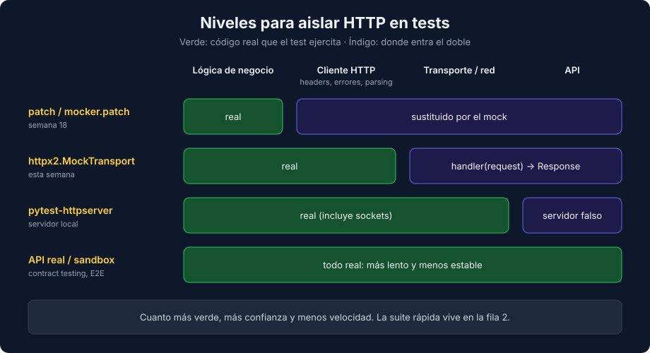

# 01 - Testing de Clientes HTTP con httpx2

> Lenguaje: **Python**



---

## 🎯 Objetivos

- Elegir el nivel de aislamiento adecuado para probar código que llama a un API.
- Diseñar un cliente HTTP con el transporte inyectable.
- Simular respuestas con `httpx2.MockTransport` y verificar la request enviada (método, ruta, query params, headers de autenticación).

---

## Por qué no llamar al API real

Un test que sale a la red depende de algo que no controlas: el API puede estar caído, lento o con datos distintos cada día. El test falla sin que tu código haya cambiado. Además, los casos que más importan (un 503, un timeout, un JSON incompleto) son justo los que un API real casi nunca te devuelve cuando los necesitas.

Hay cuatro niveles para aislar HTTP:

| Nivel | Herramienta | Qué ejercita de tu código | Cuándo usarlo |
|---|---|---|---|
| Parchear la función que llama | `patch` / `mocker.patch` (semana 18) | Solo la lógica que usa el resultado | La llamada HTTP está escondida en otra función |
| Transporte simulado | `httpx2.MockTransport`, `responses` (para `requests`) | Construcción de la request, parsing y manejo de errores | **Caso principal de esta semana** |
| Servidor HTTP local | `pytest-httpserver` | Además, sockets y serialización reales | Cuando el cliente no permite inyectar transporte |
| API real o sandbox | Contract testing (teoría 02), E2E (semana 32) | Todo, incluido el API | Pocas pruebas, fuera de la suite rápida |

---

## httpx2: el cliente de esta semana

`httpx2` es la continuación de `httpx`, mantenida por el equipo de Pydantic. La API es la misma (`Client`, `AsyncClient`, `Response`, `MockTransport`). El `TestClient` de Starlette (y por tanto el de FastAPI) usa `httpx2` y avisa de que usarlo con `httpx` está deprecado.

> ⚠️ `respx`, la librería clásica para mockear `httpx`, **no intercepta `httpx2`**: instala `httpx` 0.28.1 como dependencia propia y parchea ese transporte. Probado en este bootcamp: la request sale a la red y el test falla con `httpx2.ConnectError: [Errno -2] Name or service not known`. Por eso usamos `MockTransport`, que viene incluido en `httpx2`.

---

## Diseñar para poder testear: inyectar el transporte

```python
import httpx2


class CatalogClient:
    def __init__(self, base_url: str, token: str, transport: httpx2.BaseTransport | None = None) -> None:
        self._client = httpx2.Client(
            base_url=base_url,
            headers={"Authorization": f"Bearer {token}"},
            timeout=2.0,
            transport=transport,  # None en producción: se usa el transporte de red
        )
```

El cliente sigue construyendo sus headers, su `base_url` y su timeout. El test solo cambia la última pieza, la que envía bytes por la red.

---

## `MockTransport`: un handler en lugar del servidor

Un handler recibe un `httpx2.Request` y devuelve un `httpx2.Response`:

```python
def test_get_piece_returns_piece_when_api_responds_200():
    sent_requests = []

    def handler(request: httpx2.Request) -> httpx2.Response:
        sent_requests.append(request)
        return httpx2.Response(200, json={"id": 7, "title": "La noche estrellada", "artist": "Vincent van Gogh", "year": 1889})

    client = CatalogClient("https://catalog.test/api", token="test-token", transport=httpx2.MockTransport(handler))

    piece = client.get_piece(7)

    assert piece.title == "La noche estrellada"
    assert sent_requests[0].url.path == "/api/pieces/7"
    assert sent_requests[0].headers["Authorization"] == "Bearer test-token"
```

Guardar las requests en una lista convierte al handler en un **spy** del tráfico HTTP: puedes verificar qué envió tu cliente sin acoplarte a cómo lo hizo por dentro.

---

## Qué verificar de la request

| Aspecto | Assert |
|---|---|
| Método | `request.method == "POST"` |
| Ruta | `request.url.path == "/api/pieces/7"` |
| Query params | `request.url.params["date"] == "2026-10-01"` |
| Cuerpo JSON | `json.loads(request.content) == {...}` |
| Bearer Token | `request.headers["Authorization"] == "Bearer test-token"` |

Basic Auth funciona igual. `httpx2` codifica usuario y contraseña en base64:

```python
def test_client_sends_basic_auth_header_when_auth_is_configured():
    sent = []

    def handler(request):
        sent.append(request)
        return httpx2.Response(200)

    client = httpx2.Client(auth=("ana", "s3cret"), transport=httpx2.MockTransport(handler))
    client.get("https://catalog.test/api/me")

    expected = "Basic " + base64.b64encode(b"ana:s3cret").decode()
    assert sent[0].headers["Authorization"] == expected
```

---

## Equivalencia con `requests` + `responses`

Mucho código existente usa `requests`. La idea es la misma, pero `responses` parchea `requests` globalmente en lugar de inyectar un transporte:

```python
import requests
import responses


@responses.activate
def test_get_piece_returns_payload_when_api_responds_200():
    responses.get("https://catalog.test/api/pieces/7", json={"id": 7, "title": "La noche estrellada"})

    response = requests.get("https://catalog.test/api/pieces/7", timeout=2)

    assert response.json()["title"] == "La noche estrellada"
    assert len(responses.calls) == 1
```

| | `requests` + `responses` | `httpx2` + `MockTransport` |
|---|---|---|
| Cómo intercepta | Parche global activado con un decorador | Transporte inyectado en el cliente |
| Async | No | Sí (`AsyncClient`) |
| Dependencia extra | `responses` | Ninguna |

---

## 📚 Recursos adicionales

- [HTTPX2 — Transports (MockTransport)](https://httpx2.pydantic.dev/advanced/transports/)
- [responses — README](https://github.com/getsentry/responses)

## ✅ Checklist de verificación

- [ ] Ningún test sale a la red.
- [ ] El transporte se inyecta; el resto del cliente es el código real.
- [ ] Verificas la request (ruta, params, headers), no solo la respuesta.

---

→ [02 - Errores HTTP, timeouts y contratos](./02-errores-timeouts-y-contratos.md)
