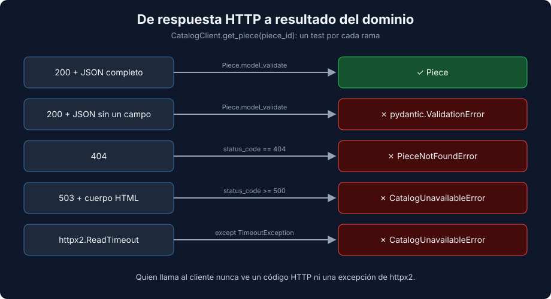

# 02 - Errores HTTP, Timeouts y Contratos

> Lenguaje: **Python**



---

## 🎯 Objetivos

- Traducir 4xx, 5xx y timeouts a excepciones del dominio y probar cada rama.
- Detectar respuestas que rompen el contrato con un modelo de `pydantic`.
- Entender qué aporta el contract testing con Pact y cuándo vale la pena.

---

## El cliente decide qué significa cada respuesta

Quien llama a `CatalogClient` no debería conocer códigos HTTP ni excepciones de `httpx2`. El cliente los traduce a excepciones del dominio:

```python
def get_piece(self, piece_id: int) -> Piece:
    try:
        response = self._client.get(f"/pieces/{piece_id}")
    except httpx2.TimeoutException as error:
        raise CatalogUnavailableError("catalog timed out") from error

    if response.status_code == 404:
        raise PieceNotFoundError(f"piece {piece_id} not found")
    if response.status_code >= 500:
        raise CatalogUnavailableError(f"catalog returned {response.status_code}")
    response.raise_for_status()
    return Piece.model_validate(response.json())
```

Cada rama necesita al menos un test: 200, 404, 5xx, timeout y contrato roto.

---

## El 5xx que no es JSON

Cuando un proxy o un balanceador falla, suele responder con una página HTML. Si el cliente llama a `response.json()` sin mirar el código de estado, el error que ve quien lo llama no dice nada del problema real:

```text
E   json.decoder.JSONDecodeError: Expecting value: line 1 column 1 (char 0)
```

Con `MockTransport` reproducirlo es trivial:

```python
httpx2.Response(503, text="<html><body>Service Unavailable</body></html>")
```

---

## Timeouts

Todos los timeouts de `httpx2` heredan de `httpx2.TimeoutException`:

| Excepción | Cuándo ocurre |
|---|---|
| `ConnectTimeout` | No se pudo abrir la conexión a tiempo |
| `ReadTimeout` | El servidor no respondió a tiempo |
| `WriteTimeout` | No se pudo enviar la request a tiempo |
| `PoolTimeout` | No había conexiones libres en el pool |

Capturar `TimeoutException` cubre los cuatro. Para simular uno, el handler lanza la excepción en lugar de responder:

```python
def timeout_handler(request: httpx2.Request) -> httpx2.Response:
    raise httpx2.ReadTimeout("read timed out", request=request)
```

Si el cliente no la captura, la excepción de `httpx2` se escapa hacia el código de negocio:

```text
E   httpx2.ReadTimeout: read timed out
```

---

## Validar el contrato con `pydantic`

El modelo describe lo que tu cliente espera del API:

```python
from pydantic import BaseModel


class Piece(BaseModel):
    id: int
    title: str
    artist: str
    year: int
```

`Piece.model_validate(payload)` falla en cuanto el API cambia algo que usas. Salida real con un payload sin `year`:

```text
1 validation error for Piece
year
  Field required [type=missing, input_value={'id': 7, 'title': 'La no...st': 'Vincent van Gogh'}, input_type=dict]
```

Y con un tipo incorrecto (`"year": "mil ochocientos"`):

```text
1 validation error for Piece
year
  Input should be a valid integer, unable to parse string as an integer [type=int_parsing, input_value='mil ochocientos', input_type=str]
```

Un test con `pytest.raises(ValidationError, match="year")` documenta qué campo es obligatorio. `jsonschema` es la alternativa cuando el contrato ya existe como JSON Schema (por ejemplo, generado desde un OpenAPI); `pydantic` es más cómodo cuando además quieres usar el modelo en el código.

---

## Contract testing con Pact (introducción)

Los tests anteriores prueban tu cliente contra **tu idea** del API. Si el equipo del API cambia `year` por `created_year`, tus tests siguen en verde y producción falla.

El contract testing orientado al consumidor (consumer-driven) cierra ese hueco:

1. **Consumidor** (tu cliente): sus tests declaran las interacciones que necesita (request y respuesta esperada). Pact las guarda en un archivo de contrato (JSON).
2. **Proveedor** (el API): su pipeline reproduce ese contrato contra el API real y falla si alguna interacción ya no se cumple.

| | Tests con `MockTransport` | Contract testing con Pact |
|---|---|---|
| Qué detecta | Errores de tu cliente | Cambios del API que rompen a sus consumidores |
| Quién lo ejecuta | Tu equipo | Consumidor y proveedor |
| Coste | Bajo | Requiere que el proveedor verifique los contratos (y a menudo un Pact Broker) |

Vale la pena cuando varios equipos consumen el mismo API y lo despliegan por separado. Para un API que controla tu propio equipo, basta con los tests de esta semana y los E2E.

---

## 📚 Recursos adicionales

- [Pydantic — Models](https://docs.pydantic.dev/latest/concepts/models/)
- [Pact — Introduction](https://docs.pact.io/)

## ✅ Checklist de verificación

- [ ] Hay un test por rama: 2xx, 404, 5xx, timeout y contrato roto.
- [ ] El 5xx se prueba con un cuerpo que no es JSON.
- [ ] Las excepciones de `httpx2` no se escapan del cliente.

---

← [01 - Clientes HTTP con httpx2](./01-testing-de-clientes-http-con-httpx2.md) | [03 - Testing asíncrono](./03-testing-asincrono.md) →
