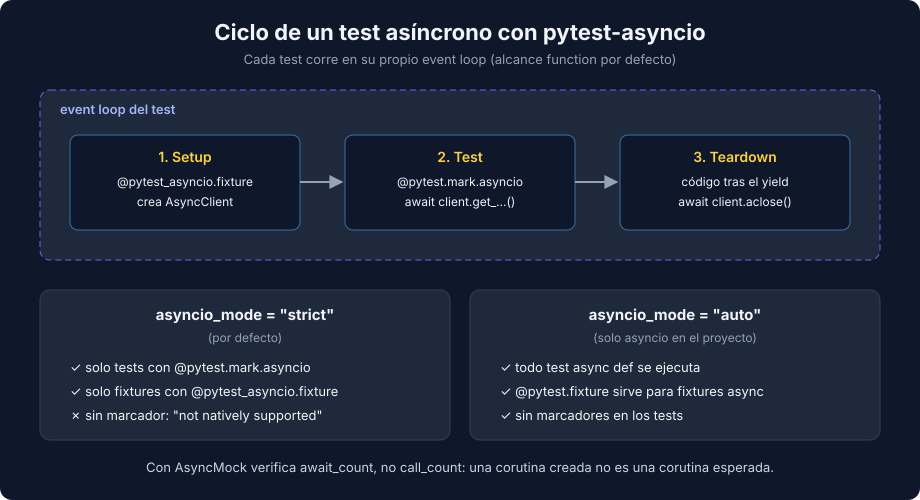

# 03 - Testing Asíncrono: AsyncClient, pytest-asyncio y AsyncMock

> Lenguaje: **Python**



---

## 🎯 Objetivos

- Ejecutar tests `async def` con `pytest-asyncio` y distinguir los modos `strict` y `auto`.
- Escribir fixtures asíncronas con teardown (`yield` + `aclose`).
- Aislar colaboradores asíncronos con `AsyncMock` y verificar que se esperaron (`await`).

---

## Por qué un cliente asíncrono

Si necesitas consultar la disponibilidad de 30 fechas, un cliente síncrono hace 30 llamadas en fila. Con `httpx2.AsyncClient` y `asyncio.gather` las lanzas a la vez y esperas todas juntas:

```python
async def total_available_seats(client: TicketingClient, dates: list[str]) -> int:
    counts = await asyncio.gather(*(client.get_available_seats(date) for date in dates))
    return sum(counts)
```

`MockTransport` también acepta un handler `async`, así que la técnica de la teoría 01 sirve igual.

---

## pytest-asyncio: `strict` frente a `auto`

pytest no sabe ejecutar corutinas. Sin plugin, un `async def test_...` falla. Salida real:

```text
async def functions are not natively supported.
You need to install a suitable plugin for your async framework, for example:
  - anyio
  - pytest-asyncio
```

`pytest-asyncio` (1.4.0 en el bootcamp) tiene dos modos, configurables en `pyproject.toml`:

```toml
[tool.pytest]
asyncio_mode = "strict"
```

| | `strict` (por defecto) | `auto` |
|---|---|---|
| Tests `async def` | Solo los marcados con `@pytest.mark.asyncio` | Todos |
| Fixtures `async` | Solo con `@pytest_asyncio.fixture` | Basta con `@pytest.fixture` |
| Cuándo usarlo | Proyectos que mezclan librerías async (anyio, trio) o quieren explicitud | Proyectos solo con `asyncio` |

En modo `strict`, olvidar el marcador produce exactamente el error anterior: el test no se ejecuta como corutina. En esta semana usamos `strict` para que cada test asíncrono sea explícito. Comprobado: la misma suite pasa en `auto` quitando todos los marcadores.

---

## Fixtures asíncronas con teardown

```python
import pytest_asyncio


@pytest_asyncio.fixture
async def seats_client():
    async def handler(request: httpx2.Request) -> httpx2.Response:
        return httpx2.Response(200, json={"available_seats": 12})

    client = TicketingClient("https://tickets.test", transport=httpx2.MockTransport(handler))
    yield client
    await client.aclose()  # teardown: se ejecuta aunque el test falle


@pytest.mark.asyncio
async def test_get_available_seats_returns_count_when_date_has_seats(seats_client):
    assert await seats_client.get_available_seats("2026-10-01") == 12
```

---

## `AsyncMock`: dobles que se esperan

Para probar `total_available_seats` sin HTTP, el cliente se sustituye por un `AsyncMock`. Cada llamada devuelve una corutina que, al esperarse, entrega el siguiente valor de `side_effect`:

```python
from unittest.mock import AsyncMock, call


@pytest.mark.asyncio
async def test_total_available_seats_sums_all_dates_when_client_answers():
    client = AsyncMock(spec=TicketingClient)
    client.get_available_seats.side_effect = [5, 7, 3]
    dates = ["2026-10-01", "2026-10-02", "2026-10-03"]

    total = await total_available_seats(client, dates)

    assert total == 15
    assert client.get_available_seats.await_count == 3
    assert client.get_available_seats.await_args_list == [call(date) for date in dates]
```

| `Mock` | `AsyncMock` |
|---|---|
| `call_count` | `await_count` |
| `assert_called_once_with` | `assert_awaited_once_with` |
| `call_args_list` | `await_args_list` |

`call_count` cuenta llamadas; `await_count` cuenta las que además se esperaron. Esa diferencia es la que detecta el error más común del código asíncrono.

---

## El error clásico: olvidar `await`

```python
counts = [client.get_available_seats(date) for date in dates]  # sin await ni gather
return sum(counts)
```

La lista contiene corutinas, no números. Salida real del test anterior:

```text
E   TypeError: unsupported operand type(s) for +: 'int' and 'coroutine'
<sys>:0: RuntimeWarning: coroutine 'AsyncMockMixin._execute_mock_call' was never awaited
```

Cuando el valor no se usa, ni siquiera hay `TypeError`. Con esta función, un test que verifica `call_count == 2` pasa en verde; el que verifica `await_count == 2` falla con `assert 0 == 2`:

```python
async def refresh_all(client, dates):
    for date in dates:
        client.get_available_seats(date)  # falta await
```

Por eso con `AsyncMock` se verifica `await_count` o `assert_awaited_*`, no `call_count`.

---

## 📚 Recursos adicionales

- [pytest-asyncio 1.4.0 — Concepts](https://pytest-asyncio.readthedocs.io/en/v1.4.0/concepts.html)
- [unittest.mock — AsyncMock](https://docs.python.org/3/library/unittest.mock.html#unittest.mock.AsyncMock)
- [HTTPX2 — Async Support](https://httpx2.pydantic.dev/async/)

## ✅ Checklist de verificación

- [ ] Cada test asíncrono lleva `@pytest.mark.asyncio` (modo `strict`).
- [ ] Las fixtures asíncronas cierran sus recursos tras el `yield`.
- [ ] Con `AsyncMock` verificas `await_count` o `assert_awaited_*`, no solo el resultado.

---

← [02 - Errores HTTP, timeouts y contratos](./02-errores-timeouts-y-contratos.md) | [Volver al README](../README.md)
