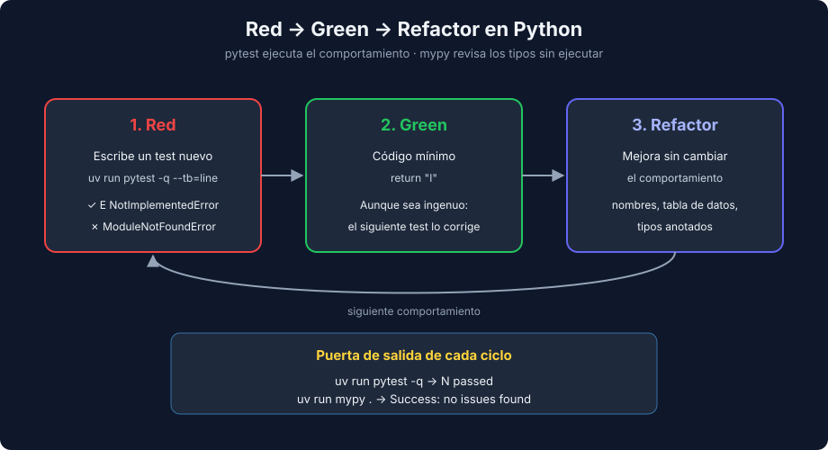

# 01 - TDD en Python: Ciclo, Herramientas y Diferencias con JS y Java

> Lenguaje: **Python** (con comparación JS / Java)



---

## 🎯 Objetivos

- Aplicar Red → Green → Refactor con pytest en micro-pasos.
- Reconocer un Red válido (falla por el motivo esperado) frente a uno falso.
- Usar `mypy --strict` como segunda red de seguridad dentro del ciclo.
- Comparar la práctica de TDD en Python con Jest (semana 11) y JUnit (semana 27).

---

## El ciclo, en Python

1. **Red**: escribe un test que describe el siguiente comportamiento y ejecútalo. Debe fallar.
2. **Green**: escribe el código mínimo que lo hace pasar, aunque sea ingenuo.
3. **Refactor**: mejora nombres y estructura con toda la suite en verde.

El ciclo ya lo conoces de la semana 11. Lo que cambia en Python son las herramientas y algunas costumbres.

---

## Un Red válido falla por el motivo esperado

Primer ciclo del kata de números romanos, con el stub `raise NotImplementedError`:

```text
E   NotImplementedError
```

Ese es un Red válido: el test llegó a llamar a la función y la función aún no hace nada. Estos otros **no** son Reds válidos:

| Salida | Qué significa |
|---|---|
| `ModuleNotFoundError: No module named 'roman'` | Falta el archivo o el `pythonpath`: el test ni siquiera se ejecutó |
| `NameError: name 'to_roman' is not defined` | Falta el import |
| `SyntaxError` | El test está mal escrito |
| Pasa en verde | El test no describe nada nuevo |

Por eso los stubs del bootcamp lanzan `NotImplementedError`: el primer Red siempre es limpio.

---

## Comandos útiles durante el ciclo

| Comando | Para qué |
|---|---|
| `uv run pytest -q --tb=line` | Una línea por fallo: basta para leer el motivo del Red |
| `uv run pytest -x` | Se detiene en el primer fallo |
| `uv run pytest --lf` | Solo repite los tests que fallaron la vez anterior |
| `uv run pytest -k roman` | Solo los tests cuyo nombre contiene `roman` |
| `uv run mypy .` | Revisión de tipos (con `[tool.mypy] strict = true`) |

---

## mypy dentro del ciclo

En Python los tipos no se comprueban al ejecutar, así que un test puede pasar con el tipo equivocado. En el ejercicio 02 los tres ejemplos pasan aunque la función devuelve `float`, porque `250.0 == 250` es `True`. mypy lo detecta sin ejecutar nada:

```text
bill.py:4: error: List item 0 has incompatible type "float"; expected "int"  [list-item]
```

Trátalo como un Red más: después del Green y del Refactor, `uv run pytest -q` y `uv run mypy .` deben terminar los dos en verde. Con `strict = true`, mypy también exige anotar los tests (`-> None`, tipos de los parámetros).

---

## TDD en Python frente a JS y Java

| Aspecto | Python (pytest) | JavaScript (Jest, S11) | Java (JUnit, S27) |
|---|---|---|---|
| Assertion | `assert result == 80` | `expect(result).toBe(80)` | `assertEquals(80, result)` |
| Setup por test | Fixture (`@pytest.fixture`) | `beforeEach` | `@BeforeEach` |
| Stub inicial | `raise NotImplementedError` | `throw new Error("Not implemented")` | `throw new UnsupportedOperationException()` |
| Dependencias | `Protocol` (tipado estructural) | Objetos con la misma forma | `interface` explícita |
| Tipos | Opcionales, revisados por mypy | Opcionales (TypeScript) | Obligatorios, revisados al compilar |
| Unidad mínima | Una función basta | Una función basta | Casi siempre una clase |

Consecuencia práctica: en Python los micro-pasos pueden ser más pequeños (una función suelta, un `assert` sin librería), pero necesitas mypy para recuperar la red de seguridad de tipos que Java tiene al compilar.

---

## Katas para practicar

- **Roman Numerals** (ejercicio 01): de `1 → "I"` a `3999 → "MMMCMXCIX"`. Enseña a pasar de `if` a una tabla de datos.
- **Bowling Game**: puntuación de una partida de bolos con strikes y spares. Enseña a elegir el siguiente test: primero todo ceros, luego todo unos, luego un spare, luego un strike, luego la partida perfecta (300 puntos). Es un buen kata extra para el fin de semana.

---

## 📚 Recursos adicionales

- [The Bowling Game Kata (Robert C. Martin)](http://butunclebob.com/ArticleS.UncleBob.TheBowlingGameKata)
- [mypy — Using mypy with an existing codebase](https://mypy.readthedocs.io/en/stable/existing_code.html)

## ✅ Checklist de verificación

- [ ] Cada Red falla por el motivo esperado, no por un import o una errata.
- [ ] El Green es el mínimo que pide el test.
- [ ] Tras cada Refactor, `pytest` y `mypy` en verde.

---

→ [02 - Diseño emergente, fixtures y código legado](./02-diseno-emergente-y-codigo-legado.md)
