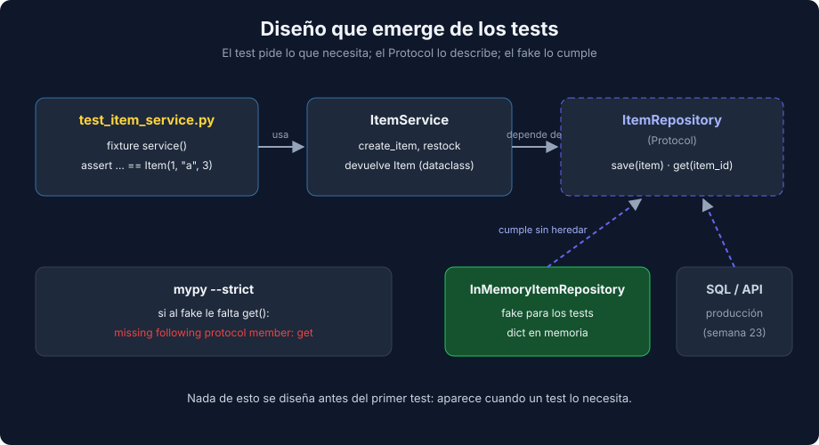

# 02 - Diseño Emergente: dataclasses, Protocol, Fixtures y Código Legado

> Lenguaje: **Python**



---

## 🎯 Objetivos

- Dejar que los tests pidan `dataclass` y `Protocol` en lugar de diseñarlos por adelantado.
- Sustituir una dependencia por un fake que cumple un `Protocol` y crearlo con una fixture.
- Poner bajo test código legado con tests de caracterización y un seam.

---

## `dataclass` congelada: el test pide un valor

Cuando un test quiere comparar un resultado completo, una `dataclass` da `__eq__` y `__repr__` gratis:

```python
from dataclasses import dataclass


@dataclass(frozen=True)
class Item:
    id: int
    name: str
    quantity: int


def test_create_item_returns_item_when_data_is_valid(service: ItemService) -> None:
    assert service.create_item("Astrolabio", 3) == Item(1, "Astrolabio", 3)
```

Si el assert falla, pytest muestra los dos `Item(id=..., name=..., quantity=...)` y ves qué campo difiere. `frozen=True` impide modificarlo por accidente: `item.quantity = 9` lanza `FrozenInstanceError: cannot assign to field 'quantity'` (subclase de `AttributeError`). Para "cambiar" un valor se crea otro con `dataclasses.replace(item, quantity=9)`.

---

## `Protocol`: la dependencia que el test necesita

`ItemService` necesita guardar y recuperar items. En lugar de una clase base abstracta, un `Protocol` describe solo lo que el servicio usa:

```python
from typing import Protocol


class ItemRepository(Protocol):
    def save(self, item: Item) -> None: ...

    def get(self, item_id: int) -> Item | None: ...
```

Cualquier clase con esos métodos cumple el protocolo **sin heredar de él** (tipado estructural). El fake de los tests es un diccionario en memoria:

```python
class InMemoryItemRepository:
    def __init__(self) -> None:
        self._items: dict[int, Item] = {}

    def save(self, item: Item) -> None:
        self._items[item.id] = item

    def get(self, item_id: int) -> Item | None:
        return self._items.get(item_id)
```

Si al fake le falta un método, mypy lo dice antes de ejecutar nada. Salida real:

```text
error: Argument 1 to "use" has incompatible type "IncompleteRepository"; expected "ItemRepository"  [arg-type]
note: "IncompleteRepository" is missing following "ItemRepository" protocol member:
note:     get
```

Un fake con estado real (guarda y devuelve) suele producir tests menos frágiles que un `Mock` con `return_value`: el test verifica el resultado, no la secuencia de llamadas.

---

## Fixtures en TDD

La fixture crea un servicio nuevo con un repositorio vacío para cada test:

```python
@pytest.fixture
def service() -> ItemService:
    return ItemService(InMemoryItemRepository())
```

Cada test empieza de cero, así que el orden no importa. Si varios tests repiten el mismo Arrange (por ejemplo, "un servicio con dos items"), extrae otra fixture en el paso de Refactor, no antes.

---

## Código legado: primero caracterizar, luego cambiar

Código legado es código sin tests. Antes de cambiarlo con TDD:

1. **Tests de caracterización**: tests que registran lo que el código hace **hoy**, aunque parezca un bug. Si mañana cambia, lo sabrás.
2. **Seam**: un punto donde puedes cambiar el comportamiento sin editar la lógica, casi siempre convirtiendo una dependencia oculta en un parámetro.

Esta función no se puede testear de forma estable porque depende de la hora real:

```python
def greeting(name: str) -> str:
    if datetime.now().hour < 12:
        return f"Buenos días, {name}"
    return f"Buenas tardes, {name}"
```

El seam es un parámetro opcional que conserva el comportamiento para los llamadores existentes:

```python
def greeting(name: str, now: datetime | None = None) -> str:
    current = now or datetime.now()
    if current.hour < 12:
        return f"Buenos días, {name}"
    return f"Buenas tardes, {name}"


def test_greeting_says_good_afternoon_when_it_is_noon() -> None:
    assert greeting("Ana", now=datetime(2026, 9, 26, 12, 0)) == "Buenas tardes, Ana"
```

Con el seam y los tests en verde, el código legado ya admite ciclos de TDD normales.

---

## 📚 Recursos adicionales

- [dataclasses — Data Classes](https://docs.python.org/3/library/dataclasses.html)
- [mypy — Protocols and structural subtyping](https://mypy.readthedocs.io/en/stable/protocols.html)
- [Characterization tests vs regression tests (Understand Legacy Code)](https://understandlegacycode.com/blog/characterization-tests-or-approval-tests/)

## ✅ Checklist de verificación

- [ ] Los modelos de valor son `dataclass(frozen=True)`.
- [ ] Las dependencias se describen con `Protocol` y los fakes pasan mypy.
- [ ] Antes de cambiar código legado hay tests de caracterización.

---

← [01 - TDD en Python](./01-tdd-en-python-ciclo-y-herramientas.md) | [03 - Property-based testing con hypothesis](./03-property-based-testing-con-hypothesis.md) →
