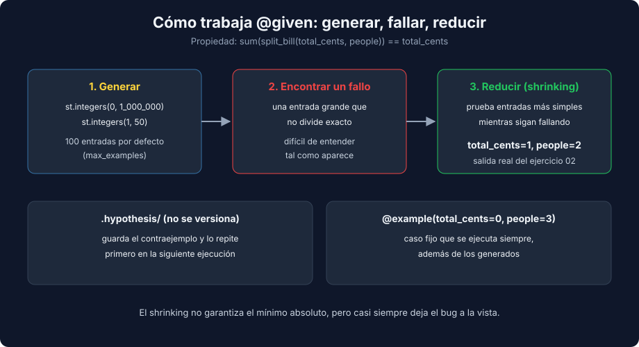

# 03 - Property-Based Testing con hypothesis

> Lenguaje: **Python** (equivalente a fast-check de la semana 13)



---

## 🎯 Objetivos

- Escribir propiedades con `@given` y estrategias de `hypothesis`.
- Elegir qué propiedad probar: invariante, ida y vuelta, idempotencia u oráculo.
- Leer un contraejemplo reducido (shrinking) y fijar casos con `@example`.
- Evitar el choque entre `@given` y fixtures de alcance function.

---

## De ejemplos a propiedades

Un test de ejemplo dice "para esta entrada, esta salida". Una propiedad dice "para **cualquier** entrada válida, esto se cumple":

```python
from hypothesis import given
from hypothesis import strategies as st


@given(
    total_cents=st.integers(min_value=0, max_value=1_000_000),
    people=st.integers(min_value=1, max_value=50),
)
def test_split_bill_shares_add_up_to_total_for_any_bill(total_cents: int, people: int) -> None:
    shares = split_bill(total_cents, people)

    assert sum(shares) == total_cents
```

`hypothesis` ejecuta el test con 100 entradas generadas por defecto (`max_examples`) y favorece valores límite como 0, 1 o el máximo del rango.

---

## Estrategias más usadas

| Estrategia | Genera |
|---|---|
| `st.integers(min_value=..., max_value=...)` | Enteros en un rango |
| `st.text()` | Cadenas Unicode, incluida la vacía |
| `st.lists(st.integers(), max_size=30)` | Listas de enteros |
| `st.dictionaries(st.text(), st.integers())` | Diccionarios |
| `st.sampled_from(["I", "V", "X"])` | Un valor de una lista |
| `st.builds(Item, id=st.integers(), ...)` | Instancias de una clase o `dataclass` |

---

## Qué propiedad probar

| Tipo | Idea | Ejemplo |
|---|---|---|
| Invariante | Algo que siempre se cumple | `sum(split_bill(t, p)) == t` |
| Ida y vuelta | Codificar y decodificar devuelve lo original | `json.loads(json.dumps(data)) == data` |
| Idempotencia | Aplicarlo dos veces es igual que una | `sorted(sorted(values)) == sorted(values)` |
| Oráculo | Comparar con una implementación obvia y lenta | Versión optimizada frente a un bucle simple |

---

## Shrinking: el contraejemplo más simple

Cuando una propiedad falla, `hypothesis` reduce la entrada hasta un caso pequeño que sigue fallando. Salida real del ejercicio 02:

```text
E   assert 0 == 1
E    +  where 0 = sum([0, 0])
E   Failing test case: test_split_bill_shares_add_up_to_total_for_any_bill(
E       total_cents=1,
E       people=2,
E   )
```

Un centavo entre dos personas: el bug se entiende de inmediato. La reducción no siempre llega al mínimo absoluto. En el kata de romanos, sin la entrada `(4, "IV")`, el contraejemplo cambia entre ejecuciones (24, 94, 464...), pero siempre termina en 4.

`hypothesis` guarda los contraejemplos en la carpeta `.hypothesis/` y los prueba primero en la siguiente ejecución. Esa carpeta no se versiona.

---

## `@example`: casos que se ejecutan siempre

```python
@given(total_cents=st.integers(min_value=0, max_value=1_000_000), people=st.integers(min_value=1, max_value=50))
@example(total_cents=0, people=3)
def test_split_bill_gives_one_share_per_person_differing_by_at_most_one_cent(total_cents: int, people: int) -> None:
    ...
```

Úsalo para bordes conocidos o para fijar un contraejemplo que ya encontraste y corregiste.

---

## `@given` y las fixtures

`hypothesis` ejecuta el cuerpo del test muchas veces, pero una fixture de alcance function se crea una sola vez por test. El estado se acumularía entre ejemplos, así que `hypothesis` lo rechaza. Salida real:

```text
E   hypothesis.errors.FailedHealthCheck: 'test_health.py::test_uses_fixture' uses a function-scoped fixture 'service'.
```

Solución: en los tests de propiedades, crea el objeto dentro del test.

```python
@given(st.lists(st.integers(min_value=0, max_value=10_000), max_size=30))
def test_total_quantity_equals_sum_of_created_quantities(quantities: list[int]) -> None:
    service = ItemService(InMemoryItemRepository())
    for index, quantity in enumerate(quantities):
        service.create_item(f"item-{index}", quantity)

    assert service.total_quantity() == sum(quantities)
```

---

## Propiedades dentro de TDD

Los ejemplos guían el diseño paso a paso; las propiedades lo protegen. Un orden que funciona: primero ciclos con ejemplos concretos, y cuando la regla general ya está clara (por ejemplo, "la suma se conserva"), una propiedad que la exprese.

---

## 📚 Recursos adicionales

- [Hypothesis — Quickstart](https://hypothesis.readthedocs.io/en/latest/quickstart.html)
- [What is property-based testing? (hypothesis.works)](https://hypothesis.works/articles/what-is-property-based-testing/)

## ✅ Checklist de verificación

- [ ] Cada propiedad describe una regla de negocio, no repite la implementación.
- [ ] Los bordes conocidos están fijados con `@example`.
- [ ] Ningún test con `@given` usa fixtures de alcance function.

---

← [02 - Diseño emergente y código legado](./02-diseno-emergente-y-codigo-legado.md) | [Volver al README](../README.md)
