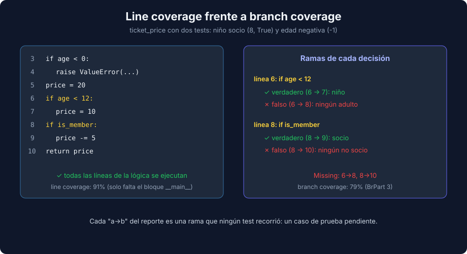

# 01 - pytest-cov: Branch Coverage, Reportes y Exclusiones

> Lenguaje: **Python** (equivalente a la semana 14 con Jest)



---

## 🎯 Objetivos

- Medir coverage con `pytest-cov` y configurarlo en `pyproject.toml`.
- Leer un reporte de branch coverage (`6->8`) y saber qué test falta.
- Generar reportes de terminal, HTML y XML.
- Excluir código sin lógica y fijar un umbral que haga fallar la suite.
- Combinar coverage de varias ejecuciones.

---

## Configuración

`pytest-cov` (7.1.0) integra `coverage.py` en pytest. La configuración vive en `pyproject.toml`:

```toml
[tool.coverage.run]
source = ["src"]      # qué se mide
branch = true         # mide ramas, no solo líneas

[tool.coverage.report]
show_missing = true
fail_under = 90
exclude_also = ['if __name__ == "__main__":']
```

Con `source` en la configuración, basta con `uv run pytest --cov`.

---

## Line coverage miente

`ticket_price` tiene tres `if`. Con dos tests (un niño socio y una edad negativa) se ejecutan todas las líneas de la lógica. Salida real **sin** `branch = true`:

```text
Name                      Stmts   Miss  Cover   Missing
-------------------------------------------------------
src/tickets/pricing.py       11      1    91%   14
```

La única línea sin ejecutar es el `print` del bloque `__main__`. Parece que la lógica está cubierta. Con `branch = true`:

```text
Name                      Stmts   Miss Branch BrPart  Cover   Missing
---------------------------------------------------------------------
src/tickets/pricing.py       11      1      8      3    79%   6->8, 8->10, 14
```

`6->8` significa: la línea 6 (`if age < 12:`) nunca saltó a la 8, es decir, ningún test usó un adulto. `8->10`: la línea 8 (`if is_member:`) nunca saltó a la 10, así que nadie probó un no socio. `BrPart` cuenta las decisiones con alguna rama sin recorrer.

---

## Reportes

| Opción | Salida | Uso |
|---|---|---|
| `--cov-report=term-missing` | Tabla con la columna `Missing` | Día a día |
| `--cov-report=html` | `htmlcov/index.html` con las líneas y ramas marcadas | Revisar a fondo |
| `--cov-report=xml` | `coverage.xml` (formato Cobertura) | CI y SonarQube |

```bash
uv run pytest --cov --cov-report=html --cov-report=xml
```

```text
Coverage HTML written to dir htmlcov
Coverage XML written to file coverage.xml
```

`htmlcov/`, `coverage.xml` y `.coverage` no se versionan.

---

## Excluir código sin lógica

Un bloque `if __name__ == "__main__":` o un `raise NotImplementedError` en una clase abstracta no necesitan tests. Hay dos formas de excluirlos:

| Forma | Alcance |
|---|---|
| `# pragma: no cover` al final de la línea | Solo esa línea o bloque |
| `exclude_also = [...]` en `[tool.coverage.report]` | Todas las líneas que coincidan con la expresión regular |

Con `exclude_also`, el reporte anterior pasa a `Stmts 9` y `Missing 6->8, 8->10`: solo quedan las ramas de la lógica. Excluir no es esconder deuda: si una línea tiene lógica, necesita un test.

---

## Umbral: la suite falla si no se cumple

Con `fail_under = 90` y solo los dos primeros tests:

```text
FAIL Required test coverage of 90.0% not reached. Total coverage: 86.67%
2 passed in 0.01s
```

Los tests pasan, pero `pytest` termina con código de salida 1. En CI eso marca el job en rojo.

---

## `coverage combine`: varias ejecuciones, un reporte

Si ejecutas la suite por partes (un módulo por job de CI o procesos separados), cada parte genera sus datos. Con `coverage run` y `parallel = true`, cada ejecución escribe un archivo `.coverage.<máquina>.<pid>.<aleatorio>`:

```bash
uv run coverage run -m pytest tests/billing
uv run coverage run -m pytest tests/catalog
uv run coverage combine
uv run coverage report
```

```text
Combined 2 files
```

Con `pytest-cov` no hace falta `combine`: combina los procesos de una misma ejecución y `--cov-append` suma una ejecución a la anterior. Comprobado: las dos formas dan el mismo reporte.

---

## 📚 Recursos adicionales

- [pytest-cov — Configuration](https://pytest-cov.readthedocs.io/en/latest/config.html)
- [coverage.py — Branch coverage measurement](https://coverage.readthedocs.io/en/latest/branch.html)

## ✅ Checklist de verificación

- [ ] `branch = true` en la configuración.
- [ ] Cada rama en `Missing` tiene un test o una exclusión justificada.
- [ ] `fail_under` refleja el umbral acordado por el equipo.

---

→ [02 - Mutation testing con mutmut](./02-mutation-testing-con-mutmut.md)
