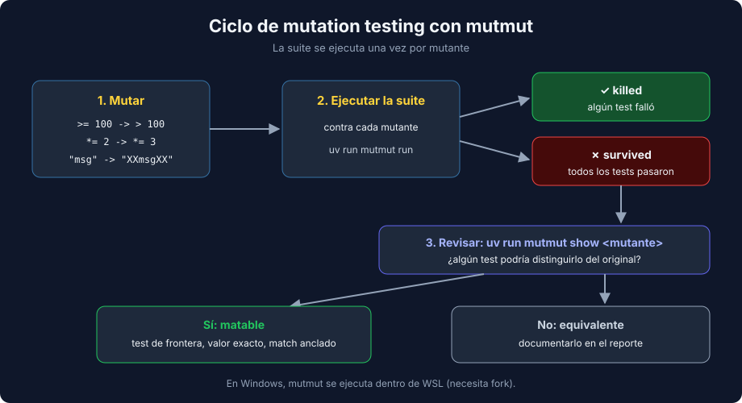

# 02 - Mutation Testing con mutmut

> Lenguaje: **Python**



---

## 🎯 Objetivos

- Explicar por qué 100% de coverage no garantiza tests útiles.
- Ejecutar `mutmut`, leer sus resultados y ver cada mutante.
- Matar mutantes con asserts más precisos y reconocer los mutantes equivalentes.

---

## Coverage dice qué se ejecutó, no qué se verificó

Esta suite tiene 100% de branch coverage:

```python
def test_points_for_gives_points_when_customer_buys() -> None:
    assert points_for(55, is_member=False) > 0
```

La línea `points = int(amount // 10)` se ejecuta, pero el test solo comprueba que el resultado es positivo. Si alguien cambia `10` por `11`, el test sigue en verde.

El **mutation testing** automatiza esa pregunta: introduce pequeños cambios (mutantes) en el código y ejecuta la suite contra cada uno.

| Resultado | Significado |
|---|---|
| **Killed** (🎉) | Algún test falló: la suite detecta ese cambio |
| **Survived** (🙁) | Todos los tests pasaron con el código cambiado |

---

## mutmut 3.8.0

```toml
[tool.mutmut]
source_paths = ["src/"]
```

> ⚠️ mutmut necesita `fork`: en Windows se ejecuta dentro de WSL. En Linux y macOS funciona directamente.

```bash
uv run mutmut run          # genera y prueba los mutantes (copia el proyecto en mutants/)
uv run mutmut results      # lista los que sobrevivieron
uv run mutmut show <name>  # muestra el cambio de un mutante
uv run mutmut browse       # interfaz de terminal para revisarlos
```

Resumen real de `mutmut run` sobre la suite débil del ejercicio 02:

```text
13/13  🎉 6 🫥 0  ⏰ 0  🤔 0  🙁 7  🔇 0  🧙 0
```

13 mutantes: 6 muertos y 7 vivos. `mutants/` es una copia de trabajo y no se versiona.

---

## Leer un mutante

```text
$ uv run mutmut show loyalty.points.x_points_for__mutmut_9
-    if is_member and amount >= 100:
+    if is_member and amount > 100:
```

Si sobrevive, ningún test compra exactamente 100. Los mutantes típicos de mutmut:

| Original | Mutante | Qué test lo mata |
|---|---|---|
| `>=` | `>` | Uno con el valor exacto de la frontera |
| `100` | `101` | El mismo test de frontera |
| `// 10` | `// 11` | Un assert con el valor exacto, no `> 0` |
| `*= 2` | `*= 3` | Un assert con el valor exacto del resultado |
| `"units must be > 0"` | `"XXunits must be > 0XX"` | `match` anclado con `^...$` |
| `round(cost, 2)` | `round(cost, None)` | Un caso cuyo resultado tenga decimales (`3.33`, no `1.0`) |

### Mutantes de cadena y `pytest.raises(match=...)`

mutmut también cambia los textos: `"units must be > 0"` pasa a `"XXunits must be > 0XX"`. Este test **no** lo mata:

```python
with pytest.raises(ValueError, match="units must be > 0"):
    restock_cost(10.0, units=0)
```

`match` es una expresión regular que se **busca** dentro del mensaje, y `"units must be > 0"` sigue apareciendo dentro de `"XXunits must be > 0XX"`. Para exigir el mensaje completo, ánclalo:

```python
with pytest.raises(ValueError, match=r"^units must be > 0$"):
    restock_cost(10.0, units=0)
```

Comprobado en el proyecto de la semana: con `match` anclado, esos mutantes mueren.

---

## Mutantes equivalentes

Algunos mutantes no se pueden matar porque no cambian el comportamiento:

```text
-    if amount <= 0:
+    if amount < 0:
```

Con `amount == 0`, el original devuelve `0` en la guarda y el mutante calcula `int(0 // 10)`, que también es `0`. Ninguna entrada distingue las dos versiones: es un **mutante equivalente**. En el ejercicio 02 quedan tres (`< 0`, `<= 1` y `/` en lugar de `//`).

Por eso el objetivo no es "0 sobrevivientes", sino **revisar cada sobreviviente** y clasificarlo:

1. Falta un test o un assert es débil → escribe el test.
2. Es equivalente → documéntalo (o simplifica el código si la rama sobra).

---

## Coste y cuándo usarlo

mutmut ejecuta la suite una vez por mutante. Con suites de segundos es rápido; con suites lentas conviene:

- limitar `source_paths` a la lógica de negocio,
- activar `mutate_only_covered_lines = true` para no mutar líneas que ningún test ejecuta,
- ejecutarlo en CI de forma periódica (por ejemplo, cada noche), no en cada commit.

---

## 📚 Recursos adicionales

- [mutmut — README](https://github.com/boxed/mutmut)
- [Mutation testing (Wikipedia)](https://en.wikipedia.org/wiki/Mutation_testing)

## ✅ Checklist de verificación

- [ ] Cada sobreviviente está revisado con `mutmut show`.
- [ ] Los sobrevivientes matables tienen un test nuevo o un assert más preciso.
- [ ] Los equivalentes están documentados.

---

← [01 - pytest-cov](./01-pytest-cov-branch-coverage-y-reportes.md) | [03 - Umbrales de calidad y SonarQube](./03-umbrales-de-calidad-y-sonarqube.md) →
