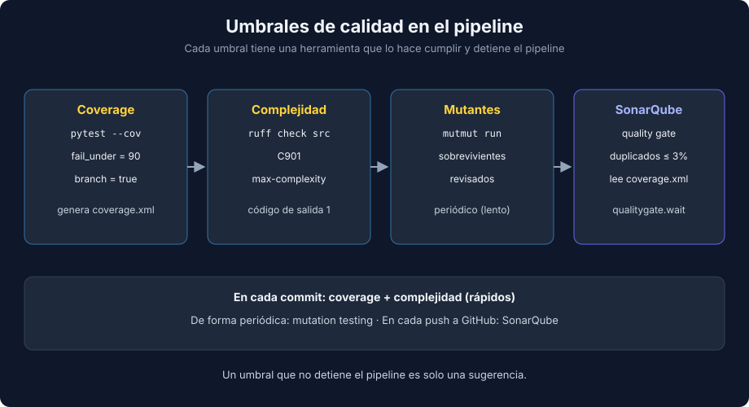

# 03 - Umbrales de Calidad y SonarQube para Python

> Lenguaje: **Python** (el flujo de CI es el de la semana 15, adaptado a `uv`)



---

## 🎯 Objetivos

- Definir umbrales para coverage, complejidad ciclomática y duplicados.
- Hacer cumplir el umbral de complejidad en local con `ruff`.
- Configurar SonarQube (Cloud o Community Edition) para un proyecto Python con `uv`.

---

## Tres umbrales, tres herramientas

| Métrica | Umbral de partida | Dónde se hace cumplir |
|---|---|---|
| Coverage de ramas | 90% en código de negocio | `fail_under` de `coverage.py` (teoría 01) |
| Complejidad ciclomática | 10 por función | `ruff` (regla `C901`) en local y en CI |
| Código duplicado | ≤ 3% en código nuevo | Quality gate de SonarQube |

Los números son un punto de partida: lo importante es que el equipo los acuerde y que un umbral incumplido haga fallar el pipeline.

---

## Complejidad ciclomática con ruff

La complejidad ciclomática cuenta los caminos independientes de una función: parte de 1 y cada `if`, `elif`, `for`, `while` o `except` suma uno. Una función muy compleja necesita muchos tests para cubrir sus ramas y es difícil de cambiar.

```toml
[tool.ruff.lint]
select = ["C901"]

[tool.ruff.lint.mccabe]
max-complexity = 10
```

```bash
uv run ruff check src
```

Salida real con `max-complexity = 5` y una función de reglas de envío con seis `if`:

```text
C901 `shipping_label` is too complex (7 > 5)
 --> src/billing/rules.py:1:5
```

`ruff` (0.16.7) termina con código 1: sirve como paso de CI. La solución no es subir el umbral, sino dividir la función (por ejemplo, una tabla de reglas o funciones por país).

---

## SonarQube para Python

SonarQube reúne coverage, duplicados, complejidad, code smells y vulnerabilidades en un quality gate. Para repos públicos, SonarQube Cloud es gratuito; para repos privados, SonarQube Community Edition se puede autohospedar (opcional).

SonarQube **no ejecuta los tests**: lee el `coverage.xml` que genera `pytest-cov`.

`sonar-project.properties`:

```properties
sonar.organization=your-organization-key
sonar.projectKey=bootcamp-python-quality

sonar.sources=src
sonar.tests=tests
sonar.python.version=3.14
sonar.python.coverage.reportPaths=coverage.xml
sonar.sourceEncoding=UTF-8

sonar.qualitygate.wait=true
```

`coverage.xml` debe usar rutas relativas para que el scanner, que corre en otra carpeta del runner, encuentre los archivos:

```toml
[tool.coverage.run]
relative_files = true
```

Workflow de GitHub Actions (mismas actions fijadas por SHA que en la semana 15, con `setup-uv` en lugar de pnpm):

```yaml
steps:
  - name: Checkout
    # actions/checkout@v7.0.1
    uses: actions/checkout@3d3c42e5aac5ba805825da76410c181273ba90b1
    with:
      fetch-depth: 0

  - name: Setup uv
    # astral-sh/setup-uv@v10.2.0
    uses: astral-sh/setup-uv@c18668ad3cf93ea998bef934396af7bb5c839dc7

  - name: Tests with coverage
    run: |
      uv sync
      uv run pytest --cov --cov-report=xml

  - name: Complexity
    run: uv run ruff check src

  - name: SonarQube Scan
    # SonarSource/sonarqube-scan-action@v8.2.2
    uses: SonarSource/sonarqube-scan-action@ba9859eae8dd6bd29e412f25ddbbef3d032000f4
    env:
      SONAR_TOKEN: ${{ secrets.SONAR_TOKEN }}
```

> En este bootcamp se verificaron en local la generación de `coverage.xml` y el paso de `ruff`. El análisis de SonarQube necesita una organización y un `SONAR_TOKEN` propios.

---

## `quality-report-python.md`

El proyecto de la semana documenta la calidad de la suite en un reporte breve: coverage de ramas, mutantes vivos y su clasificación, complejidad y umbrales. Un reporte útil explica **decisiones** ("este mutante es equivalente porque..."), no solo copia números.

---

## 📚 Recursos adicionales

- [SonarQube Cloud — Python test coverage](https://docs.sonarsource.com/sonarqube-cloud/enriching/test-coverage/python-test-coverage/)
- [SonarQube Cloud — Python](https://docs.sonarsource.com/sonarqube-cloud/advanced-setup/languages/python/)
- [Ruff — C901 complex-structure](https://docs.astral.sh/ruff/rules/complex-structure/)

## ✅ Checklist de verificación

- [ ] Cada umbral tiene una herramienta que lo hace cumplir y falla el pipeline.
- [ ] `coverage.xml` se genera con `relative_files = true`.
- [ ] El reporte explica las decisiones, no solo los números.

---

← [02 - Mutation testing con mutmut](./02-mutation-testing-con-mutmut.md) | [Volver al README](../README.md)
