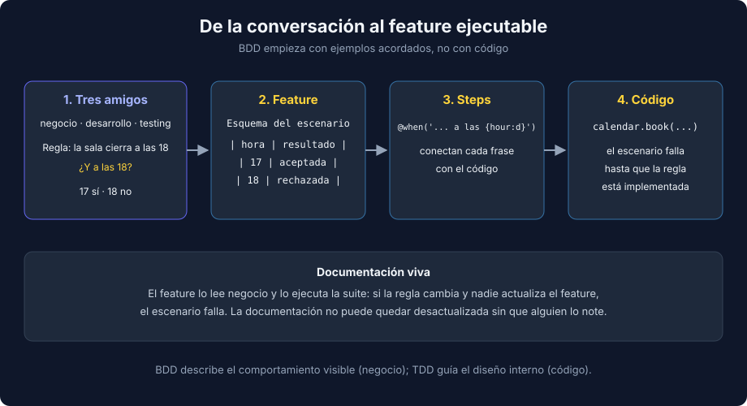

# 01 - BDD y Gherkin

> Lenguaje: **Transversal** (Gherkin) con ejemplos en **Python**



---

## 🎯 Objetivos

- Explicar qué es BDD y qué problema resuelve.
- Escribir features en Gherkin: `Feature`, `Scenario`, `Given`, `When`, `Then`, `And`, `But`, `Background`, `Scenario Outline`.
- Distinguir un escenario declarativo de uno imperativo.

---

## Qué es BDD

**Behavior Driven Development** es una práctica en la que negocio, desarrollo y testing acuerdan el comportamiento con **ejemplos concretos** antes de programar. Esos ejemplos se escriben en un formato legible (Gherkin) y después se automatizan.

La conversación importa más que la herramienta. En la reunión de "tres amigos" (alguien de negocio, alguien de desarrollo y alguien de testing) se pregunta "¿qué pasa si...?" hasta que las reglas quedan claras:

- Regla: la sala cierra a las 18.
- Pregunta: ¿se puede reservar a las 18?
- Ejemplo acordado: a las 17 sí, a las 18 no.

Ese ejemplo acordado se convierte en un escenario y, al automatizarlo, en un test que detecta el bug del ejercicio 01.

BDD y TDD se complementan: BDD describe el comportamiento visible desde fuera (en lenguaje del negocio); TDD guía el diseño interno (en lenguaje del código).

---

## Gherkin

```gherkin
# language: es
Característica: Reserva de salas de reuniones
  Para no chocar con otros equipos
  Como integrante de un equipo
  Quiero reservar una sala por horas

  Antecedentes:
    Dado un calendario de salas vacío

  Escenario: No se puede reservar una sala ocupada
    Dado que "Ana" reservó la sala "Azul" a las 9
    Cuando "Luis" intenta reservar la sala "Azul" a las 9
    Entonces la reserva se rechaza con el mensaje "room Azul is already booked at 9"
    Y la sala "Azul" queda reservada a las 9 por "Ana"
```

| Palabra clave (inglés) | En español (`# language: es`) | Para qué |
|---|---|---|
| `Feature` | `Característica` | Agrupa escenarios de una funcionalidad |
| `Background` | `Antecedentes` | Pasos comunes que se ejecutan antes de cada escenario |
| `Scenario` | `Escenario` | Un ejemplo concreto de comportamiento |
| `Given` | `Dado`, `Dada`, `Dados`, `Dadas` | Estado inicial |
| `When` | `Cuando` | La acción |
| `Then` | `Entonces` | El resultado esperado |
| `And` / `But` | `Y` / `Pero` | Continúan el paso anterior |
| `Scenario Outline` + `Examples` | `Esquema del escenario` + `Ejemplos` | El mismo escenario con varias filas de datos |

La primera línea `# language: es` activa las palabras clave en español; la lista completa sale con `uv run behave --lang-help es`. Los nombres de funciones y variables del código siguen en inglés.

---

## Scenario Outline: fronteras en una tabla

```gherkin
Esquema del escenario: Solo se reserva en horario de apertura
  Cuando "Ana" intenta reservar la sala "Verde" a las <hora>
  Entonces la reserva queda <resultado>

  Ejemplos:
    | hora | resultado |
    | 7    | rechazada |
    | 8    | aceptada  |
    | 17   | aceptada  |
    | 18   | rechazada |
```

Cada fila es un escenario independiente. Es el equivalente en Gherkin de `parametrize` (semana 17), y la tabla hace visibles las fronteras de la regla (7/8 y 17/18).

---

## Declarativo, no imperativo

| Imperativo (frágil) | Declarativo (estable) |
|---|---|
| `Cuando escribo "Ana" en el campo "usuario"` | `Cuando "Ana" reserva la sala "Azul" a las 9` |
| `Y hago clic en el botón "Reservar"` | |
| `Y espero 2 segundos` | |

Un escenario imperativo describe la **interfaz**: si cambia un botón, el escenario cambia aunque la regla de negocio sea la misma. Uno declarativo describe el **comportamiento**, y quien lee el feature entiende la regla sin conocer la pantalla.

Otras señales de un buen escenario:

- Un solo `Cuando`: un escenario prueba una acción.
- Datos mínimos: solo los que influyen en el resultado.
- Nombre que dice la regla ("No se puede reservar una sala ocupada"), no el procedimiento.

---

## 📚 Recursos adicionales

- [Cucumber — Gherkin Reference](https://cucumber.io/docs/gherkin/reference/)
- [Cucumber — Behaviour-Driven Development](https://cucumber.io/docs/bdd/)

## ✅ Checklist de verificación

- [ ] Cada escenario tiene un único `Cuando` y un nombre que expresa una regla.
- [ ] Los pasos describen comportamiento, no clics.
- [ ] Las fronteras de una regla están en un `Esquema del escenario`.

---

→ [02 - Behave: steps, context y hooks](./02-behave-steps-context-y-hooks.md)
