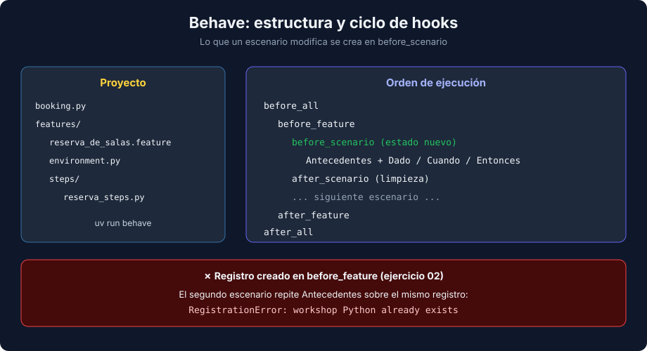

# 02 - Behave: Steps, Context y Hooks

> Lenguaje: **Python**



---

## 🎯 Objetivos

- Organizar un proyecto Behave (`features/`, `steps/`, `environment.py`).
- Escribir step definitions con parámetros tipados.
- Compartir estado con `context` y controlar su alcance con hooks.
- Usar tablas de datos, tags y las opciones de ejecución más útiles.

---

## Estructura

```text
proyecto/
|-- pyproject.toml            # behave==1.3.3 en [dependency-groups] dev
|-- booking.py                # código de negocio
`-- features/
    |-- reserva_de_salas.feature
    |-- environment.py        # hooks (opcional)
    `-- steps/
        `-- reserva_steps.py  # step definitions
```

```bash
uv run behave
```

Behave busca los `.feature` en `features/` y carga todos los módulos de `features/steps/`.

---

## Step definitions

```python
from behave import given, then, when


@when('"{person}" reserva la sala "{room}" a las {hour:d}')
def step_book(context, person, room, hour):
    context.calendar.book(room, hour, person)
```

- El texto del decorador es un patrón (librería `parse`): `{person}` captura texto y `{hour:d}` captura y convierte a `int`.
- El primer argumento siempre es `context`; después vienen los parámetros en orden.
- Un mismo step sirve a todos los escenarios que usen esa frase.

Si un paso no tiene definición, Behave lo marca `undefined` y propone un snippet con los valores **literales** (`"Ana"`, `9`). Conviértelos en parámetros antes de pegarlo.

---

## `context`: el estado del escenario

`context` es un objeto donde los steps guardan y leen datos (`context.calendar`, `context.error`). Behave lo organiza en capas: lo que asignas durante un escenario se descarta al terminar ese escenario, y lo que asignas en `before_feature` vive durante todo el feature.

Patrón para verificar errores: el `Cuando` captura la excepción y el `Entonces` la comprueba.

```python
@when('"{person}" intenta reservar la sala "{room}" a las {hour:d}')
def step_try_book(context, person, room, hour):
    try:
        context.calendar.book(room, hour, person)
    except BookingError as error:
        context.error = error
```

---

## Hooks en `environment.py`

```python
def before_scenario(context, scenario):
    context.registry = WorkshopRegistry()
```

| Hook | Cuándo se ejecuta |
|---|---|
| `before_all` / `after_all` | Una vez, al principio y al final |
| `before_feature` / `after_feature` | Antes y después de cada feature |
| `before_scenario` / `after_scenario` | Antes y después de cada escenario |
| `before_step` / `after_step` | Antes y después de cada paso |
| `before_tag` / `after_tag` | Alrededor de los elementos con un tag |

El alcance importa. En el ejercicio 02, un registro creado en `before_feature` lo comparten todos los escenarios, y el segundo falla con `workshop Python already exists` porque `Antecedentes` vuelve a añadir el mismo taller. Regla: lo que un escenario modifica se crea en `before_scenario`.

---

## Tablas de datos

```gherkin
Antecedentes:
  Dado los talleres:
    | taller  | cupos |
    | Python  | 2     |
    | Testing | 1     |
```

```python
@given("los talleres:")
def step_workshops(context):
    for row in context.table:
        context.registry.add_workshop(row["taller"], int(row["cupos"]))
```

Cada fila se lee por el nombre de la columna. Los valores son siempre texto.

---

## Tags y opciones de ejecución

```gherkin
@smoke
Escenario: Inscribirse en un taller con cupo
```

| Comando | Qué hace |
|---|---|
| `uv run behave --tags=smoke` | Solo los escenarios con `@smoke` |
| `uv run behave --tags="not wip"` | Todos menos los `@wip` |
| `uv run behave --format progress` | Salida compacta |
| `uv run behave --dry-run` | Lista pasos definidos y no definidos sin ejecutarlos |
| `uv run behave features/x.feature:10` | Solo el escenario de la línea 10 |

---

## 📚 Recursos adicionales

- [Behave — Tutorial](https://behave.readthedocs.io/en/latest/tutorial/)
- [Behave — Fixtures y hooks (API)](https://behave.readthedocs.io/en/latest/api/)

## ✅ Checklist de verificación

- [ ] Los steps usan parámetros, no valores literales.
- [ ] El estado mutable se crea en `before_scenario`.
- [ ] Los errores esperados se capturan en el `Cuando` y se verifican en el `Entonces`.

---

← [01 - BDD y Gherkin](./01-bdd-y-gherkin.md) | [03 - pytest-bdd y cuándo usar BDD](./03-pytest-bdd-y-cuando-usar-bdd.md) →
