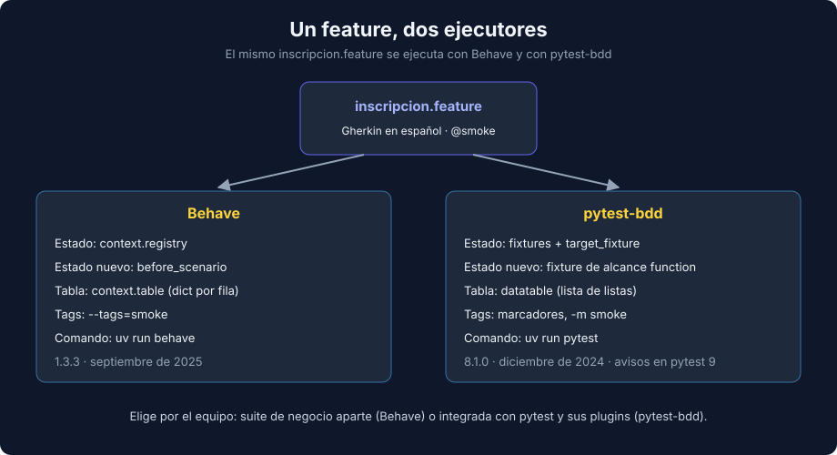

# 03 - pytest-bdd y Cuándo Usar BDD

> Lenguaje: **Python**



---

## 🎯 Objetivos

- Ejecutar un feature de Gherkin con pytest-bdd y compararlo con Behave.
- Elegir herramienta según el proyecto.
- Reconocer cuándo BDD aporta valor y cuándo es ceremonia.

---

## El mismo feature, ejecutado por pytest

pytest-bdd lee los mismos archivos `.feature` y convierte cada escenario en un test de pytest:

```python
import pytest
from pytest_bdd import given, parsers, scenarios, then, when

from workshops import WorkshopRegistry

scenarios("../features/inscripcion.feature")


@pytest.fixture
def registry() -> WorkshopRegistry:
    return WorkshopRegistry()


@when(parsers.parse('"{person}" se inscribe en "{workshop}"'), target_fixture="result")
def enroll(registry, person, workshop):
    return registry.enroll(workshop, person)


@then(parsers.parse('la inscripción queda "{status}"'))
def status_is(result, status):
    assert result == status
```

- `scenarios(...)` genera un test por escenario (`test_inscribirse_en_un_taller_con_cupo`).
- En lugar de `context`, el estado viaja en **fixtures**: `registry` es una fixture normal y `target_fixture="result"` convierte el valor que devuelve el `When` en una fixture que el `Then` recibe.
- Una fixture de alcance function es nueva en cada escenario: no hace falta un hook `before_scenario`.
- Las tablas llegan en el argumento `datatable` como lista de listas (la primera fila es la cabecera).
- Los tags se convierten en marcadores de pytest: `@smoke` se filtra con `-m smoke` (regístralo en `markers` si usas `strict = true`).

---

## Behave o pytest-bdd

| Criterio | Behave | pytest-bdd |
|---|---|---|
| Ejecución | Su propio comando (`behave`) | Dentro de `pytest`, junto al resto de la suite |
| Estado | `context` + hooks | Fixtures de pytest |
| Plugins de pytest (`pytest-cov`, `-k`, `-x`, `parametrize`) | No | Sí |
| Reportes orientados a negocio | Formatos propios (`pretty`, `progress`, JSON) | Los de pytest |
| Mantenimiento (septiembre de 2026) | `behave` 1.3.3 (septiembre de 2025) | `pytest-bdd` 8.1.0 (diciembre de 2024), con avisos `PytestRemovedIn10Warning` en pytest 9 |

Regla práctica: si el equipo ya vive en pytest y quiere coverage y fixtures compartidas, pytest-bdd. Si los features los leen personas de negocio y la suite BDD va aparte, Behave. En este bootcamp el proyecto usa Behave.

> Riesgo real: pytest-bdd usa APIs que pytest 10 eliminará. Por eso el ejercicio 02 filtra ese aviso en `pyproject.toml`; antes de adoptarlo en un proyecto largo, revisa si hay una versión compatible.

---

## Cuándo aporta valor BDD

| Aporta valor | Es solo ceremonia |
|---|---|
| Reglas de negocio con muchos casos y fronteras | Funciones técnicas sin regla de negocio (parsers, utilidades) |
| Negocio participa en escribir o revisar los escenarios | Nadie fuera del equipo técnico lee los features |
| El feature se usa como documentación viva y acuerdo | Los escenarios repiten tests unitarios con otra sintaxis |

Antipatrones frecuentes:

- **Escenarios imperativos** acoplados a la interfaz (clics, campos, esperas).
- **Steps demasiado específicos**: uno por escenario, sin reutilización.
- **Lógica en los steps**: el step debería llamar al código de negocio, no reimplementarlo.
- **Todo por BDD**: la base de la pirámide sigue siendo unitaria (pytest); BDD cubre los flujos de negocio.

---

## 📚 Recursos adicionales

- [pytest-bdd — Documentación](https://pytest-bdd.readthedocs.io/en/latest/)
- [Behave — Documentación](https://behave.readthedocs.io/en/latest/)

## ✅ Checklist de verificación

- [ ] Sabes explicar cómo viaja el estado en Behave (`context`) y en pytest-bdd (fixtures).
- [ ] Elegiste la herramienta por el contexto del equipo, no por moda.
- [ ] Los features describen reglas de negocio, no pantallas.

---

← [02 - Behave: steps, context y hooks](./02-behave-steps-context-y-hooks.md) | [Volver al README](../README.md)
